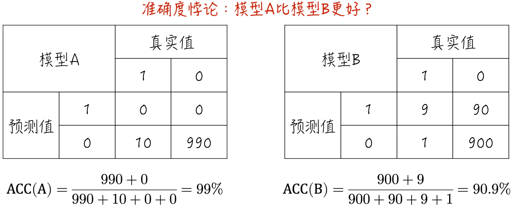
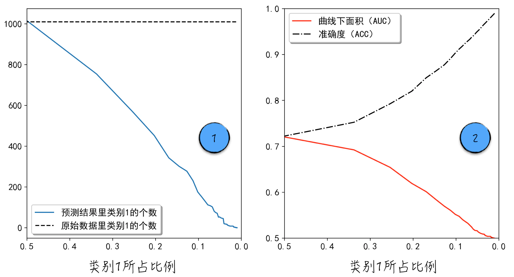
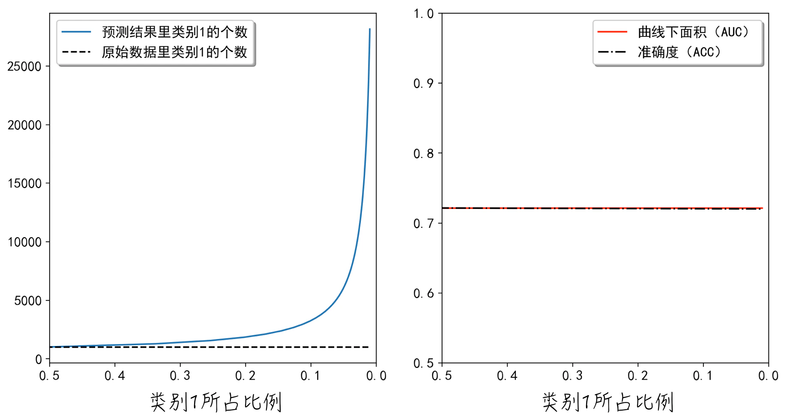

## 4.4 非均衡数据集

在使用逻辑回归解决二分类问题时，我们常常面对非均衡数据集（Imbalanced Data）这一挑战。非均衡数据集指的是针对分类问题，数据集中各个类别的样本比例并不平衡。

在实际应用中，非均衡数据集十分常见。举例来说，在网络广告行业中，当需要对用户是否点击网页上的广告进行建模时，将“点击广告”定义为类别 1，“不点击广告”定义为类别 0。通常情况下，类别 1 的数据占比会非常低，可能仅占千分之一左右。这种数据的不均衡给建模带来了额外的困难。若处理不慎，可能导致模型结果失去意义。在深入讨论这一主题之前，先稍微偏离话题，探讨一下什么是准确度悖论（Accuracy Paradox）。

### 4.4.1 准确度悖论

准确度悖论指的是，在处理非均衡数据集时，如果仅仅依赖准确度来评估模型，可能会出现误导性的结果。这一悖论在非均衡数据集场景下的表现尤为突出。具体来说，根据表 4-2 的分析，真阳性（TP）和真阴性（TN）这两个部分代表模型预测正确，而另两个部分代表模型预测错误。基于此，定义评估模型效果的指标：准确度（Accuracy，ACC）。

$$
ACC=\frac{TP+TN}{TP+FP+FN+TN}
\tag{4-27}
$$

准确度这一指标表面看来合理，但在面对非均衡数据集时，它可能产生严重的偏差，甚至变得毫无意义。考虑以下例子：数据集中包含 1000 个数据点，其中有 990 个属于类别 0，剩余的 10 个属于类别 1，如图 4-20 所示。



模型 A 对所有数据的预测都是类别 0，实际上，这个模型并没有实现任何有意义的预测功能。尽管如此，其准确度却高达 99%。模型 B 的预测表现实际上相当良好：对于类别 1，10 个数据中有 9 个被正确预测；对于类别 0，990 个数据中有 900 个被正确预测。然而，它的准确度只有 90.9%，远低于模型 A。

这便是所谓的准确度悖论：在面对非均衡数据集时，准确度这个评估指标会使得模型严重偏向数量更多的类别，导致模型的预测功能失真。这也是在 [4.3 节](/books/deconstructing_LLM/chapter-4/4-3)中并没有介绍准确度这一指标的原因。实际上，[4.3.4 节](/books/deconstructing_LLM/chapter-4/4-3#section-4-3-4)讨论的 AUC（曲线下面积）在处理非均衡数据集时也能够保持稳定，不会像准确度悖论那样出现明显的偏差。

### 4.4.2 模型效果影响

非均衡数据集不仅会引发准确度悖论，而且会对模型的性能产生严重影响。下面通过一个简单的例子来说明这个问题：按照公式（4-28）生成数据，其中变量 $y$ 为标签；$x_1$ 和 $x_2$ 为特征；$\varepsilon$ 为随机扰动项，它服从逻辑分布。

$$
y=
\begin{cases}
1,&x_1-x_2+\varepsilon>0\\
0,&\text{其他}
\end{cases}
\tag{4-28}
$$

上面生成的数据完美符合逻辑回归模型的假设。理论上，使用逻辑回归对这些数据进行建模会得到非常好的结果。然而，当数据集是均衡的，也就是类别 1 所占比例大约为 0.5 时，模型的表现确实不错；但当类别 1 占比接近 0，也就是数据集非均衡时，模型的表现就会变得很糟糕。尽管数据集中类别 1 的数量始终不变，但模型的预测几乎都是类别 0，如图 4-21 中的标记 1 所示（[完整代码](https://github.com/GenTang/regression2chatgpt/blob/zh/ch04_logit/imbalanced_data.ipynb)）。这表明，在面对非均衡数据集时，模型几乎丧失了预测功能。但如 [4.4.1 节](/books/deconstructing_LLM/chapter-4/4-4#section-4-4-1)所讨论的，准确度（ACC）不能很好地评估这种模型状况，反而失真地认为模型的表现很好。与之相反，AUC 能够在非均衡数据集上保持稳定，准确地评估模型的性能，如图 4-21 中的标记 2 所示。



上述例子直观展示了非均衡数据集对模型效果的影响，下面探讨造成这种结果的数学原因。假设对于二分类问题，类别 0 的占比非常高。不妨假设在某点 $\mathbf X$ 附近有 $k$ 个类别 0 和 1 个类别 1。为了讨论过程简洁，进一步假设这些点距离 $\mathbf X$ 非常近，可以近似地认为等于它。参考 [4.1.4 节](/books/deconstructing_LLM/chapter-4/4-1#section-4-1-4)和 [4.1.5 节](/books/deconstructing_LLM/chapter-4/4-1#section-4-1-5)的内容，逻辑回归的损失函数如下：

$$
\begin{aligned}
P(y_i=1)=h(\mathbf X_i)&=\frac{1}{1+e^{-\mathbf X_i\boldsymbol\beta}}\\
LL&=-\frac{1}{n}\sum_{i=1}^{n}\left[y_i\ln h(\mathbf X_i)+(1-y_i)\ln(1-h(\mathbf X_i))\right]
\end{aligned}
\tag{4-29}
$$

根据这个设定，模型在类别 1 上的损失是 $-\ln h(\mathbf X)$ 的值，因此，类别 1 的诉求是提高 $h(\mathbf X)$ 的值；而模型在类别 0 上的损失是 $-\ln[1-h(\mathbf X)]$，其诉求相反，是降低 $h(\mathbf X)$ 的值。模型在这些数据上的总损失等于 $-\ln h(\mathbf X)-k\ln[1-h(\mathbf X)]$。这会导致模型通过降低 $h(\mathbf X)$ 的值来降低总体损失。也就是说，模型会选择“牺牲”类别 1，以满足类别 0 的需求。当 $k$ 值越大时，这种偏向会更加显著。

需要注意的是，尽管上面的讨论基于逻辑回归模型，但得出的结论同样适用于后续章节中将讨论的其他分类模型。

### 4.4.3 解决方案

针对非均衡数据集，一个常见的解决方案是调整损失函数中不同类别的权重。以逻辑回归为例，将模型的损失函数改写为公式（4-30）。

$$
LL=-\frac{1}{n}\sum_{i=1}^{n}\left[w_1y_i\ln h(\mathbf X_i)+w_0(1-y_i)\ln(1-h(\mathbf X_i))\right]
\tag{4-30}
$$

其中，$w_0$ 和 $w_1$ 是类别权重。当类别 1 的比例很低时，增加 $w_1$ 可以提升模型对类别 1 损失的敏感度，从而平衡不同类别的影响。通常情况下，类别的权重会被设置为类别占比的倒数。具体的计算方法可参考程序清单 4-4 中的第 1 行和第 2 行。通过权重调整，在模型看来，训练数据就处于均衡状态了。

#### 程序清单 4-4 非均衡数据集（[完整代码](https://github.com/GenTang/regression2chatgpt/blob/zh/ch04_logit/imbalanced_data.ipynb)）

```python
positive_weight = len(_y[_y > 0]) / float(len(_y))
class_weight = {1: 1. / positive_weight, 0: 1. / (1 - positive_weight)}
# 为了消除惩罚项的干扰，将惩罚系数设为很大
model = LogisticRegression(class_weight=class_weight, C=1e4)
model.fit(_x, _y.ravel())
```

调整权重后的模型结果如图 4-22 左侧所示：模型错误地将许多类别 0 的数据预测为类别 1。这与我们的预期相符：通过增加类别 1 的权重，模型更倾向于“珍惜”类别 1，“牺牲”类别 0。调整后的 AUC 更大，模型效果比调整前更好。值得注意的是，ACC 和 AUC 这两个评估指标几乎相等，因此如图 4-22 右侧所示，它们几乎重叠在一起。



除了权重调整，针对非均衡数据集还有一些其他解决方法，例如通过重新抽样，将占比较多的类别变少或将占比较少的类别变多。有兴趣的读者可以参考其他资料进一步了解。
