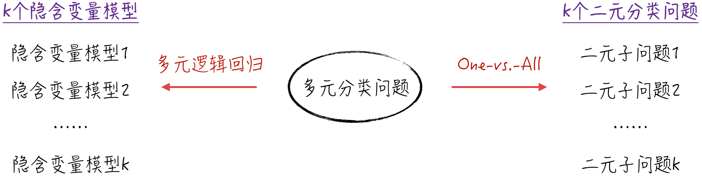
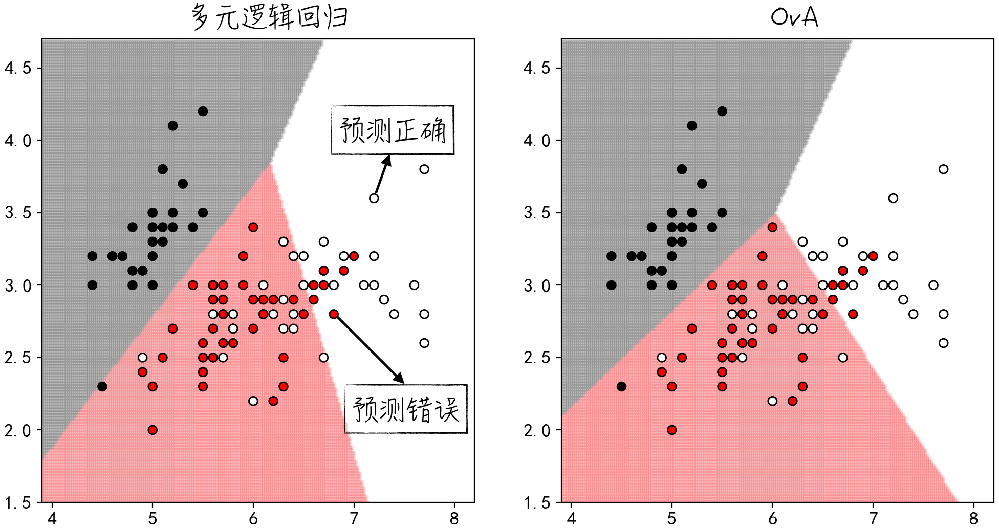

## 4.5 多元分类问题：超越是与否

在实际应用中，我们常常遇到多元分类问题，即要预测的分类多于两个。例如，在电商网站中，用户可以被划分为多个类别：普通用户、星级用户或者疑似流失用户。逻辑回归是否适用于这样的多元分类问题呢？答案是肯定的，但需要对模型进行一些适当的调整。常见的方法有两种：一种方法是对模型的结构进行调整，调整后的模型被称为多元逻辑回归模型（Multinomial Logit Regression）；另一种方法是不改变模型结构，但通过额外的步骤，将多元分类问题转换为多个二元分类问题，其中，最经典的方法就是 One-vs.-All（OvA）[^one-vs-one]。接下来将对这两种方法进行详细讨论。

### 4.5.1 多元逻辑回归

假设面对的多元分类问题有 $k$ 个类别，分别记为 $0,1,\cdots,k-1$。延续 [4.1.2 节](/books/deconstructing_LLM/chapter-4/4-1#section-4-1-2)中的思路，修改隐含变量的模型假设如下：

$$
\begin{cases}
Y_{i,0}^*=\mathbf X_i\boldsymbol\theta_0+\varepsilon_0\\
Y_{i,1}^*=\mathbf X_i\boldsymbol\theta_1+\varepsilon_1\\
\qquad\vdots\\
Y_{i,k-1}^*=\mathbf X_i\boldsymbol\theta_{k-1}+\varepsilon_{k-1}
\end{cases}
\tag{4-31}
$$

其中，$Y_{i,j}^*$ 表示数据 $i$ 对类别 $j$ 的隐含变量，可以理解为类别 $j$ 对数据 $i$ 的效用；$\mathbf X_i$ 表示数据 $i$ 对应的特征；$\boldsymbol\theta_j$ 为对应线性模型的参数；$\varepsilon_j$ 是随机扰动项，它服从标准的类型 1 极端值分布[^extreme-value]（Standard Type-1 Extreme Value Distribution），记为 $\varepsilon_j\sim EV_1(0,1)$。

与二元的推导类似，数据 $m$ 属于类别 $l$，当且仅当类别 $l$ 对数据 $m$ 的效用大于其他类别对数据 $m$ 的效用，即 $Y_{m,l}^*=\max_jY_{m,j}^*$。假设 $Y_m=l$ 表示数据 $m$ 的分类为 $l$。可以得到：

$$
\begin{cases}
P(Y_i=0)=P(Y_{i,0}^*=\max_jY_{i,j}^*)\\
P(Y_i=1)=P(Y_{i,1}^*=\max_jY_{i,j}^*)\\
\qquad\vdots\\
P(Y_i=k-1)=P(Y_{i,k-1}^*=\max_jY_{i,j}^*)
\end{cases}
\tag{4-32}
$$

经过一系列复杂的数学推导，可以得到各个类别分布概率的具体表达式：

$$
\begin{cases}
P(Y_i=1)=P(Y_i=0)e^{\mathbf X_i\boldsymbol\beta_1}
=\dfrac{e^{\mathbf X_i\boldsymbol\beta_1}}{1+\sum_{j=1}^{k-1}e^{\mathbf X_i\boldsymbol\beta_j}}\\
P(Y_i=2)=P(Y_i=0)e^{\mathbf X_i\boldsymbol\beta_2}
=\dfrac{e^{\mathbf X_i\boldsymbol\beta_2}}{1+\sum_{j=1}^{k-1}e^{\mathbf X_i\boldsymbol\beta_j}}\\
\qquad\vdots\\
P(Y_i=0)=\dfrac{1}{1+\sum_{j=1}^{k-1}e^{\mathbf X_i\boldsymbol\beta_j}}
\end{cases}
\tag{4-33}
$$

可以注意到，多元逻辑回归与传统逻辑回归非常相似。实际上，当 $k=2$ 时，多元逻辑回归的公式（4-33）就恢复成了逻辑回归的公式（4-9）。因此，逻辑回归可以被视为多元逻辑回归的一个特例。类似于逻辑回归，我们可以基于各个类别的概率分布推导出参数的似然函数，然后利用最大似然估计法来估计这些参数的值。对于多元逻辑回归模型，参数的似然函数如公式（4-34）所示。其中 $1_{\{Y_i=j\}}$ 是示性函数：当 $Y_i=j$ 时，函数值等于 1，否则等于 0。

$$
\begin{aligned}
L=P(\mathbf Y\mid\boldsymbol\beta)
&=\prod_i\prod_{j=0}^{k-1}P(Y_i=j)^{1_{\{Y_i=j\}}}\\
\ln L&=\sum_i\sum_{j=0}^{k-1}1_{\{Y_i=j\}}\ln P(Y_i=j)
\end{aligned}
\tag{4-34}
$$

### 4.5.2 One-vs.-All：从二元到多元

虽然多元分类问题涉及多个类别，但如果将注意力集中在某一特定类别上，比如类别 1，那么数据只有两种可能状态：属于类别 1 或者不属于类别 1[^ova-imbalance]。这就是我们熟悉的二元分类问题。

将上述思路逐步扩展到所有类别，就得到了 One-vs.-All 策略。具体而言，假设多元分类问题有 $k$ 个类别，分别记为 $0,1,\cdots,k-1$，为每个类别构建一个独立的模型，将原始的 $k$ 元分类问题拆解为 $k$ 个二元分类问题。沿用之前的数学记号，$Y_i=j$ 表示数据 $i$ 的分类为 $j$，生成 $k$ 个新的标签变量如下：

$$
\tilde Y_{i,j}=
\begin{cases}
1,&Y_i=j\\
0,&Y_i\neq j
\end{cases}
\tag{4-35}
$$

依次使用逻辑回归模型对数据 $\{\mathbf X_i,\tilde Y_{i,j}\}$ 建模，得到相应的预测值，即在新的二元分类场景下，将数据 $i$ 属于类别 $j$ 的概率记为 $\hat P_j(\tilde Y_{i,j}=1)$：

$$
\hat P_j(\tilde Y_{i,j}=1)=\frac{1}{1+e^{\mathbf X_i\hat{\boldsymbol\varphi}_j}}
\tag{4-36}
$$

其中 $\hat{\boldsymbol\varphi}_j$ 为第 $j$ 个逻辑回归模型参数的估计值（为了区别于 [4.5.1 节](/books/deconstructing_LLM/chapter-4/4-5#section-4-5-1)中的模型，这里使用新的字母 $\hat{\boldsymbol\varphi}_j$ 表示参数的估计值）。

公式（4-36）中的 $\hat P_j(\tilde Y_{i,j}=1)$ 在某种程度上代表了最终标签 $Y_i$ 等于 $j$ 的概率。因此，我们选择概率最大的类别作为最终的预测结果。

$$
\begin{aligned}
\hat Y_i=j
&\Longleftrightarrow
\hat P_j(\tilde Y_{i,j}=1)=\max_t\hat P_t(\tilde Y_{i,t}=1)\\
\hat Y_i&=\operatorname*{argmax}_t\hat P_t(\tilde Y_{i,t}=1)
\end{aligned}
\tag{4-37}
$$

在面对多元分类问题时，上述两种处理方法可以直观地呈现为图 4-23 所示的流程。



### 4.5.3 模型实现

这两种方法的理论推导涉及一些复杂的数学计算，借助 scikit-learn 来实现它们相对简单。如程序清单 4-5 中的第 6 行和第 9 行代码所示，只需正确设置 `multi_class` 参数即可，其中 `multinomial` 表示多元逻辑回归，`ovr` 表示 One-vs.-All 方法。

#### 程序清单 4-5 多元分类问题（[完整代码](https://github.com/GenTang/regression2chatgpt/blob/zh/ch04_logit/multi_logit_example.ipynb)）

```python
from sklearn.linear_model import LogisticRegression

# 使用逻辑回归对多元分类问题建模，并可视化结果
features = ['x1', 'x2']
labels = 'label'
methods = ['multinomial', 'ovr']
# 使用两种不同的方法对数据建模
for i in range(len(methods)):
    model = LogisticRegression(multi_class=methods[i])
    model.fit(data[features], data[labels])
    ......
```

使用一个包含 3 个类别的数据集训练模型，得到的结果如图 4-24 所示。



在图 4-24 中，黑色边框圆圈代表原始数据，而不同的填充颜色表示不同的类别。另外，3 种不同的背景色表示模型的预测结果。如果圆圈的填充颜色与背景色相匹配，就表示预测正确；反之则表示预测错误。从图像上看，这两种方法的结果略有差异，但差别并不显著。从数学角度来看，这两种方法各有优劣，并没有哪一种是绝对更好的。

[^one-vs-one]: 除了本书介绍的 One-vs.-All 方法（在有些文献中，此方法也被称为 One-vs.-Rest，简称为 OvR），还有另一种处理策略称为 One-vs.-One。这种方法将一个包含 $k$ 个类别的分类问题分解为 $k(k-1)/2$ 个二元分类问题：对每两个类别进行组合，然后使用二元分类器（例如逻辑回归）来解决这两个类别的分类问题。最后，根据各个二元分类器的结果，通过一种类似投票的方法得出最终的预测结果。
[^extreme-value]: 在统计学中，极端值分布可以看作正态分布的一种扩展形式：从图像上来看，它的概率密度函数呈现出类似正态分布的特点，但尾部更为厚重，即极端值的出现概率更高。这使得极端值分布在金融领域的应用十分广泛，特别是在金融市场波动剧烈、风险高涨的情况下。2008 年的金融危机后，极端值分布常被用来预防那些罕见但重大的“黑天鹅”事件。极端值分布有不同类型，其中类型 1 极端值分布也被称为古贝尔分布（Gumbel Distribution），其概率密度函数为 $EV_1(\mu,\beta)=\frac{1}{\beta}e^{\frac{x-\mu}{\beta}}e^{-e^{\frac{x-\mu}{\beta}}}$。
[^ova-imbalance]: 不难发现，数据在属于类别 1 和不属于类别 1 之间的分布很容易出现不均衡，导致在使用 One-vs.-All 方法时容易面临非均衡数据集的问题。关于这一问题的解决方法，请参考 [4.4 节](/books/deconstructing_LLM/chapter-4/4-4)。
