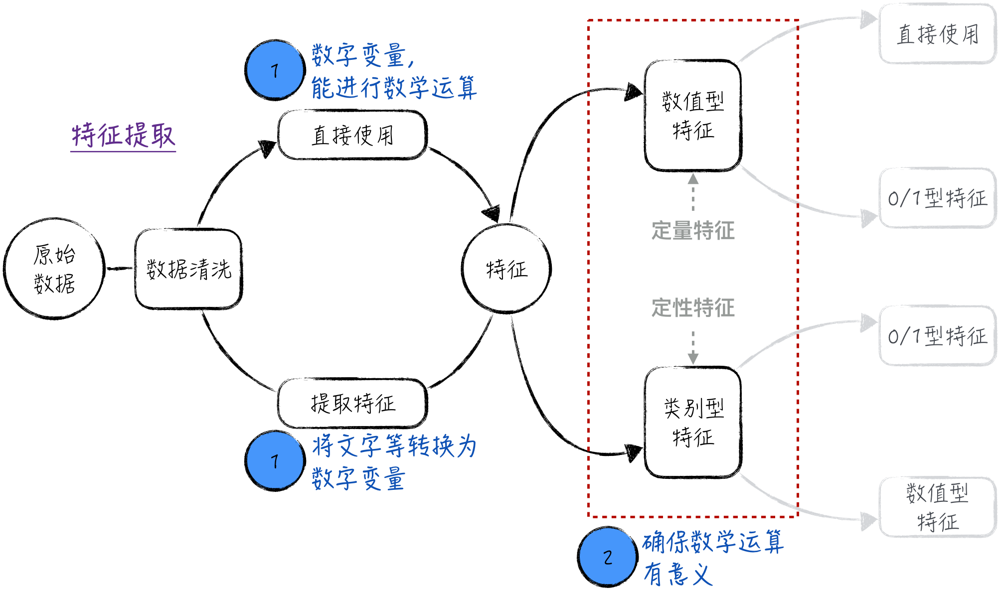

## 5.1 定量与定性：特征的数学运算合理吗

模型的本质是对数据进行数学运算。为了确保模型的计算具有意义，需要保证以下两点：首先，数据必须是可计算的；其次，对特征（自变量）进行的数学运算必须合理有效。一般情况下，建模所使用的数据都可以进行计算。在特殊场景下，如自然语言处理或图像识别，可能需要对原始数据进行特定的转换，不过这些转换通常相对简单。

保证数学运算的合理性是更复杂的问题，需要针对不同场景进行单独分析。总体来说，主要关注特征运算的两个方面。

- 数字之间的大小关系。
- 数字的基本四则运算。

为了更好地探讨这些问题，下面将模型使用的特征分为两类：数值型特征和类别型特征，如图 5-1 所示。

数值型特征（也称为定量特征）代表可测量或计数的数值，例如长度、收入、重量等。这些特征的数值间的大小关系在数学和现实生活中都具有实际意义。举例来说，对于收入，数值 100 小于 1000；在现实生活中，100 元也小于 1000 元。同样，对这些数值进行四则运算是合理的。然而需要注意的是，数值型特征常常暗含着边际效应恒定的假设（参考 [4.2.3 节](/books/deconstructing_LLM/chapter-4/4-2#section-4-2-3)和 [5.3 节](/books/deconstructing_LLM/chapter-5/5-3)）。在某些场景下，这一假设与真实情况并不完全符合，直接使用这些特征可能会影响模型的效果。

类别型特征（也称为定性特征）代表类别，比如性别、省份、学历、产品等级等。这些特征的取值通常是文字，而不是数字。例如，性别这个特征的可能取值为男、女。为了在模型中使用它们，需要将文字转换为数字，比如用 1 表示男、0 表示女，但这种简单的转换方式并不能完全满足需求。

- **有序的类别型特征**是指有内在顺序的特征，比如产品等级，其中 0 代表合格、1 代表良好、2 代表优秀。在这种情况下，“0 小于 1”确实对应着“合格等级次于良好等级”，但数学上的四则运算却失去了对应的实际意义。举例来说，数学上 2 减 1 等于 1，但在产品等级中，优秀减良好是否等于良好呢？
- **无序的类别型特征**是指无内在顺序的特征，比如代表省份的变量，0 表示北京、1 表示上海、2 表示深圳等。在这种情况下，数字之间的大小关系和四则运算都毫无实际意义。

因此，即使进行了简单的转换，在模型中直接使用类别型特征也是无意义的，甚至可能严重影响模型的效果。

综上所述，不论是数值型特征，还是类别型特征，通常都需要根据应用场景进行相应的变换或处理，然后再应用到模型中。下面将深入讨论针对不同类型特征的具体处理方法，以确保数据的合理使用。
