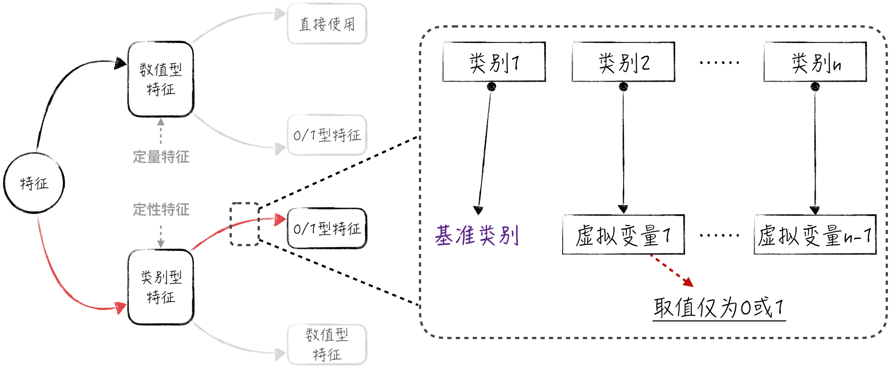
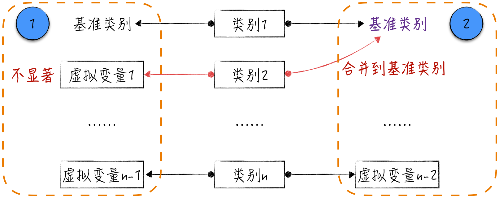
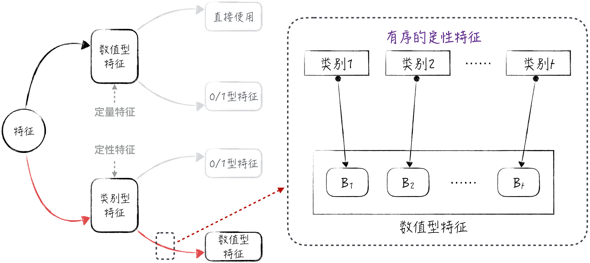

## 5.2 定性特征的处理

在处理定性特征时，通常有两种处理方法：一种是将定性特征转换为多个虚拟变量，另一种是将有序的定性特征转换为定量特征。

- **定性特征转换为虚拟变量**：这种方法将定性特征中的每个类别拆分为单独的虚拟变量。每个虚拟变量代表一个类别，且取值为 1 或 0，表示该样本是否属于该类别。这种转换方法在处理分类问题时很常见。
- **有序特征转换为定量特征**：如果定性特征具有内在的顺序关系，在一些场景下，可以将其转换为定量特征，既保留其顺序信息，还使四则运算具有一定的实际意义。

### 5.2.1 虚拟变量

如前文所述，直接对定性特征进行数字编码，所得到的变量难以进行有意义的数学运算。解决这一问题的方法之一是将定性特征转换为多个虚拟变量。

为了更好地说明这一点，下面来看一个简单的例子：假设用身高和性别构建线性回归模型以预测体重。性别是一个二元定性特征，可能的取值为男或女。为了在模型中使用这个特征，可以用两个新生成的变量来替代性别，分别为 $x_1$ 和 $x_2$。这些变量被称为虚拟变量（Dummy Variable）。其中，$x_1=1$ 表示性别为男，$x_1=0$ 表示性别不为男；$x_2$ 类似，表示性别是否为女。虚拟变量是一种特殊的离散型变量，其可能的取值只有 0 或 1，因此也被称为 0/1 特征。

用 $y$ 表示体重，$z$ 表示身高，搭建如下的模型：

$$
y=ax_1+bx_2+cz+d+\varepsilon
\tag{5-1}
$$

需要注意的是 $x_1+x_2\equiv1$，这意味着 $x_1$ 和 $x_2$ 之间存在线性关系。然而，这会引发另一个问题：多重共线性[^dummy-trap]（将在 [5.4 节](/books/deconstructing_LLM/chapter-5/5-4)中讨论）。为了避免这个问题，对公式（5-1）做如下数学变换：

$$
\begin{aligned}
y&=a(x_1+x_2)+(b-a)x_2+cz+d+\varepsilon\\
&=(b-a)x_2+cz+(a+d)+\varepsilon
\end{aligned}
\tag{5-2}
$$

上述数学变换可理解为：首先选择性别男作为基准类别，生成一维虚拟变量 $x_2$，其含义与前述相同。系数 $b-a$ 表示性别女相对于性别男（基准类别）的体重差异。需要强调的是，对于二元定性特征，从表面上看，直接对变量进行数字编码和使用虚拟变量结果是一样的，但这只是一个巧合而已，实际上两种方法有本质区别。

将上面的方法推广到 $n$ 元定性特征（可能取值为 $n$ 个的定性特征）：选择一个类别作为基准类别（对于基准类别的选择，请参考 [5.4.4 节](/books/deconstructing_LLM/chapter-5/5-4#section-5-4-4)），并生成 $n-1$ 个虚拟变量，分别表示剩下的 $n-1$ 个类别。这样，在模型构建中，用这 $n-1$ 个新生成的虚拟变量代替原来的定性特征。具体过程如图 5-2 所示。

虚拟变量的代码实现相对简单，读者可以参考随书配套代码（[完整代码](https://github.com/GenTang/regression2chatgpt/blob/zh/ch05_econometrics/categorical_variable.ipynb)），正文中不再展开。然而，需要提醒大家注意的是，针对新生成的虚拟变量，同样可以利用置信区间和假设检验进行变量筛选。如图 5-3 中标记 1 所示，一个虚拟变量在统计上不显著，意味着该虚拟变量所代表的类别与基准类别并没有显著差异。在建模过程中需要将其合并，从而形成一个更大的基准类别，如图 5-3 中标记 2 所示。

### 5.2.2 定性特征转换为定量特征

前面提到的虚拟变量方法是一个通用的处理方式，但存在一个明显的缺点：每个虚拟变量都只能取 0 或 1，无法提供更多信息。特别是对于有序定性特征，这种方法会丢失特征中每个类别的顺序信息。为了解决这个问题，通常根据类别的顺序将定性特征转换为定量特征。在这里，着重讨论其中的一种方法：针对二元分类问题的 Ridit Scoring[^ridit]。

假设有序的定性特征 $x$ 有 $t$ 个可能的类别，记为 $(1,2,\cdots,t)$。对于标签 $y$，在其他变量相同时，排在越后面的类别，$y=1$ 的概率越小。换言之，在条件相同的情况下，类别 1 的概率最大，类别 $t$ 的概率最小。用 $(p_1,p_2,\cdots,p_t)$ 分别表示各个类别所占比例，定义类别 $i$ 的 Ridit Scoring 为：

$$
B_i=\sum_{j<i}p_j-\sum_{j>i}p_j
\tag{5-3}
$$

基于公式（5-3），可以针对有序定性特征 $x$ 生成一个数值型特征，其包含 $t$ 个离散值，正好对应公式中定义的 $t$ 个值，如图 5-4 所示。这种方法能更好地保留定性特征的顺序信息，并将其转化为数值特征以供模型使用。

将定性特征转换为定量特征有许多类似的方法，但它们的通用性都不强：首先，这些方法通常仅适用于有序的定性特征；其次，这些方法的转换公式是固定的，从而限制了它们的适用范围。然而，在人工智能领域，有一种更为直接的方法，即利用神经网络完成定性特征向定量特征的转换。一个经典案例是自然语言处理中的文字嵌入，相关细节将在第 [10.2.2 节](/books/deconstructing_LLM/chapter-10/10-2#section-10-2-2)中讨论。提前介绍神经网络的案例是为了强调，在处理定性特征时，可以借助更复杂的模型手段，而不仅仅依赖经验或人为定义的特征转换公式。

[^dummy-trap]: 由虚拟变量引起的多重共线性问题在学术上被称为虚拟变量陷阱，详见 [5.4.4 节](/books/deconstructing_LLM/chapter-5/5-4#section-5-4-4)。
[^ridit]: 此方法在保险业中应用很广。具体细节参考 Brockett, P. L. 等，2002，*Fraud Classification Using Principal Component Analysis of Ridits*，*Journal of Risk and Insurance* 69(3)，341–371。
