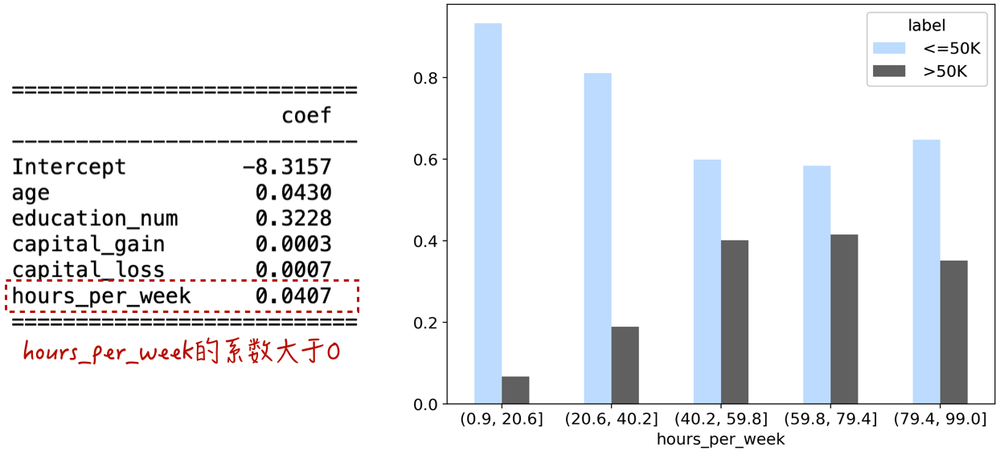
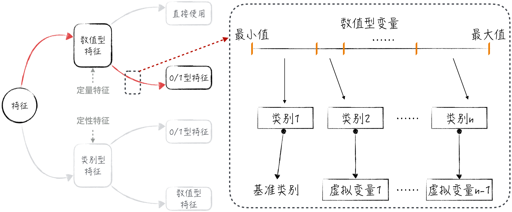
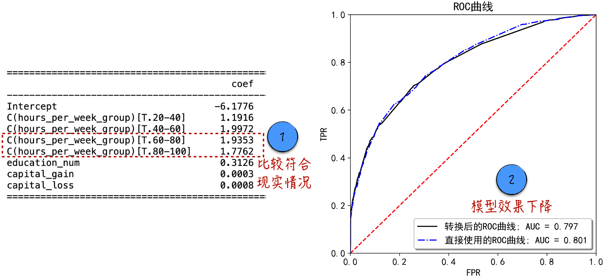
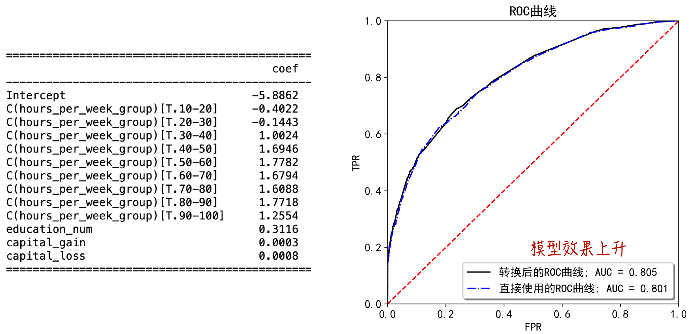
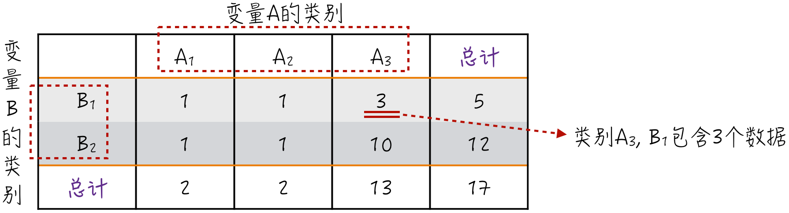
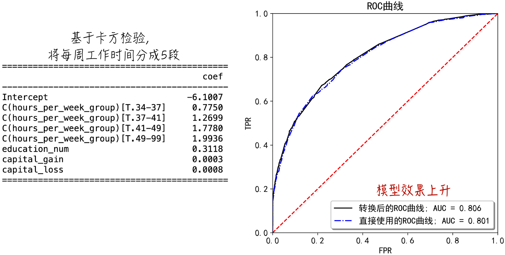

## 5.3 定量特征的处理

本章依然以美国个人收入的普查数据（数据的具体字段可参考 4.2 节）为例，讨论定量特征的处理。在讨论具体细节之前，先简单回顾第 4 章中的逻辑回归模型。用 $P(y_i=1)$ 表示年收入大于 5 万美元的概率，逻辑回归模型可以表示为如下形式：

$$
\ln\frac{P(y_i=1)}{1-P(y_i=1)}=\mathbf X_i\boldsymbol\beta
\tag{5-4}
$$

$P/(1-P)$ 被称为事件的发生比，公式（5-4）表示该比例的对数是线性模型。如果直接使用一个定量特征，意味着它对事件发生比对数的边际效应是恒定的。例如，当它在模型中的系数大于 0 时，它与事件发生的概率始终成正比，反之亦然。然而，这个隐含的模型假设并不总是符合现实情况。举个例子，每周工作时间的模型系数大于 0，如图 5-5 左侧所示。但是它与年收入大于 5 万美元的交叉报表如图 5-5 右侧所示：当工作时间少于 80 小时，年收入多于 5 万美元的比例与工作时间成正比；然而，当工作时间超过 80 小时后，年收入多于 5 万美元的比例反而下降了。

从数学的角度来看，隐含的边际效应恒定假设来自两个核心因素，即线性模型和直接使用定量特征。逻辑回归模型包含线性模型是无法改变的事实。而且，正如之前章节所探讨的，几乎所有的人工智能模型都包含线性模型。因此，要解决这个问题，唯一的途径是将定量特征按照若干个区间转换为定性特征。在实践中，这种方法是最常用且最有效的。接下来将深入探讨这种方法的具体细节。

### 5.3.1 定量特征转换为定性特征

将定量特征转换为定性特征的方法可以分为 3 个主要步骤，整个过程如图 5-6 所示。

1. 将定量特征的取值区间划分成若干份。
2. 根据这些划分的子区间定义类别，并生成对应的定性特征。
3. 利用定性特征的第一种处理方法，产生多个虚拟变量，用于替代转换后的定性特征。

这个方法的设计思路在于，定量特征对预测值的影响在一定范围内可以近似为恒定的，而这些“恒定”的范围对应着划分的子区间。通常，子区间的划分需要依赖业务场景的专业知识和数据科学家的个人经验。

根据上述方法，将每周工作时间均匀地划分为 5 个子区间，然后进行建模，所得结果如图 5-7 所示（[完整代码](https://github.com/GenTang/regression2chatgpt/blob/zh/ch05_econometrics/continuous_variable.ipynb)）。尽管模型参数更贴近实际情况（见图 5-7 中标记 1），但模型效果却在下降（见图 5-7 中标记 2）。出现这种现象是因为直接使用定量特征时，即使是微小的工作时间差异也会对模型结果产生影响。然而，将其转换为定性特征后，工作时间上的差异不一定会影响模型的预测结果。例如，在新的模型中，每周工作 30 小时和每周工作 40 小时属于同一类别，其对应的特征值是相同的，这意味着工作时间从 30 小时增加到 40 小时不会改变模型的预测结果。

将定量特征转换为定性特征后，数据的表达能力有所降低，导致模型效果下降。这时可以通过增加划分的子区间数来增加定性特征的信息。例如，将每周工作时间细分为 10 份，可以提高模型的预测效果，如图 5-8 所示。然而，更多的子区间意味着更多的虚拟变量，这会使模型变得更复杂，容易出现过拟合的问题。

既然区间划分会严重影响模型效果，那么有没有一种更工程化的方法来帮助我们找到最佳的划分方式呢？答案是肯定的。下面将介绍一种在银行信贷模型中广泛应用的分段方法。

### 5.3.2 基于卡方检验的方法

在介绍定量特征划分之前，首先来了解一下卡方检验（Chi-Squared Test）。该检验可以评估两个类别型变量 $A$ 和 $B$ 之间的相关性。卡方检验会计算变量之间的卡方统计量，该统计量越大，变量之间的相关性就越强[^chi-square-test]。卡方统计量的计算方法如下。

- 定义两个变量的列联表（Contingency Table），这其实就是前文经常使用的交叉报表。该表是一个二维列表，行表示一个变量，列表示另一个变量，如图 5-9 所示。
- 根据列联表，可以得到每个变量的分布函数，比如 $P(A=A_3)=13/17$ 和 $P(B=B_1)=5/17$。假设 $A$ 和 $B$ 相互独立，可以计算列联表中每个小格的概率值和期望值。以 $A=A_3,B=B_1$ 为例，其概率值和期望值可根据公式（5-5）得出。

$$
\begin{aligned}
P(A=A_3,B=B_1)&=P(A=A_3)P(B=B_1)=\frac{5\times13}{17\times17}\\
E_{3,1}&=17\times P(A=A_3,B=B_1)\approx3.82
\end{aligned}
\tag{5-5}
$$

- 在公式（5-5）的基础上，进一步定义每一格的统计量，如公式（5-6）所示，其中 $V_{3,1}$ 是真实值，$E_{3,1}$ 是期望值。将这些统计量相加，得到卡方统计量 $T=\sum T_{i,j}$。$T$ 服从自由度为 $(3-1)\times(2-1)=2$ 的卡方分布[^chi-square-distribution]。

$$
T_{3,1}=\frac{(V_{3,1}-E_{3,1})^2}{E_{3,1}}=\frac{(3-3.82)^2}{3.82}
\tag{5-6}
$$

基于上述数学工具，下面开始划分定量特征。对于分类问题，标签变量是类别型变量，而分段后的定性特征也是类别型变量。因此，划分区间的目标是使这两个变量的卡方统计值达到最大，即尽可能地提高定性特征与标签变量之间的相关性。

在具体的算法实现中，可以采用贪心算法来获得“最优”的分段[^greedy]（实现细节请参考本书[配套代码](https://github.com/GenTang/regression2chatgpt/blob/zh/ch05_econometrics/continuous_variable.ipynb)，正文中不作详细讨论）。根据算法结果，将每周工作时间分为 5 段，分别是 1～34、34～37、37～41、41～49、49～99。基于这个分段结果搭建模型，可以获得更好的预测结果，如图 5-10 所示。

[^chi-square-test]: 卡方检验的本质是假设检验。零假设为两个变量相互独立，卡方统计量越大，相应的 P-value 就越小。当 P-value 小于某个阈值时，就可以拒绝相互独立的零假设。因此可以近似地理解为：卡方统计量越大，两个变量越相关。
[^chi-square-distribution]: 卡方分布（Chi-Square Distribution）是概率论与统计学中常用的一种概率分布。假设 $Z_1,Z_2,\cdots,Z_k$ 表示 $k$ 个相互独立的标准正态分布变量（期望为 0，标准差为 1），定义 $X=\sum_{i=1}^{k}Z_i^2$，则 $X$ 服从自由度为 $k$ 的卡方分布。
[^greedy]: 贪心算法并非总能确保获得理论上的最优结果。
