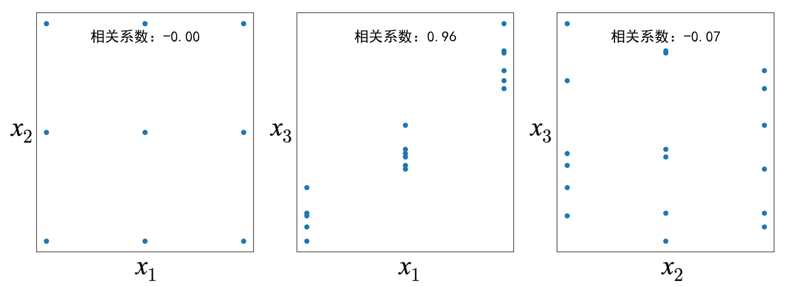
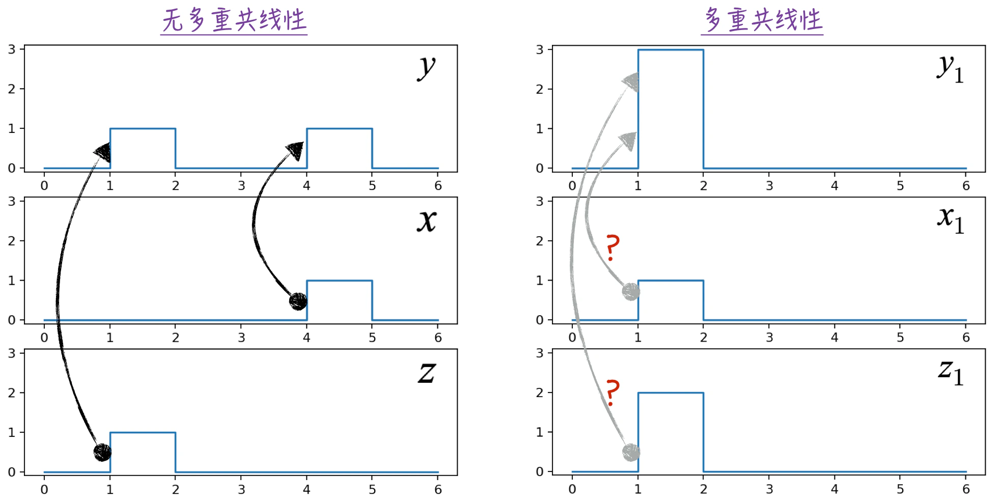
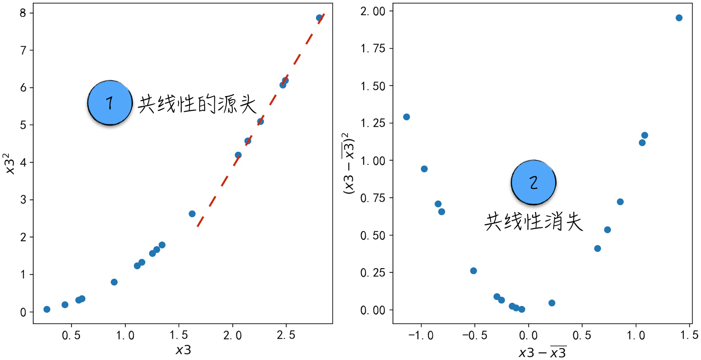

## 5.4 多重共线性：多变量的烦恼

多重共线性（Multicollinearity 或 Collinearity）源自对线性回归模型的深入研究。它是指在多变量线性模型中，特征之间存在高度相关关系，这会导致模型参数的估计不准确。虽然多重共线性最初是针对线性模型的，但实际上几乎所有模型都会受它的影响（具体原因将在 [5.4.1 节](/books/deconstructing_LLM/chapter-5/5-4#section-5-4-1)中讨论）。这个问题很常见，因此在搭建其他模型时，也常常利用线性模型的分析工具来检测和处理特征之间存在的多重共线性问题。本节内容将主要聚焦于线性回归模型。

### 5.4.1 多重共线性效应

下面通过一个人造的例子来说明多重共线性对参数估计的影响。假设数据集中包含 1 个标签变量 $y$ 和 3 个特征变量 $x_1,x_2,x_3$。标签和特征之间的关系如公式（5-7）所示，其中，$\varepsilon$ 是随机扰动项。当然，在搭建模型时，并不知道这个公式。

$$
y=0.7x_1-1.1x_2+0.3x_3+\varepsilon
\tag{5-7}
$$

在这个数据集中，变量 $x_1$ 和 $x_2$ 不相关，它们的相关系数等于 0；变量 $x_1$ 和 $x_3$ 高度相关，相关系数[^pearson]等于 0.958（约为 0.96），具体如图 5-11 所示。

首先，使用不相关的变量 $x_1$ 和 $x_2$ 搭建 3 个不同的线性回归模型。这些模型的具体形式如公式（5-8）所示。

$$
\begin{aligned}
y&=a_1x_1+b+\varepsilon\\
y&=a_2x_2+b+\varepsilon\\
y&=a_1x_1+a_2x_2+b+\varepsilon
\end{aligned}
\tag{5-8}
$$

各模型的参数估计结果列举在表 5-1 中（[完整代码](https://github.com/GenTang/regression2chatgpt/blob/zh/ch05_econometrics/multicollinearity.ipynb)）。

表 5-1

| 模型 | $a_1$ 估计值 | $a_1$ 标准差 | $a_1$ 是否显著（5%） | $a_2$ 估计值 | $a_2$ 标准差 | $a_2$ 是否显著（5%） |
|:--:|:--:|:--:|:--:|:--:|:--:|:--:|
| 只有 $x_1$ | 0.972 | 0.279 | 是 | — | — | — |
| 只有 $x_2$ | — | — | — | -1.113 | 0.244 | 是 |
| $x_1$ 和 $x_2$ | 0.972 | 0.021 | 是 | -1.113 | 0.021 | 是 |

根据表 5-1，可以得到如下结论。

1. 模型参数 $a_1$ 的估计值始终保持不变，不管是否加入新变量 $x_2$。这一结论也适用于模型参数 $a_2$。
2. 当引入新变量 $x_2$ 后，模型参数 $a_1$ 的估计值的标准差（准确的说法是参数估计值的标准差估计值）减小了，模型参数 $a_2$ 也是如此。简言之，引入新的不相关变量后，原有变量估计值的标准差减少了。需要注意的是，尽管这个结论在大多数情况下成立，但在某些情况下，即使原有的某个变量与新引入的变量没有关系，其估计值的标准差也会增加。然而，在数学上可以证明，标准差的增加程度微乎其微，具体细节超出了本书的讨论范围。
3. 探讨参数估计值的标准差是为了评估变量的显著性。根据第 2 点中的结论，引入不相关的新变量通常不会影响原有变量的显著性，尽管在极端情况下可能有例外。

综上所述，当多个变量相互不相关时，使用这些变量一同构建模型是“安全”的。对于这些变量中的任意一个，模型中使用它或不使用它都不会影响其他变量的参数估计。这是模型搭建时的理想情形（这其实也是线性回归模型的假设之一：自变量间不存在多重共线性）。

然而，如果变量之间存在强相关关系，情况将会有所不同。为了研究这一问题，使用高度相关的 $x_1$ 和 $x_3$ 构建一组模型，具体形式如公式（5-9）所示。

$$
\begin{aligned}
y&=a_1x_1+b+\varepsilon\\
y&=a_3x_3+b+\varepsilon\\
y&=a_1x_1+a_3x_3+b+\varepsilon
\end{aligned}
\tag{5-9}
$$

这些模型的结果如表 5-2 所示。

表 5-2

| 模型 | $a_1$ 估计值 | $a_1$ 标准差 | $a_1$ 是否显著（5%） | $a_3$ 估计值 | $a_3$ 标准差 | $a_3$ 是否显著（5%） |
|:--:|:--:|:--:|:--:|:--:|:--:|:--:|
| 只有 $x_1$ | 0.972 | 0.279 | 是 | — | — | — |
| 只有 $x_3$ | — | — | — | 1.090 | 0.282 | 是 |
| $x_1$ 和 $x_3$ | -0.168 | 0.959 | 否 | 1.260 | 1.017 | 否 |

表 5-2 中的结果与之前的结论有很大差异，具体如下。

1. 模型参数 $a_1$ 的估计值不仅与变量 $x_1$ 相关，还取决于模型中是否包含变量 $x_3$。当加入新变量 $x_3$ 后，$a_1$ 的估计值从比较准确的 0.972 变成了偏离较大的 -0.168。
2. 加入新变量 $x_3$ 后，模型参数 $a_1$ 的标准差估计值也大幅增加，从原来的 0.279 变为 0.959。这意味着加入新的高度相关变量后，原有变量的标准差增大了。当然，这个结论也有例外情况。
3. 原本模型参数 $a_1$ 是显著的，但加入变量 $x_3$ 后，$a_1$ 变得不再显著。这个结论很大程度上是第 2 点的推论。

到目前为止，已经讨论了多重共线性对线性回归模型的影响：它会使模型参数的估计值变得不准确[^unbiased]。

如果摒弃具体模型结构，可以用更为直观的方式（但并不精确）来理解多重共线性的影响。无论模型类型如何，变量的参数表示变量对标签变量的影响。当模型中的变量彼此不相关或相关性较低时，模型可以较为轻松地推断出标签变量的变化来源于哪个变量。如图 5-12 左侧所示，当 $x$ 和 $z$ 各自变化时，$y$ 与这两个变量的关系相对明确，相应的模型参数也能准确地估计。但是，如果模型中存在两个或多个强相关的变量，由于这些变量总是同时变动，模型很难单独分辨出标签变量的变化来源于哪个变量。如图 5-12 右侧所示，如果 $x_1$ 和 $z_1$ 彼此相关、同时变动，就难以准确确定 $y_1$ 与它们之间的关系。因此，多重共线性会影响参数估计的准确性，这一点对所有模型都成立。

### 5.4.2 检测多重共线性

本节将探讨如何检测变量之间是否存在共线性问题。当涉及两个变量时，通常使用相关性指标进行评估；对于多个变量，共线性的检测通常基于线性模型的假设检验以及方差膨胀因子（Variance Inflation Factor）进行分析。

在进行两个变量的检测时，根据变量类型的不同，可以将其分为 3 种情况。

1. **定量变量间的检测**：使用相关系数和对应的 P-value。通常采用皮尔逊积矩相关系数（Pearson Correlation）或斯皮尔曼等级相关系数（Spearman Correlation）[^spearman]。这些系数的范围在 $[-1,1]$ 之间，接近 0 表示两变量几乎相互独立，接近 1 表示正相关，接近 -1 表示负相关。若相关系数明显不等于 0（参考 P-value 进行判断），则存在共线性问题。
2. **定性变量间的检测**：采用卡方检验中的卡方统计量和相应的 P-value。具体细节请参考 [5.3.2 节](/books/deconstructing_LLM/chapter-5/5-3#section-5-3-2)。
3. **同时包含定量变量 $A$ 和定性变量 $B$ 的检测**：使用 one-way ANOVA 分析[^anova-code]中的 $\eta^2$。one-way ANOVA 是一种假设检验技术，常用于检验多组数据均值是否显著不同。具体来说，将定量变量 $A$ 作为标签变量、定性变量 $B$ 作为特征，构建线性回归模型，并进行 one-way ANOVA 分析。指标 $\eta^2$ 表示变量 $A$ 中可由变量 $B$ 解释[^eta-square]的比例。该指标接近 1 时，表明两变量之间存在共线性问题。

针对多个变量之间的共线性问题，主要有两种常用的检测方法：假设检验和方差膨胀因子。

假设检验的思路是：当某几个变量分别不显著，但它们联合起来却又显著时，这意味着这几个变量之间存在多重共线性问题。有关假设检验的技术细节，前面的章节已有详细讨论，这里不再赘述。

接下来重点讨论方差膨胀因子。传统上，该指标用于衡量模型参数估计值的方差膨胀情况。为了解释这一点，以如下的线性回归模型为例：

$$
y=\beta_0+\beta_1x_1+\cdots+\beta_kx_k+\varepsilon
\tag{5-10}
$$

其中，$\varepsilon$ 的方差是 $\sigma^2$。以参数 $\beta_1$ 为例（其他参数类似），根据数学推导，其估计值的估计方差记为 $\widehat{\operatorname{Var}}(\hat\beta_1)$，公式如下：

$$
\widehat{\operatorname{Var}}(\hat\beta_1)=\frac{\sigma^2}{\operatorname{Var}(x_1)}\frac{1}{1-R_1^2}
\tag{5-11}
$$

公式（5-11）中的 $R_1^2$ 是决定系数，对应的线性回归模型是公式（5-12）。

$$
x_1=\alpha_0+\alpha_2x_2+\cdots+\alpha_kx_k+e
\tag{5-12}
$$

正如[第 3 章](/books/deconstructing_LLM/chapter-3)所述，线性模型的决定系数是用来评估模型解释能力的指标。决定系数 $R_1^2$ 越接近 1，说明模型的拟合效果越好。这也意味着变量 $x_1$ 的变化几乎可以被其他变量完全解释。换句话说，数据中存在严重的多重共线性问题，而且 $x_1$ 是引起共线性问题的变量之一。反之，若 $R_1^2$ 接近 0，则表示在模型里加入 $x_1$ 不会引起共线性问题。

于是针对 $x_i$，按公式（5-13）定义它的方差膨胀因子 $\operatorname{VIF}_i$。通常，当方差膨胀因子大于 5 时，可以确定相应的变量存在明显的共线性问题。这个检测方法的核心思想是观察某个变量在多大程度上能够由其他变量线性表示。

$$
\operatorname{VIF}_i=\frac{1}{1-R_i^2}
\tag{5-13}
$$

以上是检测多重共线性问题的常用方法。通过这些方法，可以对 [5.4.1 节](/books/deconstructing_LLM/chapter-5/5-4#section-5-4-1)中的数据进行检测，并得出合理的结论，具体实现请参考随书配套代码（[完整代码](https://github.com/GenTang/regression2chatgpt/blob/zh/ch05_econometrics/multicollinearity.ipynb)）。如果检测到数据中存在这样的问题，那应该如何解决它呢？这是下一节将探讨的内容。

### 5.4.3 解决方法

为了更便于探讨，本节将延续 [5.4.1 节](/books/deconstructing_LLM/chapter-5/5-4#section-5-4-1)中使用的数据集。在探讨具体解决方法之前，首先对导致多重共线性的原因进行分类。这些原因可以分为两类：数据导致的共线性和结构性共线性。前面的章节主要讨论了数据导致的共线性，这也是最常见的一种。而结构性共线性是指由特征提取引起的共线性。例如，基于变量 $x_3$ 生成新的变量 $x_3^2$，$x_3$ 和 $x_3^2$ 之间很容易引发共线性问题。针对这两类问题，各自存在相应的解决方法。

源于数据的多重共线性是一个复杂的问题，没有通用的解决方案。对此需要根据具体场景进行具体分析。以下简要介绍 5 种常用的解决方法。

1. **增加训练数据**

   增加训练数据是解决多重共线性问题最有效也最无效的方法。多重共线性对线性模型的影响在于增加参数估计的方差，导致估计值不稳定。通过增加训练数据，可以使参数估计变得更为稳定（这一结论对其他模型也成立），这是解决多重共线性问题最为有效的方法。

   然而，增加训练数据受到很多实际因素的限制，例如数据收集成本等。有时候，获取更多数据几乎是不可能的。而且增加训练数据超出了模型搭建的范畴，更像是商业或经济问题。从这个层面来看，它可能是最无效的解决方法。

2. **去掉不重要的变量**

   如果数据集中存在高度相关的变量，例如 $x_1$ 和 $x_3$，可以考虑在模型中去掉其中一个变量，比如 $x_3$，以消除共线性问题。然而，这种做法存在一定风险，因为去掉变量会导致信息损失。同时，难以确定哪个变量更为重要，可能导致错误地删除了重要变量。

3. **数据降维**

   如果数据中存在共线性问题，可以在原始变量的基础上生成较少的新特征，用这些新特征进行建模。比如根据 $x_1$ 和 $x_3$ 生成新变量 $x_4$，然后利用 $x_4$ 搭建模型。在新特征的生成过程中，需要尽可能保留原始变量的信息，这可以通过数据降维来实现。主成分分析（Principal Component Analysis，PCA）是其中最常见的算法之一。

4. **加入惩罚项**

   如果只针对线性回归模型，可以通过加入惩罚项来消除共线性带来的影响。具体地，在线性回归模型中加入 L2 惩罚项（即 Ridge 回归）能比较有效地解决共线性问题，相关代码可参考第 [4.3.2 节](/books/deconstructing_LLM/chapter-4/4-3#section-4-3-2)。

5. **鸵鸟政策（Ostrich Policy）**[^ostrich]

   简而言之，鸵鸟政策就是对共线性问题视而不见。尽管这并不是一个解决问题的方法，但在某些情况下是合理的。例如，对于已知数据，模型的预测几乎不受共线性影响。因此，在这种情况下，忽略共线性问题是可以接受的。

如果遇到结构性共线性，除了前面提到的 5 种解决方法之外，还有一种更工程化的方法：变量归一化。举例说明，考虑 $x_3$ 和 $x_3^2$。如图 5-13 中标记 1 所示，在远离原点的地方，$x_3$ 和 $x_3^2$ 几乎呈一条直线，这就是结构性共线性的来源。解决方法是让变量的值尽量靠近原点，如图 5-13 中标记 2 所示。

因此，对变量进行归一化操作，即用 $(x_3-\bar x_3)/\operatorname{std}(x_3)$ 替代 $x_3$，用 $(x_3-\bar x_3)^2/\operatorname{Var}(x_3)$ 替代 $x_3^2$。稍加注意可以得到，变量 $(x_3-\bar x_3)/\operatorname{std}(x_3)$ 的方差等于 1，这也是该方法被称为变量归一化的原因。经过归一化后，变量更加集中于原点附近。此外，每个变量的变化范围大致相同，这有利于模型参数的估算[^normalization]。因此，在实际建模过程中，无论是否存在多重共线性问题，通常都会对变量进行归一化处理。

### 5.4.4 虚拟变量陷阱

本节将焦点重新放到定性特征上，讨论一种由它带来的多重共线性。如先前在 [5.2.1 节](/books/deconstructing_LLM/chapter-5/5-2#section-5-2-1)所讨论的，在处理多维度的定性特征时，需要将其转换为多个虚拟变量。若处理不当，这些虚拟变量之间很容易产生共线性问题，也就是所谓的虚拟变量陷阱（Dummy Variable Trap）。

针对虚拟变量陷阱，先前已经探讨了一个简单情形。简单回顾一下，对于一个有 $n$ 个类别的定性特征，若将其转换为 $n$ 个虚拟变量，因为这些虚拟变量之和总是等于 1，所以同时使用它们必然导致严重的共线性问题。实际上，这很可能使模型参数无法估计。为了解决这个问题，通常从定性变量的 $n$ 个类别中选择一个作为基准类别，然后将 $n$ 维定性变量转换为 $n-1$ 个虚拟变量。

这种方法似乎解决了问题，但如果基准类别的选择不合理，生成的虚拟变量仍然可能存在严重的共线性问题。简单来说，如果选择的基准类别占比较少，那么在大多数情况下，数据不属于基准类别，因此生成的虚拟变量之和等于 1。虽然不是总是等于 1，但大部分情况下等于 1 仍会导致严重的共线性问题。

解决这个问题有一个简单而有效的方法：对于一个有 $n$ 个类别的定性特征，选择占比最大的类别作为基准类别，并生成 $n-1$ 个虚拟变量以代表其余类别。然而，这种方法并非始终有效。如果特征对应的类别特别多，且类别分布较均匀（比如自然语言处理中的文字或单词），无论选择哪个类别作为基准，都可能导致严重的共线性问题。在这种情况下，只能探索减少类别数量，或者利用神经网络等方法将定性特征转化为定量特征。

[^pearson]: 这里的相关系数是指皮尔逊积矩相关系数（Pearson Product-Moment Correlation Coefficient）。它常用于度量两个变量 $X$ 和 $Y$ 之间的线性相关性，取值为 -1～1。1 表示完全正相关，-1 表示完全负相关。其定义为 $\rho_{X,Y}=\operatorname{Cov}(X,Y)/(\sigma_X\sigma_Y)$。
[^unbiased]: 这个结论在学术上并不十分严谨。在多重共线性下，线性回归模型的参数估计值实际上是无偏的，即估计值的期望仍然等于真实值。然而，由于估计值的标准差增大，在绝大多数情况下，具体的估计值会偏离真实值较远。基于这一点，可以说多重共线性导致参数估计值不准确。此外，针对已知数据（训练数据），多重共线性并不会影响模型效果。
[^spearman]: 斯皮尔曼等级相关系数（Spearman's Rank Correlation Coefficient）是统计中常用的相关性指标。它利用单调关系评价两个统计变量的相关性，取值为 -1～1。如果数据中没有重复值，并且两个变量完全单调相关，斯皮尔曼相关系数为 1 或 -1。
[^anova-code]: ANOVA（Analysis of Variance，方差分析）是数据分析中常见的统计模型，主要用于探讨连续型变量与类别型变量之间的关系。相关实现请参考 [one_way_anova.ipynb](https://github.com/GenTang/regression2chatgpt/blob/zh/ch05_econometrics/one_way_anova.ipynb)。
[^eta-square]: 假设定性变量 $B$ 有 $k$ 个类别，于是将定量变量 $A$ 按 $B$ 的取值分为 $k$ 组。$A$ 的方差 $SS_{\mathrm{total}}$ 可以分解为组间方差 $SS_{\mathrm{between}}$ 和组内方差 $SS_{\mathrm{within}}$，并定义 $\eta^2=SS_{\mathrm{between}}/SS_{\mathrm{total}}$。$\eta^2$ 的取值介于 0 与 1 之间。当它等于 1 时，表示在一个组内 $A$ 恒等于某个值，即 $A$ 的取值完全由 $B$ 的取值决定。
[^ostrich]: 根据维基百科的记载，当鸵鸟遇到危险时，会闭上眼睛，把头埋进土里。当鸵鸟看不到危险时，就相信危险不存在，但其身体仍然暴露在外面。因此，鸵鸟政策指面对危险时采取放任态度。
[^normalization]: 相关细节请参考 [6.2.1 节](/books/deconstructing_LLM/chapter-6/6-2#section-6-2-1)。
