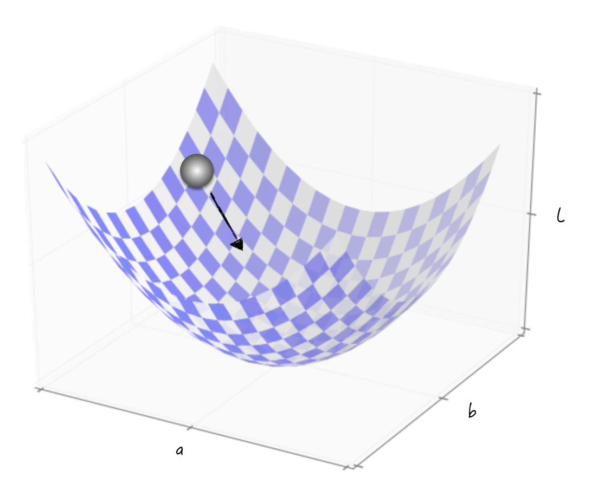

## 6.1 算法思路：模拟滚动

抽离特定背景，从数学的角度来看，无论是在监督学习还是无监督学习中，每个模型都涉及一个与之相关的损失函数，这个损失函数内含若干未知的模型参数。以回归问题为例，线性回归模型对应的损失函数如公式（6-1）所示，其中 $\boldsymbol{X}_i=(x_{i,1},x_{i,2},\cdots,x_{i,k},1)$ 表示自变量向量，1 表示常数变量，$\boldsymbol{\beta}=(a_1,a_2,\cdots,a_k,a_{k+1})^{\mathrm T}$ 表示未知的模型参数。

$$
L=\frac{1}{n}\sum_{i=1}^{n}\left(y_i-\boldsymbol{X}_i\boldsymbol{\beta}\right)^2
\tag{6-1}
$$

又比如针对分类问题，逻辑回归模型对应的损失函数如公式（6-2）所示，其中 $y_i\in\{0,1\}$ 表示数据的类别。

$$
\begin{aligned}
h(\boldsymbol{X}_i)&=\frac{1}{1+e^{-\boldsymbol{X}_i\boldsymbol{\beta}}}\\
L&=-\frac{1}{n}\sum_{i=1}^{n}\left[y_i\ln h(\boldsymbol{X}_i)+(1-y_i)\ln\left(1-h(\boldsymbol{X}_i)\right)\right]
\end{aligned}
\tag{6-2}
$$

公式（6-1）是基于欧氏距离的损失函数，在回归问题里很常用。公式（6-2）的定义基于概率分布，是分类问题常用的损失函数，在学术上被称为交叉熵。

不论损失函数的具体形式如何，它的函数值都对应着模型的预测误差，因此这个值越小越好。仔细分析损失函数后会发现，由于模型使用的数据都是给定的，它的函数值完全取决于模型的未知参数。以公式（6-1）和公式（6-2）为例，公式中的 $\boldsymbol{X}_i,y_i$ 是不变的，$L$ 的取值完全取决于参数 $\boldsymbol{\beta}$。由此可以得到未知参数的估计原则：使得损失函数达到最小值。

下面来看看如何求一个损失函数的最小值。为了表述方便，假设损失函数为 $L(a,b)=1/n\sum_{i=1}^{n}(y_i-ax_i-b)^2$。数学功底深厚的读者或许会注意到，对于这个损失函数，可以通过解析方法迅速得到参数估计值的解析表达式[^least-squares]，从而得到具体的估计结果。这种情况在某些特定情况下的确成立，但这只是一种特例。在现实世界的数据和问题中，损失函数通常具有复杂的形式和结构，我们无法轻易地通过代数方法获得参数估计的解析解。逻辑回归就是一个典型的例子。为了应对这样的情况，需要一种普适性强、适用于各种复杂函数的方法。

换个角度来思考这个问题。$L$ 的函数图像如图 6-1 所示，可以把它想象成一个炒菜的圆底锅。在圆底锅的边上轻轻放下一颗鸡蛋，根据生活经验，无论圆底锅的形状如何，也无论鸡蛋的初始位置在哪里，鸡蛋都会最终滚动到锅的底部。同理，在求解函数的最小值时，可以采用类似的思路：从一个随机选择的起始点出发，然后模拟鸡蛋滚动的过程，逐步改变点的位置，直到达到函数图像的最低点。这个最低点的位置就是我们要找的参数的估计值。

在数学上，可以借助函数的导数来实现这种模拟。导数可以揭示函数局部范围内的图像特性，从而告诉我们“鸡蛋”应该滚向哪个方向[^other-optimizers]。

在学术上，这个方法被称为梯度下降法（Gradient Descent），下面将讨论这个算法的细节。

[^least-squares]: 对于一个处处可导的函数，函数最值的必要条件是导数值等于 0，即 $\partial L/\partial a=0,\partial L/\partial b=0$。这两个公式对应的线性方程组刚好能解出参数估计值的表达式：$\hat a=\frac{\sum_i(x_i-\bar x)(y_i-\bar y)}{\sum_i(x_i-\bar x)^2}$，$\hat b=\bar y-\hat a\bar x$。这组公式也被称为最小二乘法。
[^other-optimizers]: 图 6-1 参考自 *Neural Networks and Deep Learning*。还有其他不同的求解最优化问题的方法，这些方法大多源自模拟生活中的某个过程。比如模拟生物繁殖，得到遗传算法；模拟钢铁冶炼的冷却过程，得到退火法。但这些算法都是工程实现方面的算法，跟正文中介绍的模型是两个不同的概念。比如对于线性回归模型，既可以用传统的梯度下降法求解，也可以用遗传算法得到参数的估计值。
