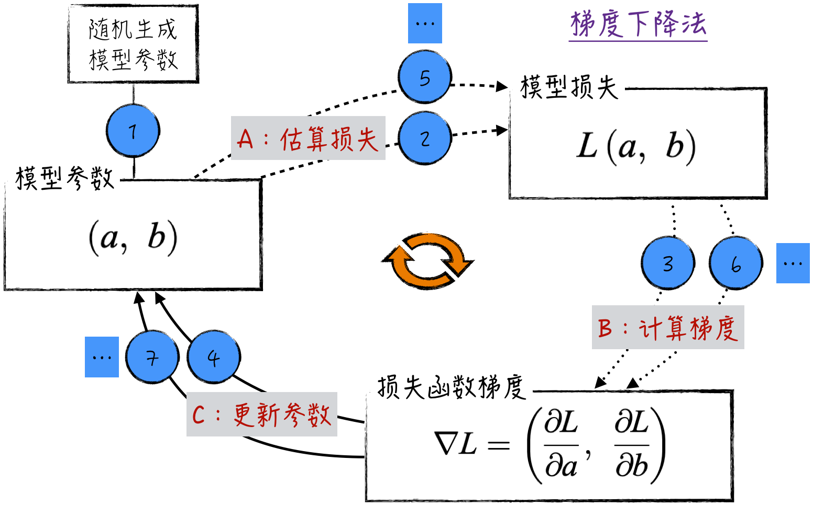
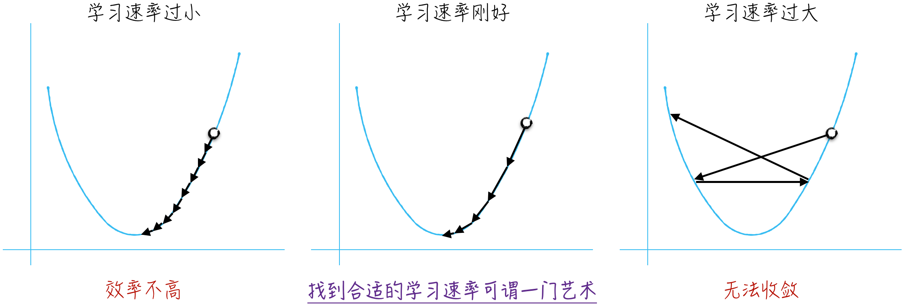
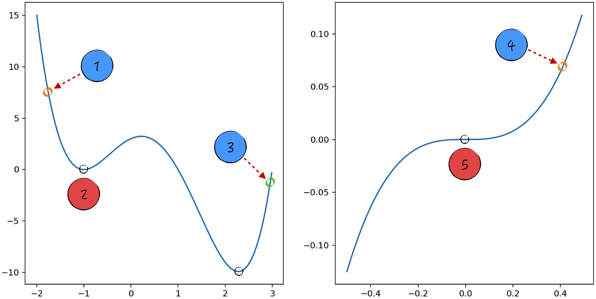

## 6.2 梯度下降法

针对损失函数 $L$，假设选取的初始点为 $a_0,b_0$；现在将这两个点稍稍移动一点，得到 $a_1,b_1$。根据泰勒级数（Taylor Series）[^taylor-series]，暂时只考虑一阶导数[^higher-order]，可以得到公式（6-3），其中 $\Delta a=a_1-a_0,\Delta b=b_1-b_0$。

$$
\Delta L=L(a_1,b_1)-L(a_0,b_0)\approx\frac{\partial L}{\partial a}\Delta a+\frac{\partial L}{\partial b}\Delta b
\tag{6-3}
$$

如果令

$$
(\Delta a,\Delta b)=-\eta\left(\frac{\partial L}{\partial a},\frac{\partial L}{\partial b}\right)
\tag{6-4}
$$

其中 $\eta>0$，可以得到 $\Delta L\approx-\eta[(\partial L/\partial a)^2+(\partial L/\partial b)^2]\leq0$。这说明如果按公式（6-4）移动参数，损失函数的函数值始终是下降的，这正是我们想要达到的效果。如果一直重复这种移动，数学上可以证明，损失函数能最终得到它的最小值，整个过程就像鸡蛋在圆底锅里滚动一样，于是可以得到参数的迭代公式，见公式（6-5）。

$$
\begin{aligned}
a_{k+1}&=a_k-\eta\frac{\partial L}{\partial a}\\
b_{k+1}&=b_k-\eta\frac{\partial L}{\partial b}
\end{aligned}
\tag{6-5}
$$

也可以换一个类比角度来理解梯度下降法的核心思想。想象你站在一个山坡上，目标是要找到最低的山谷。公式（6-5）就如同导航，在山坡上指引着你下山的方向。如果地势是向下的（损失函数的偏导数 $\partial L/\partial a<0$），那么你会朝着这个方向迈出一步；相反，如果地势是向上的（$\partial L/\partial a>0$），那么你会退回一步，避免走向更高的地方。

在数学上，向量 $\nabla L=(\partial L/\partial a,\partial L/\partial b)$ 被称为损失函数 $L$ 的梯度。这也是公式（6-5）表示的算法被称为梯度下降法的原因。同时可以证明，函数的梯度正好是函数值下降得最快的方向，因此梯度下降法也是最高效的“下降”方式。

综上，可以将梯度下降法的主要算法归纳为三步：根据当前参数和训练数据计算模型损失；计算当前的损失函数梯度；利用梯度，迭代更新模型参数，如图 6-2 所示。

需要强调的是，从严谨的数学角度来看，多元可微函数 $L$ 在点 $P$ 上的梯度，实际上是由 $L$ 在点 $P$ 上各个变量的偏导数构成的向量。然而在人工智能领域，尤其是神经网络领域，为了简化表达，我们通常会用“变量的梯度”[^variable-gradient]这一术语来指代该变量在特定情况下的偏导数或者对偏导数的估计值。

### 6.2.1 算法使用的窍门

公式（6-5）中的参数 $\eta>0$ 控制着参数更新的强度。在学术上，$\eta$ 被称为学习速率（Learning Rate），是模型训练过程中一个很重要的超参数，能直接影响算法的正确性和效率，如图 6-3 所示。

- 一方面，参数 $\eta$ 不能太大。从数学角度来讲，公式（6-3）是一阶泰勒展开，它是一个近似公式，只在学习速率很小，也就是 $\Delta a,\Delta b$ 很小时才近似成立。从直观上来讲，如果每次移动的步伐过大，容易发生来回摇摆的现象，无法到达最低点，影响算法的准确性。
- 另一方面，参数 $\eta$ 也不宜过小。如果它的值太小，会导致每次迭代时参数几乎不变，使算法的效率降低，需要很长时间才能到达最低点。

在人工智能领域，选择适当的学习速率[^learning-rate]是一项既具有艺术性，又深受学术关注的技能，众多优化算法和工程技巧在此领域崭露头角。在 11.5.1 节中，会结合具体场景继续探讨这个问题。

如公式（6-5）所示，在梯度下降法的迭代公式中，算法使用相同的学习速率来迭代更新不同的参数。然而，当损失函数对不同参数的偏导数存在显著差异时，可能会导致参数的收敛速度差异明显。这意味着一些参数可能会迅速向最优值收敛，而其他参数则可能变得较为缓慢。这种情况会对优化过程产生不利影响。举个简单的例子，考虑损失函数 $L(a,b)=1/n\sum_{i=1}^{n}(y_i-ax_i-b)^2$，可以计算出这个函数的梯度为

$$
\begin{aligned}
\frac{\partial L}{\partial a}&=-\frac{2}{n}\sum_{i=1}^{n}x_i(y_i-ax_i-b)\\
\frac{\partial L}{\partial b}&=-\frac{2}{n}\sum_{i=1}^{n}(y_i-ax_i-b)
\end{aligned}
\tag{6-6}
$$

假设变量 $x_i$ 的绝对值较大（变化幅度较大），那么 $\partial L/\partial a$ 的绝对值就将远远大于 $\partial L/\partial b$。这会导致相同的学习速率，对参数 $a$ 而言过大，而对参数 $b$ 而言又过小，从而影响算法的效果。

为了应对这一问题，可以采用变量归一化处理的策略，在一定程度上解决收敛速度差异的问题。通过对变量进行归一化，将不同变量的取值范围映射到相似的尺度上，使损失函数在各个参数方向的变化更均匀。这有助于在优化过程中，不同参数的更新步幅保持相对平衡，进而提升参数的收敛效率。

### 6.2.2 算法的局限性：局部最优与鞍点

梯度下降法虽然在优化模型参数时非常有用，但它也存在一个明显的限制。理论上，梯度下降法只能确保到达局部最低点或者鞍点，无法保证到达全局最低点。

- 如图 6-4 左侧部分所示，从位置 1 出发，算法更可能停留在位置 2（局部最低点），而不是全局最低点。
- 如图 6-4 右侧部分所示，从位置 4 出发，算法可能会停留在位置 5（鞍点），即使算法没有停留在鞍点，也可能在位置 5 附近长时间徘徊，因为附近的梯度接近于 0。这种情况会导致模型训练变得非常漫长，并且容易引起误解，导致我们错误地提前终止训练。

如果选择位置 3 作为起点，算法就能顺利到达最低点。这启发我们在使用梯度下降法时，可以通过多次尝试不同的起点来规避算法的局限性。举例来说，针对损失函数 $L(a,b)$，可以随机生成多组初始参数集，即多组 $a_0,b_0$，然后对每组初始参数集分别应用梯度下降法，直至函数值收敛到某个稳定值。最后，从这些收敛值中找出最小值，将其视为函数的最小值。

尽管这种方法在一定程度上解决了局部最优和鞍点问题，但它也存在明显的缺点：计算成本极高，因为需要在不同的起点上反复运行梯度下降法。对于相对简单的模型或小型数据集，这种策略可能还能接受。然而，在人工智能领域中，模型的规模不断增大，例如大语言模型通常包含数十亿甚至上百亿个参数，即使单次训练也需要大量时间和资源，这样的操作显然就不切实际了。

因此，我们需要改进梯度下降法，提高其运行效率。在众多优化算法中，最基础的是随机梯度下降法。这种方法在梯度计算过程中引入了一定的随机性，使模型更有可能避开局部最低点和鞍点的限制。[6.4 节](/books/deconstructing_LLM/chapter-6/6-4)将讨论随机梯度下降法及其各种变体。

[^taylor-series]: 回顾一下泰勒一阶展开式。假设 $f(x_1,x_2,\cdots,x_n)$ 是一个一阶可导的函数，则在 $\boldsymbol{x}$ 很靠近 $\boldsymbol{a}$ 时，有 $f(\boldsymbol{x})\approx f(\boldsymbol{a})+\sum_{i=1}^{n}\frac{\partial f(\boldsymbol{a})}{\partial x_i}(x_i-a_i)$。但是当 $\boldsymbol{x}$ 离 $\boldsymbol{a}$ 较远时，上述近似关系的误差就很大了。
[^higher-order]: 如果考虑多阶导数，可以得到其他的最优化问题求解算法，比如使用二阶导数的共轭梯度法（Conjugate Gradient Method）等。这些算法对于特定问题可以更快地得到收敛解，但它们对损失函数的要求更多，计算复杂度也更高，并不适合神经网络和分布式机器学习，所以这里不做深入探讨。
[^variable-gradient]: 这一概念在实际应用中非常重要，因为在优化算法中，需要计算或者估计损失函数关于某个参数的偏导数，以指导这个参数的更新。然而，若要准确地计算梯度，就需要对多元函数的每个偏导数进行计算，这让准确的数学表述变得非常烦琐。因此，通过使用“变量的梯度”这一术语，能够使表达更简洁，并在实际操作中更加便利地进行参数更新和优化。
[^learning-rate]: 在实际应用中，确定适当的学习速率可以确保学习速率与梯度的乘积在合适的范围内。这意味着需要动态调整的不仅是学习速率，还有参数的梯度。
