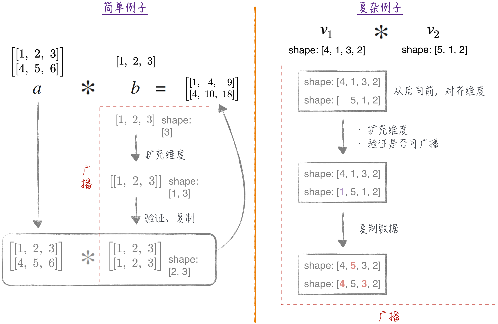
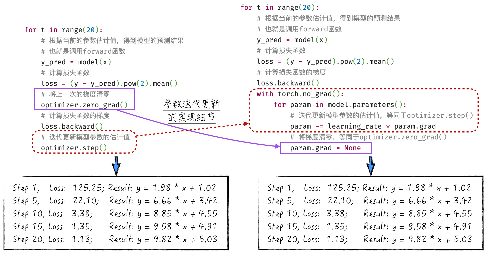

## 6.3 梯度下降法的代码实现

Python 作为一种高级编程语言，以其易理解、易编写的特性受到广泛欢迎，然而其计算速度相对较慢，因此在处理大量数值计算时显得不太高效。在实际生产中，为了提高计算速度，通常不会直接使用 Python 从零开始实现高效的最优化算法，而常常采用另一种策略来兼顾 Python 的易用性和数值计算的高效性。使用底层编程语言（如 C 或 C++）来实现高效的数值运算，然后将这些底层函数封装成 Python 的对象，以便用户能够轻松地通过 Python 与这些底层函数进行交互。

[3.2.1 节](/books/deconstructing_LLM/chapter-3/3-2#section-3-2-1)中提到的 NumPy 便是这一策略的典型代表。接下来介绍的 PyTorch 也采用了类似的运行架构。站在这些工具的“肩膀”上，实现最优化算法就变得简单许多。下面将展示如何在 PyTorch 的基础上实现梯度下降法，以训练线性回归模型。

### 6.3.1 PyTorch 基础

工欲善其事，必先利其器。在讨论如何实现梯度下降法之前，首先探讨一下 PyTorch 这个强大的工具。PyTorch 是一种备受欢迎的开源机器学习框架，被广泛用于构建、训练和部署神经网络模型，因具有灵活性、动态计算图和卓越的 GPU 支持而成为神经网络领域的首选。

PyTorch 的基础数据结构是张量（其数学基础可参考 [2.1 节](/books/deconstructing_LLM/chapter-2/2-1)）。张量的创建方式如程序清单 6-1 所示。

#### 程序清单 6-1 张量的创建（[完整代码](https://github.com/GenTang/regression2chatgpt/blob/zh/ch06_optimizer/pytorch_tutorial.ipynb)）

```python
# 使用 tensor 封装的函数创建 tensor
zeros = torch.zeros(2, 3)
tensor([[0., 0., 0.],
        [0., 0., 0.]])

ones = torch.ones(2, 3)
tensor([[1., 1., 1.],
        [1., 1., 1.]])

torch.manual_seed(1024)
random = torch.rand(3, 4)
tensor([[0.8090, 0.7935, 0.2099, 0.9279],
        [0.8136, 0.7422, 0.4769, 0.4955],
        [0.3602, 0.1178, 0.7852, 0.0228]])

# 从 Python 对象创建
data = [[2, 3, 4], [1, 0, 1]]
t_data = torch.tensor(data)
tensor([[2, 3, 4],
        [1, 0, 1]])

## 从 NumPy 对象创建
import numpy as np

n_data = np.array(data)
tn_data = torch.from_numpy(n_data)
tensor([[2, 3, 4],
        [1, 0, 1]])

## NumPy bridge，也就是说对 NumPy 对象的改变会传导到 tensor
n_data += 1
torch.all(torch.from_numpy(n_data) == tn_data)
tensor(True)
```

正如 [2.1.6 节](/books/deconstructing_LLM/chapter-2/2-1#section-2-1-6)所讨论的，张量的形状（Shape）是至关重要的概念，它定义了张量的维度以及每个维度的大小。在实际应用中，可以通过使用一系列函数来改变张量的形状，使其适应不同的运算需求，如程序清单 6-2 所示。

#### 程序清单 6-2 改变张量的形状（[完整代码](https://github.com/GenTang/regression2chatgpt/blob/zh/ch06_optimizer/pytorch_tutorial.ipynb)）

```python
# 增加或减少数据的维度
a = torch.rand(3, 4)  # (3, 4)
## 增加维度
b = a.unsqueeze(0)    # (1, 3, 4)
## 减少维度
c = b.squeeze(0)      # (3, 4)
## 数据相同，但是维度不同
print(torch.all(c.eq(b)))   # tensor(True)
print(c.shape == b.shape)   # False

# 变换 tensor 形状
data = torch.tensor(range(0, 10))  # tensor([1, 2, 3, 4, 5, 6, 7, 8, 9])
view1 = data.view(2, 5)
tensor([[0, 1, 2, 3, 4],
        [5, 6, 7, 8, 9]])
transpose1 = view1.T
tensor([[0, 5],
        [1, 6],
        [2, 7],
        [3, 8],
        [4, 9]])
## 非毗邻存储的对象不能进行 view 操作
print(view1.is_contiguous(), transpose1.is_contiguous())
True False
## 下面的操作会报错
view2 = transpose1.view(1, 10)
```

1. 程序清单 6-2 的第 4～6 行使用 `unsqueeze` 和 `squeeze` 函数来增加或减少张量的维度。需要注意的是，这些操作并不会改变张量实际存储的数据，也不会在实质上改变张量的形状。相反，它们只是在张量的形状中添加或删除一个空的维度。具体的变化可以在第 8 行和第 9 行中看到。
2. 为了改变张量的形状，可以使用 `view` 函数，如第 12～15 行所示。但需要注意的是，`view` 函数只能用在毗邻存储的张量[^contiguous]对象上。非毗邻存储的张量只能使用 `reshape` 函数来改变形状。尽管这两个函数在功能上相似，但在计算效率上存在显著差异：相较于 `view` 函数，`reshape` 的计算开销要大得多。因此，在实际应用中，最好优先选择使用 `view` 函数。

张量的运算分为两种：逐元素操作（Element-Wise Operations）和矩阵乘法，这些计算方法在处理数据和构建神经网络模型时都具有重要作用。程序清单 6-3 中讨论了这些操作，并介绍了 PyTorch 中的广播机制（Broadcasting Semantics），它在处理不同形状的张量时起到了重要的作用。

#### 程序清单 6-3 张量的常见运算（[完整代码](https://github.com/GenTang/regression2chatgpt/blob/zh/ch06_optimizer/pytorch_tutorial.ipynb)）

```python
# 逐元素操作
twos = torch.ones(2, 2) * 2
tensor([[2., 2.],
        [2., 2.]])
powers = twos ** torch.tensor([[1, 2], [3, 4]])
tensor([[ 2.,  4.],
        [ 8., 16.]])

## tensor 广播，tensor broadcasting
a = torch.tensor(range(1, 7)).view(2, 3)
tensor([[1, 2, 3],
        [4, 5, 6]])
b = torch.tensor(range(1, 4)).view(3)
tensor([1, 2, 3])
print(a * b)
tensor([[ 1,  4,  9],
        [ 4, 10, 18]])
## 关于广播，更复杂的例子
a = torch.ones(4, 1, 3, 2)
b = a * torch.rand(5, 1, 2)
print(b.shape)
torch.Size([4, 5, 3, 2])

# 矩阵运算
mat1 = torch.randn(3, 4)       # (3, 4)
mat2 = torch.randn(4, 5)       # (4, 5)
re = mat1 @ mat2               # (3, 5)
## 矩阵运算的广播
mat1 = torch.randn(5, 1, 3, 4) # (5, 1, 3, 4)
mat2 = torch.randn(8, 4, 5)    # (8, 4, 5)
re = mat1 @ mat2               # (5, 8, 3, 5)
```

1. 逐元素操作要求进行运算的两个张量的形状必须相同，如程序清单 6-3 中的第 2～7 行所示。然而，在实际应用中，常常需要对形状不同的张量进行操作。为此，PyTorch 引入了广播机制，它允许在一定条件下对形状不同的张量进行逐元素操作，如第 9～22 行所示。
2. 广播机制的流程相对复杂，如图 6-5 所示，需要注意几个关键步骤。首先，从后向前逐个比较两个张量的维度；接着，对缺失的维度进行扩充（类似于 `unsqueeze` 函数的操作）；然后，检查广播规则，即两个张量的各分量要么相等，要么其中一个等于 1；最后，复制数据，实现广播操作。
3. 广播机制不仅适用于逐元素操作，它同样影响着张量的矩阵乘法。不同之处在于，当执行矩阵乘法时，广播机制只会作用于前面的维度，而不涉及最后两维，如第 29～31 行所示。



### 6.3.2 利用 PyTorch 的封装函数

本节将探索如何利用 PyTorch 提供的封装函数来实现梯度下降法。正如 [6.2 节](/books/deconstructing_LLM/chapter-6/6-2)中所讨论的，实现梯度下降法涉及 3 个关键步骤。

1. 根据当前参数和训练数据，计算模型损失。
2. 计算当前的损失函数梯度：利用模型定义的损失函数及训练数据，计算得到当前损失函数的梯度。需要注意的是，损失函数梯度的计算依赖于损失函数的数学表达式、用于梯度计算的训练数据，以及当前的参数估计值。这一步可以由 PyTorch 封装好的反向传播算法[^autograd]（Back Propagation，BP）来完成。
3. 利用梯度，更新模型参数：在计算得到损失函数的当前梯度后，利用这个梯度来迭代更新模型参数的估计值。这一步可以由 PyTorch 提供的优化算法函数（例如 `torch.optim.SGD`）来实现。

首先进行一些准备工作，包括生成训练所需的数据和定义模型的结构。尽管这部分代码相对简单，但仍需注意以下两点。

1. 在程序清单 6-4 的第 2～4 行，对变量 `x` 进行归一化处理。这一步的目的在于保证梯度下降法的稳定性。实际上，读者可以很容易地修改代码，不对 `x` 进行归一化处理，但会影响梯度下降法的稳定性，进而可能导致无法收敛的情况。在实际建模过程中，几乎会对每个变量进行归一化处理，以确保模型的稳健性和可靠性。
2. 在程序清单 6-4 的第 9～28 行，通过继承 `torch.nn.Module` 的方式来定义线性回归模型。在具体的实现中，需要重写两个核心函数：`__init__` 和 `forward`。`__init__` 函数定义了模型所需的参数及相应的初始值，`forward` 函数中描述了如何利用这些参数获得模型的预测结果[^forward]。

#### 程序清单 6-4 定义模型和产生训练数据（[完整代码](https://github.com/GenTang/regression2chatgpt/blob/zh/ch06_optimizer/gradient_descent.ipynb)）

```python
# 产生训练用的数据
x_origin = torch.linspace(100, 300, 200)
# 将变量 x 归一化，否则梯度下降法很容易不稳定
x = (x_origin - torch.mean(x_origin)) / torch.std(x_origin)
epsilon = torch.randn(x.shape)
y = 10 * x + 5 + epsilon

# 为了使用 PyTorch 的高层封装函数，通过继承 Module 类来定义函数
class Linear(torch.nn.Module):
    def __init__(self):
        """
        定义线性回归模型的参数：a, b
        """
        super().__init__()
        self.a = torch.nn.Parameter(torch.zeros(()))
        self.b = torch.nn.Parameter(torch.zeros(()))

    def forward(self, x):
        """
        根据当前的参数估计值，得到模型的预测结果
        参数
        ----
        x：torch.tensor，变量 x
        返回
        ----
        y_pred：torch.tensor，模型预测值
        """
        return self.a * x + self.b

    def string(self):
        """
        输出当前模型的结果
        """
        return f'y = {self.a.item():.2f} * x + {self.b.item():.2f}'
```

接下来，进入核心的算法实现阶段，如程序清单 6-5 所示，其中包括定义模型的损失函数、计算损失函数的梯度，以及计算迭代更新参数估计值。这些步骤相对固定，几乎适用于所有模型。或许第 14 行中的“将上一次的梯度清零”操作可能会引发一些读者的困惑。实际上，这行代码与反向传播算法的工作机制息息相关，第 7 章将对其进行详细的解释和讨论。

#### 程序清单 6-5 梯度下降法（[完整代码](https://github.com/GenTang/regression2chatgpt/blob/zh/ch06_optimizer/gradient_descent.ipynb)）

```python
# 定义模型
model = Linear()
# 确定最优化算法
learning_rate = 0.1
optimizer = torch.optim.SGD(model.parameters(), lr=learning_rate)

for t in range(20):
    # 根据当前的参数估计值，得到模型的预测结果
    # 也就是调用 forward 函数
    y_pred = model(x)
    # 计算损失函数
    loss = (y - y_pred).pow(2).mean()
    # 将上一次的梯度清零
    optimizer.zero_grad()
    # 触发反向传播算法，计算损失函数的梯度
    loss.backward()
    # 迭代更新模型参数的估计值
    optimizer.step()
```

本节运用 PyTorch 提供的高级封装函数实现了梯度下降法。尽管如此，整个算法的核心难点仍然被这些函数隐藏了，其中有两个关键函数起到了重要作用。首先是 `optimizer.step()`，负责实现参数的迭代更新，其细节相对简单，可以轻松地实现，如图 6-6 所示；其次是负责反向传播算法的 `loss.backward()` 函数，其实现相当复杂，将在第 7 章中详细讨论。



[^contiguous]: 毗邻存储（C Contiguous）是一个与硬件相关的概念。简而言之，毗邻存储意味着数据在内存中是连续存储的，这种存储方式能够显著提升数据的读取和计算速度。张量在内存中的存储细节超出了本书的范围，对此感兴趣的读者可以在 PyTorch 的官方文档中找到更详细的信息。
[^autograd]: 在 PyTorch 中，算法的正式名字是自动微分（Autograd 或 Automatic Differentiation）算法。这两者指的其实是同一个算法。
[^forward]: 或许有些读者会对“为什么将模型的预测函数称为 `forward`”感到好奇。这是因为在神经网络领域，常常将计算模型的预测结果并评估损失的步骤称为向前传播，而将更新模型参数的步骤称为向后传播。这种命名习惯在 PyTorch 这个主要应用于神经网络的开源工具中得到了延续。关于向前传播和向后传播的具体细节，将在第 7 章中深入讨论。
