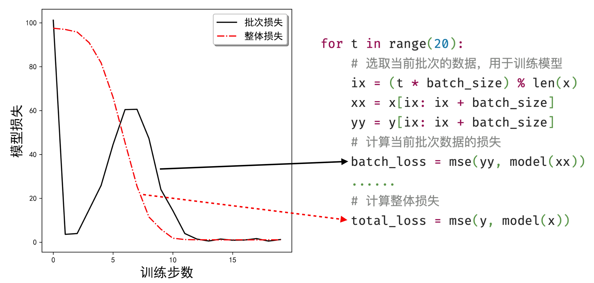
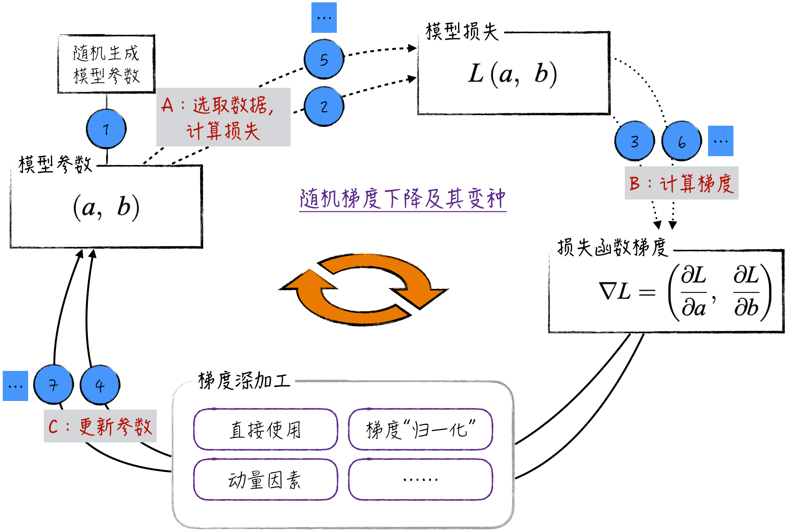
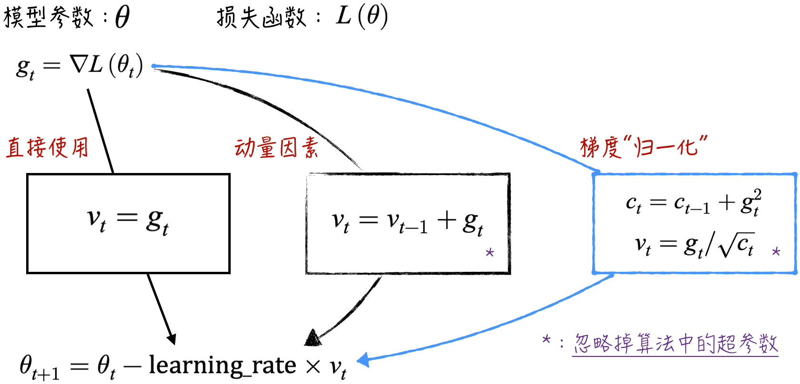

## 6.4 随机梯度下降法：更优化的算法

梯度下降法虽然在理论上很美好，但在实际应用中常常会碰到瓶颈。为了说明这个问题，令 $L_i$ 表示模型在 $i$ 点的损失，即 $L_i=(y_i-ax_i-b)^2$，对所有数据点的损失求和后，可以得到整体损失函数 $L=1/n\sum_{i=1}^{n}L_i$。即模型的损失函数实际上是各个数据点损失的平均值，这一观点适用于大多数模型[^average-loss]。

计算整体损失函数 $L$ 的梯度可得，$\nabla L=1/n\sum_{i=1}^{n}\nabla L_i$。也就是说，损失函数的梯度等于所有数据点处梯度的平均值。但是在实际应用中，使用大型数据集计算所有数据点的平均梯度需要相当长的时间。为了加速这个计算过程，可以考虑使用随机梯度下降法（Stochastic Gradient Descent，SGD）。

### 6.4.1 算法细节

随机梯度下降法的核心思想是：每次迭代时只随机选择小批量的数据点来计算梯度，然后用这个小批量数据点的梯度平均值来代替整体损失函数的梯度[^sample-gradient]。

为了使算法的细节更加准确，引入一个超参数，称为批量大小（Batch Size），记作 $m$。每次随机选取 $m$ 个数据，记为 $I_1,I_2,\cdots,I_m$。使用这些数据点的梯度平均值来近似代替整体损失函数的梯度：$\nabla L=1/n\sum_{i=1}^{n}\nabla L_i\approx1/m\sum_{j=1}^{m}\nabla L_{I_j}$。由此得到新的参数迭代公式：

$$
\begin{aligned}
a_{k+1}&=a_k-\frac{\eta}{m}\sum_{j=1}^{m}\frac{\partial L_{I_j}}{\partial a}\\
b_{k+1}&=b_k-\frac{\eta}{m}\sum_{j=1}^{m}\frac{\partial L_{I_j}}{\partial b}
\end{aligned}
\tag{6-7}
$$

在随机梯度下降法中，所有数据点都使用了一遍，称为模型训练了一轮。由此在实际应用中常使用另一个超参数——训练轮次（Epoch），表示所有数据将被用几遍，用于控制随机梯度下降法的循环次数。换句话说，就是公式（6-7）被迭代运算多少次。

在一些机器学习书籍和学术文献中，还对随机梯度下降法（当 $m=1$ 时）和小批量梯度下降法（当 $m>1$ 时）进行了进一步的区分。然而，这两种方法之间的区别并不大，其核心思想都是基于随机采样来近似计算梯度，从而高效地更新参数、优化模型。在实际应用中，会根据问题的性质和数据规模选择合适的批次大小，以获得最佳的训练效果。因此，本书将统一使用随机梯度下降法来代表这一类方法，以保持概念清晰和简洁。

与梯度下降法相比，随机梯度下降法更高效，这是因为小批量梯度计算比整体梯度计算快得多。尽管在随机梯度下降法中，采用小批量数据估计梯度可能会引入一些噪声，但实践证明这些噪声对整个优化过程有好处，有助于模型克服局部最优的“陷阱”，逐步逼近全局最优参数。

### 6.4.2 代码实现

随机梯度下降法的实现与梯度下降法类似，不同之处在于，每次计算梯度时需要“随机”选取一部分数据，具体的实现步骤可以参考程序清单 6-6。

1. 在程序清单 6-6 的第 2 行，引入一个名为 `batch_size` 的超参数，用于控制每个批次中的数据量大小。选择合适的 `batch_size` 对算法的运行效率和稳定性至关重要。如果参数设置过大，可能会导致算法运行效率下降；而过小的参数可能使算法变得过于随机，影响收敛的稳定性。选择合适的参数需要结合具体的模型和应用场景，结合相关领域的经验进行决策。
2. 在程序清单 6-6 的第 11～13 行，展示了一种随机选取批次数据的实现方式。这也是随机梯度下降法与普通梯度下降法的主要区别之一。实现随机性的方式有很多种，比如引入随机数等。这里仅呈现一种经典方法：将数据按顺序划分成批次。

#### 程序清单 6-6 随机梯度下降法（[完整代码](https://github.com/GenTang/regression2chatgpt/blob/zh/ch06_optimizer/stochastic_gradient_descent.ipynb)）

```python
# 定义每批次用到的数据量
batch_size = 20
# 定义模型
model = Linear()
# 确定最优化算法
learning_rate = 0.1
optimizer = torch.optim.SGD(model.parameters(), lr=learning_rate)

for t in range(20):
    # 选取当前批次的数据，用于训练模型
    ix = (t * batch_size) % len(x)
    xx = x[ix: ix + batch_size]
    yy = y[ix: ix + batch_size]
    yy_pred = model(xx)
    # 计算当前批次数据的损失
    loss = (yy - yy_pred).pow(2).mean()
    # 将上一次的梯度清零
    optimizer.zero_grad()
    # 计算损失函数的梯度
    loss.backward()
    # 迭代更新模型参数的估计值
    optimizer.step()
    # 注意！loss 记录的是模型在当前批次数据上的损失，该数值的波动较大
    print(f'Step {t + 1}, Loss: {loss: .2f}; Result: {model.string()}')
```

在随机梯度下降法的执行过程中，通常使用模型的整体损失作为指标来监测算法的运行情况。但要注意的是，程序清单 6-6 中第 16 行定义的 `loss` 表示模型在小批量数据上的损失，这个值仅依赖于少量数据，迭代过程中会表现出极大的不稳定性，因此并不适合作为评估算法运行情况的主要标志。

如果希望更准确地监测算法的运行情况，需要在更大的数据集上估计模型的整体损失，例如在全部训练数据上计算损失，如图 6-7 所示。这种评估方式更稳定，能够更全面地反映模型的训练进展。



### 6.4.3 进一步优化

回顾一下随机梯度下降法的设计思路。虽然这个方法放弃了严格的数学严谨性，只采用小批量数据的平均梯度来近似数学上严格定义的梯度，但在实际应用中取得了显著的效果。在学术界，这种算法被称为标准随机梯度下降法（Vanilla SGD）。事实上，我们可以延续这一思路，在标准随机梯度下降法的基础上对梯度进行更深入的处理，以进一步提升算法的性能，如图 6-8 所示。



图 6-8 展示了 3 种不同的梯度深加工的思路，分别是直接使用、动量因素和梯度“归一化”。

1. **直接使用**：它代表了标准随机梯度下降法的基本形式，即直接使用小批量数据的平均梯度来更新模型参数。
2. **动量因素**：在物理世界中，动量是指物体在运动方向上保持运动的趋势。类比到优化中，动量随机梯度下降法引入了动量项，允许模型参数在更新时累积之前的梯度信息（具体的公式如图 6-9 所示）。这种方法有助于跳出局部最小值，加速收敛到全局最小值，代表性算法包括 Momentum SGD 和 Nesterov Momentum。



3. **梯度“归一化”**：之前的方法都是全局地使用相同的学习速率（可参考 [6.2.1 节](/books/deconstructing_LLM/chapter-6/6-2#section-6-2-1)），这可能导致不同参数的收敛速度不一致。为了解决这个问题，可以在算法中直接对梯度做类似归一化的处理，从而更好地平衡各个参数的更新效率。这类算法的代表有 Adagrad 和 RMSprop。

将动量因素和梯度归一化这两种优化思路相结合，就得到了一种强大的优化算法——Adam（Adaptive Moment Estimation）。Adam 优化算法在实际应用中十分常见，尤其在深度学习领域广泛应用。它的独特之处在于综合了动量因素和梯度归一化的思想，以及自适应地调整学习速率和动量参数，从而在模型训练过程中更高效地更新模型参数。然而，该算法的细节相当烦琐，超出了本书的范围，在此不深入讨论。

[^average-loss]: 对于解决回归问题的模型，这个结论显然成立。对于解决分类问题的模型（比如逻辑回归模型），只需对模型的似然函数做简单的数学变换（先求对数，再求相反数），就可以得到同样的结论。
[^sample-gradient]: 这在数学上是完全合理的。从统计的角度来看，用所有数据点求平均值，并不比随机抽样的方法高明很多。与线性回归参数估计值类似，两个结果都是随机变量：它们都以真实梯度为期望，只是前者的置信区间更小。
