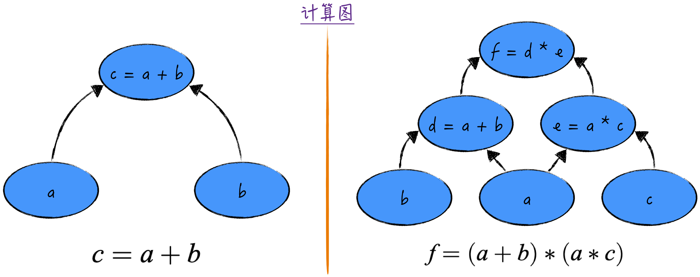
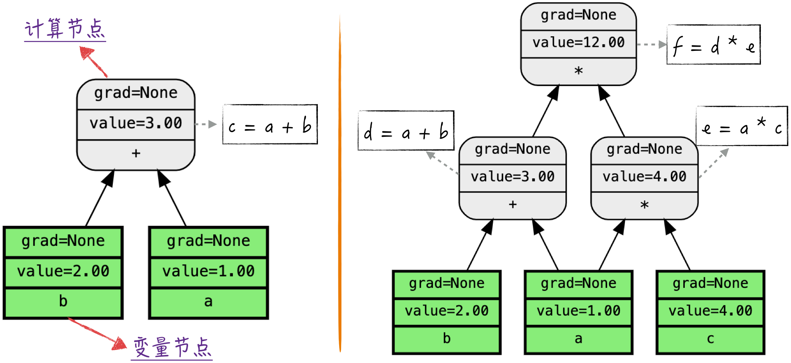

## 7.1 计算图和向前传播

反向传播算法，又被称为自动微分算法（在 PyTorch 中，该算法被命名为 Autograd），是神经网络领域的核心技术之一。它在本质上是一种快速计算函数梯度的技术，使深度学习在计算上变得可行。特别是对于大规模的神经网络而言，与其他朴素的实现相比，采用反向传播算法能够将梯度下降法的训练速度提高多达 1000 万倍。

虽然 PyTorch 已经较为完美地实现了反向传播算法，但为了应对现实世界中的复杂问题，其代码中除实现算法的核心步骤外，还融入了许多对工程细节的处理，如容错性、通用性和复杂的矩阵运算等。这种完善的实现是一把双刃剑：一方面便于使用，能够高效地计算梯度；另一方面，过多的细节可能使初学者在阅读代码时难以理解算法的核心思想，常常迷失在纷繁复杂的代码丛林中。

为了帮助读者更好地理解，本章将通过 Python 代码实现一个简单的反向传播算法。这种实现方式的基础是计算图（Computational Graph）。在深入讨论反向传播算法之前，需要进行一些准备工作，介绍什么是计算图以及如何构建一个简单的计算图。通过逐步构建的方式，读者将更好地理解反向传播算法的原理和实现过程，并为深入理解后续章节的内容打下坚实的基础。

### 7.1.1 什么是计算图

计算图是一种非常有用的数学运算表示方法：将数学运算表示为一个有向无环图（Directed Acyclic Graph，DAG）。计算图由 3 个部分组成。

1. **基本运算**：计算图定义的各种简单的数学运算[^basic-operations]，例如加、减、乘、除、乘方等，它们是构建复杂运算的基础。只要基本运算被定义得足够完备，那么任何复杂的数学运算都可以通过基本运算的组合来实现。
2. **节点**：每个节点代表参与运算的变量，在实际应用中，这些变量可以是标量（Scalar）、向量（Vector）、矩阵（Matrix）等。在本章提供的代码示例中，为了简洁，仅实现了支持标量的计算图。
3. **有向边**：如果变量 $y$ 是由变量 $x$ 通过基本运算得到的，那么在图中就有一条从 $x$ 指向 $y$ 的有向边，反之亦然。因此，有向边的定义与计算图支持的基本运算密切相关。

首先来看一个简单的例子，$c=a+b$ 对应的计算图包含 3 个节点：$a$、$b$ 和 $c$。如图 7-2 左侧所示，既有从 $a$ 指向 $c$ 的边，也有从 $b$ 指向 $c$ 的边。接着，考虑一个相对复杂的例子 $f=(a+b)*(a*c)$。复杂运算可以通过基本运算的组合来实现，相应的计算图也可以按照类似的方式构建，如图 7-2 右侧所示。其中，计算图定义了两个中间变量 $d$ 和 $e$ 来帮助我们组合基本运算。



这种组合基本运算的方式使计算图成为一种非常灵活和强大的数学运算表示方法。无论是简单的数学运算，还是复杂的数学模型，都可以用计算图来清晰地表示，并通过向前传播的过程计算出最终结果。

### 7.1.2 代码实现

为了构建计算图，需要定义一个名为 `Scalar` 的类来表示计算图中的节点，如程序清单 7-1 所示。对于 `Scalar` 类，构建计算图的关键属性如下。

- `value`：用于记录计算图中节点的数值。
- `prevs`：用于记录指向当前节点的有向边的起点（为了便于后续实现反向传播，这里没有选择直接记录有向边，而是选择记录有向边的起点）。

接下来定义一些类方法，也就是计算图支持的基本运算，比如加、减、乘和除等。以加法为例，如程序清单 7-1 中的第 13～22 行所示，创建一个新的 `Scalar` 对象来存储加法运算的结果，并在 `prevs` 属性中记录有向边的起点，指示该结果是由两个节点相加得到的。

#### 程序清单 7-1 定义 Scalar 类（[完整代码](https://github.com/GenTang/regression2chatgpt/blob/zh/ch07_autograd/utils.py)）

```python
# 定义 Scalar 类，用于展示计算图和 Autograd 算法的实现细节
class Scalar:
    def __init__(self, value, prevs=[], op=None, label='', requires_grad=True):
        # 节点的值
        self.value = value
        # 节点的标识（label）和对应的运算（op），用于作图
        self.label = label
        self.op = op
        # 节点的前节点
        self.prevs = prevs
        ......

    def __add__(self, other):
        """
        定义加法，self + other 将触发该函数
        """
        if not isinstance(other, Scalar):
            other = Scalar(other, requires_grad=False)
        # output = self + other
        output = Scalar(self.value + other.value, [self, other], '+')
        ......
        return output
```

在引入 `Scalar` 类之后，就可以自由地定义计算图并将其展示出来，如程序清单 7-2 所示。定义好的计算图可以实现向前传播，即计算数学表达式的结果。向前传播的过程如程序清单 7-2 中的第 16～27 行所示：构建一个类似于图 7-2 的计算图，并将变量设置为特定的值，然后沿着图的节点一路向前计算，最终得到数学表达式的结果。

#### 程序清单 7-2 定义计算图并向前传播（[完整代码](https://github.com/GenTang/regression2chatgpt/blob/zh/ch07_autograd/autograd.ipynb)）

```python
# 定义作图函数，用于画出计算图
def draw_graph(root, direction='forward'):
    """
    图形化展示以 root 为顶点的计算图
    参数
    ----
    root：Scalar，计算图的顶点
    direction：str，向前传播（forward）或者反向传播（backward）
    返回
    ----
    re：Digraph，计算图
    """
    ......

# 简单的计算图
a = Scalar(1.0, label='a')
b = Scalar(2.0, label='b')
c = a + b
draw_graph(c)
# 稍微复杂的计算图
a = Scalar(1.0, label='a')
b = Scalar(2.0, label='b')
c = Scalar(4.0, label='c')
d = a + b
e = a * c
f = d * e
draw_graph(f)
```

为了更好地理解向前传播的过程，可以将计算图绘制成图，如图 7-3 所示。图中的节点分为两类：计算节点和变量节点。计算节点表示进行数学运算的节点，在图 7-3 的左侧，计算节点 $c$ 是由节点 $a$ 和 $b$ 相加得到的。变量节点是计算图中的叶子节点，在实际应用中，通常将模型的参数表示为变量节点。图中的有向边表示数值传播的方向，这个过程非常类似于神经网络中从输入到输出的传递过程。



[^basic-operations]: 不同的计算图支持不同的基本运算，有些还定义了一些特殊函数作为基本运算，例如 PyTorch 将常用的损失函数也定义为基本运算，包括均方误差、交叉熵等。
