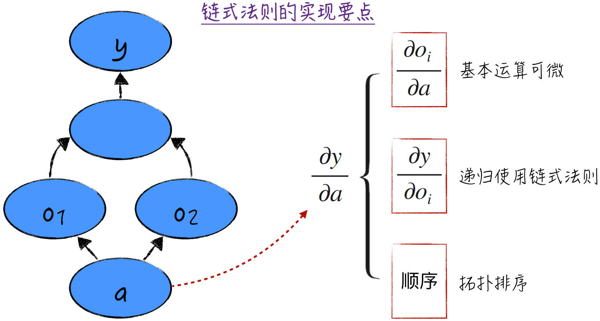
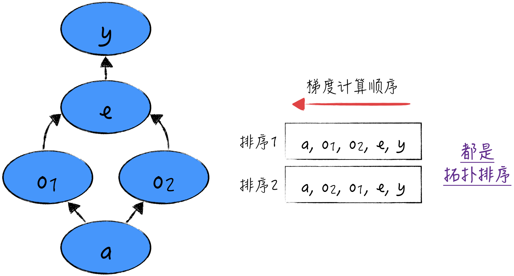
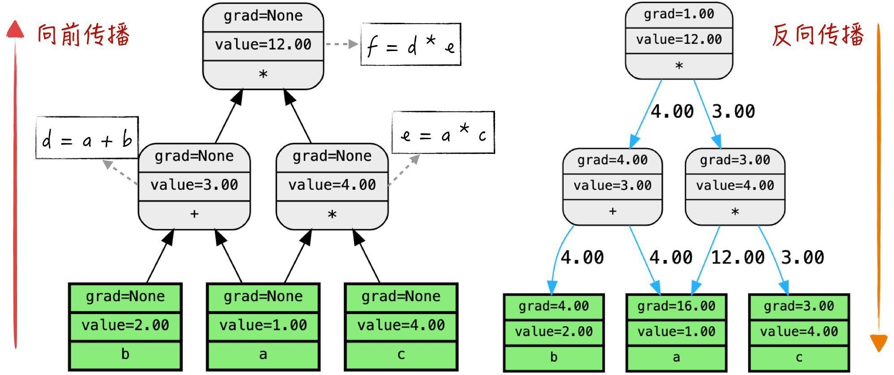
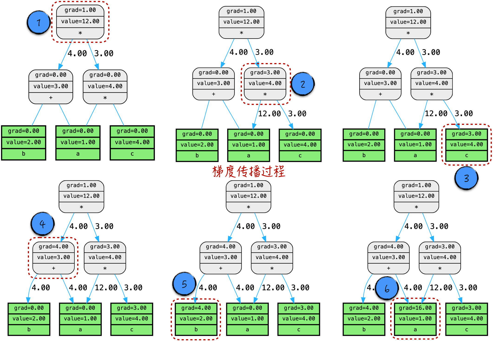
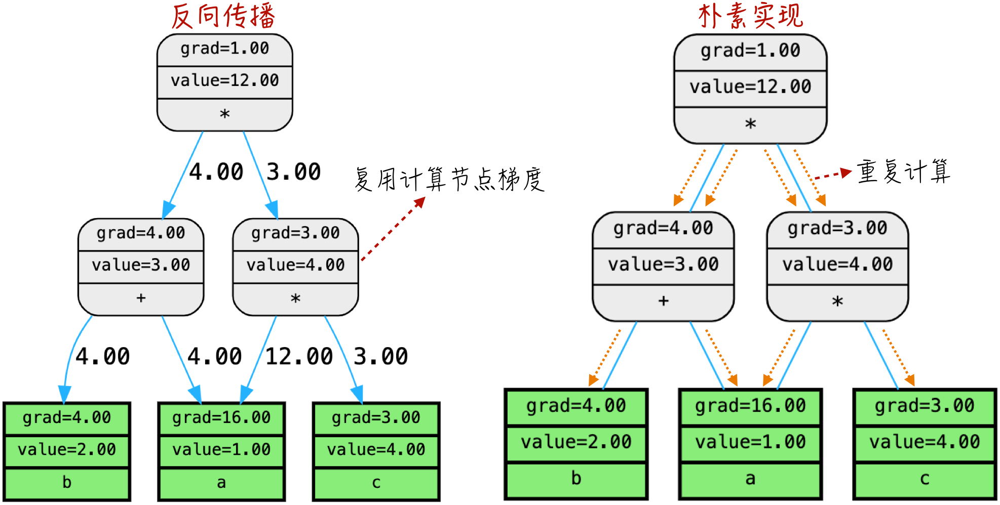

## 7.2 链式法则和反向传播

下面结合计算图，回顾数学中的链式法则（可参考 [2.3.4 节](/books/deconstructing_LLM/chapter-2/2-3#section-2-3-4)）。为了方便表述，考虑函数只有一个变量的情况，即 $y=f(a)$。实际上，多元函数在计算某个变量的偏导数时，会将其他变量当作常数处理，因此只考虑一元函数并没有丢失一般性。

假设函数能够用计算图表示（事实上，只要基本运算的定义足够完备，这个目标并不难实现），在相应的计算图中，从节点 $a$ 出发，能够直接到达的节点记为 $o_1,o_2,\cdots,o_n$。为了方便，这些节点代表的中间变量同样记为 $o_1,o_2,\cdots,o_n$。那么在数学上，可以得到 $y=g(o_1,o_2,\cdots,o_n)$。

根据链式法则，可以得到如下的公式：

$$
\frac{\partial y}{\partial a}
=\frac{\partial y}{\partial o_1}\frac{\partial o_1}{\partial a}
+\cdots+
\frac{\partial y}{\partial o_n}\frac{\partial o_n}{\partial a}
=\sum_{i=1}^{n}\frac{\partial y}{\partial o_i}\frac{\partial o_i}{\partial a}
\tag{7-1}
$$

公式（7-1）是反向传播算法的理论基础。借助这个公式，我们不需要像朴素的数学求导那样，先得到变量 $a$ 梯度的解析表达式，再求出梯度。相反，我们可以借助下面的这些值，直接求得变量 $a$ 的梯度：每个中间变量的梯度 $\partial y/\partial o_i$，以及中间变量关于变量 $a$ 的偏导数 $\partial o_i/\partial a$。

在计算机中实现反向传播算法并正确计算得到变量 $a$ 的梯度，需要注意以下 3 点，如图 7-4 所示。

1. 计算中间变量关于 $a$ 的偏导数，也就是 $\partial o_i/\partial a$。这并不难实现，因为基本运算都是已知的简单函数，而且都是可微的。
2. 求出每个中间变量的梯度，也就是 $\partial y/\partial o_i$。由于中间变量也是计算图中的一个节点，因此可以递归地使用链式法则来求得梯度。
3. 确保在计算 $a$ 的梯度之前，每个中间变量的梯度都已经计算完成。由于计算图是有向无环图，所以计算图的拓扑排序能保证这一点。



接下来简单讨论什么是拓扑排序。

### 7.2.1 拓扑排序

拓扑排序（Topological Sorting）是一种排序方式，它适用于有向无环图。拓扑排序要求满足这样的条件：如果图中存在一条有向边从节点 $a$ 指向节点 $b$，那么节点 $a$ 需要排在节点 $b$ 的前面。直观上理解，拓扑排序可以看作将图按照有向边的方向划分成不同的层次，然后从最后一层的叶子节点开始，逐层向前遍历计算图中的节点。在具体的算法实现上，可以通过深度优先搜索（Depth First Search）来得到拓扑排序。需要注意的是，一个图的拓扑排序通常来说并不是唯一的，但是这并不妨碍它的使用，如图 7-5 所示。



在反向传播算法中，拓扑排序的倒序正好是梯度计算的顺序。借助这个顺序，在计算某个节点的梯度时，所有依赖的中间变量的梯度都已经被正确计算完成。拓扑排序确保了梯度传递顺序的正确性，避免了梯度计算的混乱和错误。

### 7.2.2 代码实现

为了实现反向传播算法，需要对 `Scalar` 类进行一些扩展，如程序清单 7-3 所示，其中新增了以下属性。

- `grad`：用于记录该节点的梯度值。
- `grad_wrt`：用于记录该节点对前一节点的偏导数。以图 7-2 为例，假设当前节点是 $o_i$，那么这个变量中记录的就是偏导数 $\partial o_i/\partial a$ 的值。

接下来，需要为计算图中的每个基本运算定义相应的偏导数规则。举例来说，加法的偏导数实现如程序清单 7-3 中的第 20～23 行所示，乘法的偏导数实现如第 35～38 行所示。

#### 程序清单 7-3 定义基本运算的偏导数（[完整代码](https://github.com/GenTang/regression2chatgpt/blob/zh/ch07_autograd/utils.py)）

```python
class Scalar:
    def __init__(self, value, prevs=[], op=None, label='', requires_grad=True):
        ......
        # 是否需要计算该节点偏导数，即 ∂loss/∂self
        self.requires_grad = requires_grad
        # 存储该节点偏导数，即 ∂loss/∂self
        self.grad = 0.0
        # 如果该节点的 prevs 非空，则存储所有的 ∂self/∂prev
        self.grad_wrt = dict()

    def __add__(self, other):
        """
        定义加法，self + other 将触发该函数
        """
        if not isinstance(other, Scalar):
            other = Scalar(other, requires_grad=False)
        # output = self + other
        output = Scalar(self.value + other.value, [self, other], '+')
        output.requires_grad = self.requires_grad or other.requires_grad
        # 计算偏导数 ∂output/∂self = 1
        output.grad_wrt[self] = 1
        # 计算偏导数 ∂output/∂other = 1
        output.grad_wrt[other] = 1
        return output

    def __mul__(self, other):
        """
        定义乘法，self * other 将触发该函数
        """
        if not isinstance(other, Scalar):
            other = Scalar(other, requires_grad=False)
        # output = self * other
        output = Scalar(self.value * other.value, [self, other], '*')
        output.requires_grad = self.requires_grad or other.requires_grad
        # 计算偏导数 ∂output/∂self = other
        output.grad_wrt[self] = other.value
        # 计算偏导数 ∂output/∂other = self
        output.grad_wrt[other] = self.value
        return output
```

下面讨论反向传播算法的核心实现，具体内容如程序清单 7-4 所示。

算法的核心实现位于程序清单 7-4 中的第 33 行和第 34 行。在第 33 行中，计算公式（7-1）中的乘法部分，将中间变量的梯度与偏导数相乘。第 34 行实现了公式（7-1）中的累加部分。

值得注意的是，同一个节点可能会出现在多个不同的计算图中（具体的例子见 [7.3 节](/books/deconstructing_LLM/chapter-7/7-3)）。为了避免不同计算图之间的梯度相互影响，代码中使用 `cg_grad` 来计算当前计算图的梯度，使用 `grad` 属性来记录节点的累积梯度。

#### 程序清单 7-4 反向传播算法的核心实现（[完整代码](https://github.com/GenTang/regression2chatgpt/blob/zh/ch07_autograd/utils.py)）

```python
class Scalar:
    ......
    def backward(self):
        """
        从当前节点出发，求解以当前节点为顶点的计算图中每个节点的偏导数，如 ∂self/∂node
        """
        def _topological_order():
            """
            利用深度优先算法，返回计算图的拓扑排序
            """
            def _add_prevs(node):
                if node not in visited:
                    visited.add(node)
                    for prev in node.prevs:
                        _add_prevs(prev)
                    ordered.append(node)
            ordered, visited = [], set()
            _add_prevs(self)
            return ordered

        def _compute_grad_of_prevs(node):
            """
            从 node 节点出发，向后传播
            """
            # 得到当前节点在计算图中的梯度。由于一个节点可以在多个计算图中出现，
            # 因此使用 cg_grad 记录当前计算图的梯度
            dnode = cg_grad[node]
            # 使用 node.grad 记录节点的累积梯度
            node.grad += dnode
            for prev in node.prevs:
                # 由于 node 节点的偏导数已经计算完成，因此可以向后传播
                # 需要注意的是，向后传播到上游节点是累加关系
                grad_spread = dnode * node.grad_wrt[prev]
                cg_grad[prev] = cg_grad.get(prev, 0.0) + grad_spread

        # 当前节点的偏导数等于 1，因为 ∂self/∂self = 1。这是反向传播算法的起点
        cg_grad = {self: 1}
        # 为了计算每个节点的偏导数，需要使用拓扑排序的倒序来遍历计算图
        ordered = reversed(_topological_order())
        for node in ordered:
            _compute_grad_of_prevs(node)
```

将这两部分代码整合在一起，就得到了一个完整的实现。需要注意的是，只需要实现少数几个基本运算的偏导数，然后借助计算图这一框架，就能计算任意函数的梯度。这正是反向传播算法的强大之处。

### 7.2.3 梯度传播过程

下面将通过具体的例子来深入理解算法的效果。如程序清单 7-5 所示，构建一个相对简单的计算图，并在这个图上进行向前传播和反向传播操作。

#### 程序清单 7-5 向前传播与反向传播（[完整代码](https://github.com/GenTang/regression2chatgpt/blob/zh/ch07_autograd/autograd.ipynb)）

```python
a = Scalar(1.0, label='a')
b = Scalar(2.0, label='b')
c = Scalar(4.0, label='c')
d = a + b
e = a * c
f = d * e
# 向前传播作图
draw_graph(f)
# 触发反向传播
f.backward()
# 反向传播作图
draw_graph(f, 'backward')
```

顾名思义，向前传播是将输入的数值沿着计算图的方向逐步传递，直至到达最后的顶点，从而得到运算结果。反向传播则正好相反，从顶点开始，沿着计算图的反方向将梯度逐步传播到计算图中的每个节点，如图 7-6 所示。这个过程可以看作信息的流动，从输入开始，直到输出，再从输出返回到输入，通过构建计算图和运用链式法则，实现对梯度的计算。



为了帮助读者更深入地理解反向传播算法的细节，下面通过绘制图形来观察算法在执行过程中每个节点的变化情况，如图 7-7 所示。我们可以逐步跟踪算法的执行过程，以了解信息在计算图中的流动过程：首先将顶点的初始梯度设置为 1，然后开始逐层传播；计算节点会从上游节点累积梯度，并根据节点所代表的运算规则传递梯度；变量节点只需执行累加梯度的操作。



反向传播算法极大地提高了计算效率，这是因为在朴素的梯度计算实现中，对于每个节点的梯度，需要遍历从该节点到计算图顶端的所有路径，导致了重复计算。而反向传播算法巧妙地复用了计算节点的梯度信息，减少了计算次数，如图 7-8 所示。值得注意的是，当计算图的结构变得更复杂时，反向传播算法的优化效果也更加显著。



这种高效的梯度计算方法在众多领域都发挥着重要作用，尤其在神经网络领域表现出色。它为模型的训练提供了重要的支持，特别是当神经网络拥有庞大的参数规模和复杂的层次结构时。反向传播算法的引入大幅提升了神经网络训练的速度，为实际应用带来了巨大的便利。
