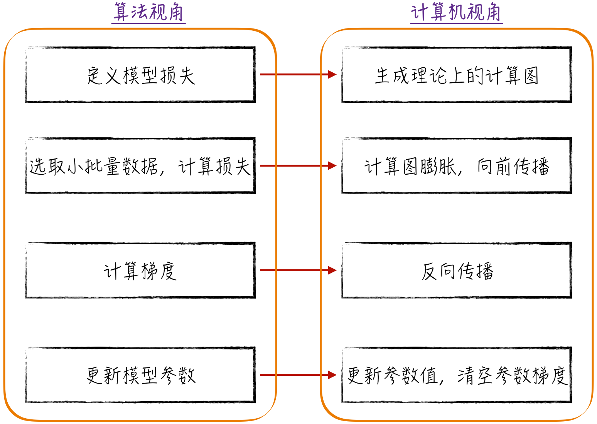
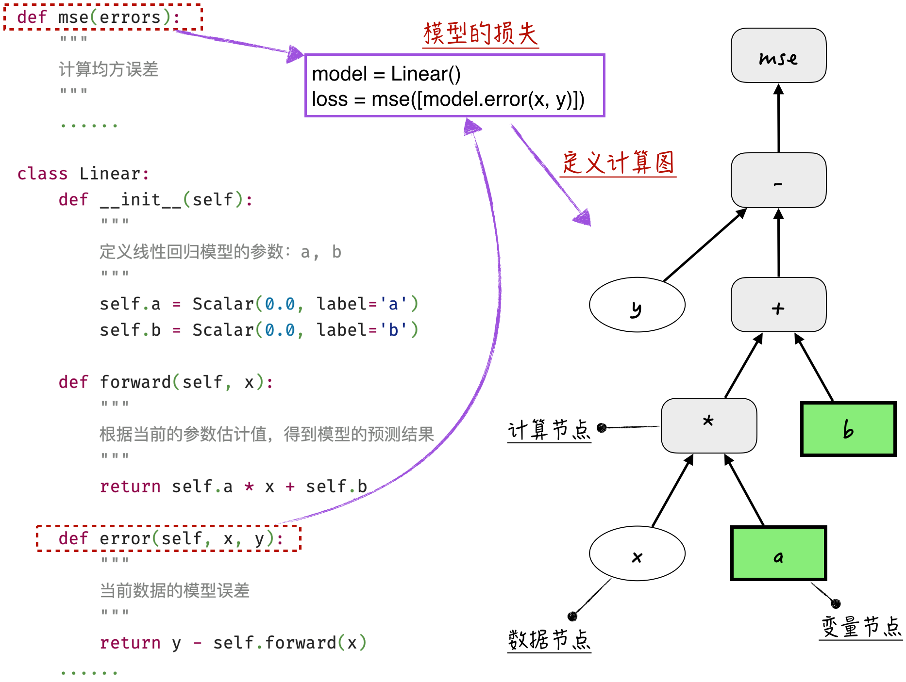
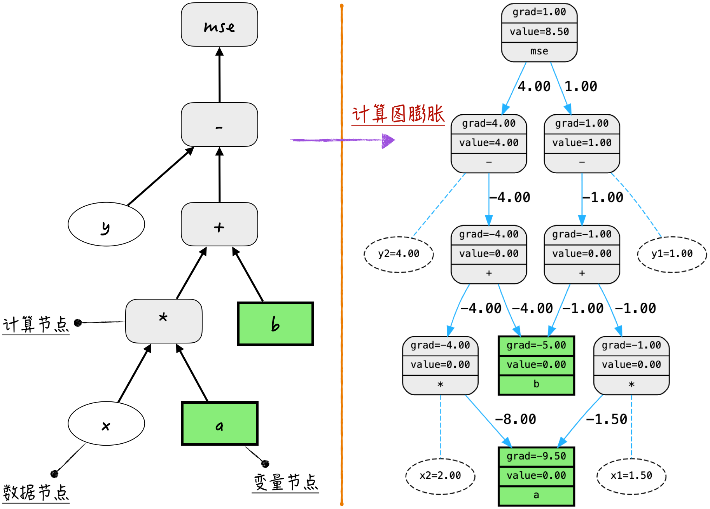
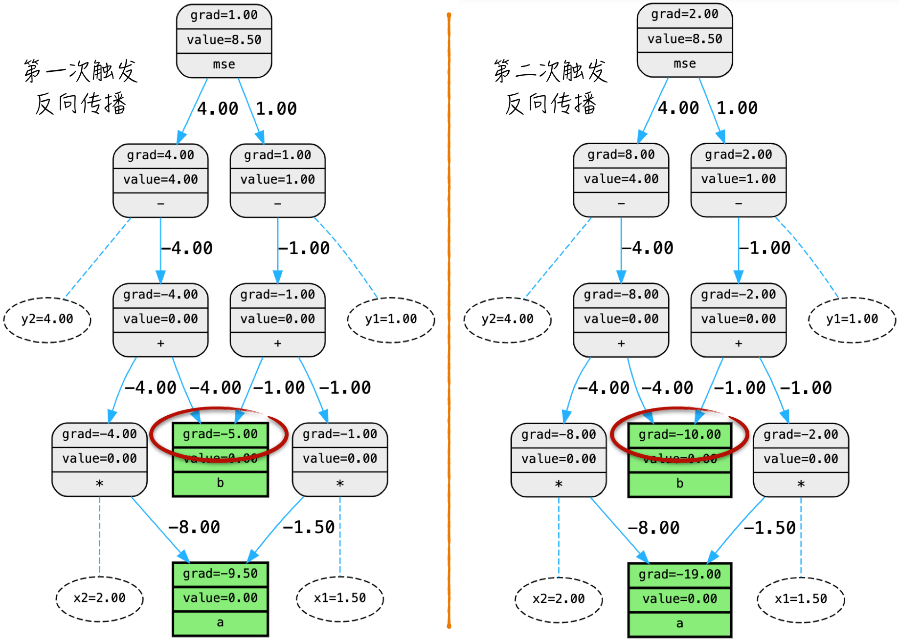
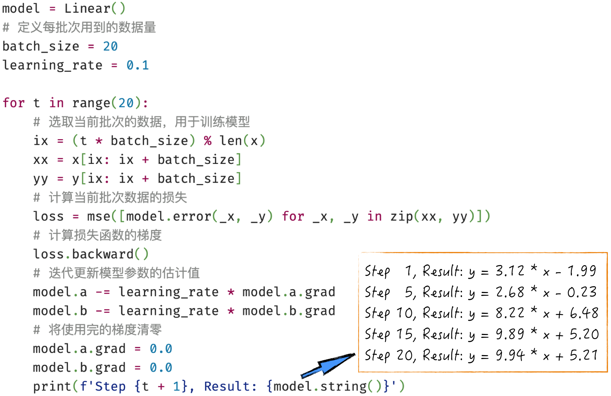

## 7.3 参数估计的全流程

前面的章节构建了计算图并实现了反向传播算法，能够将计算过程以可视化的方式展现出来。本节将利用这些工具来探索第 6 章中介绍的最优化算法是如何运作的（为了简化表达，本节仅讨论标准的随机梯度下降法）。本节将介绍向前传播和向后传播这两个关键的子流程如何配合；计算图如何随着训练数据而变化，梯度如何在图中传递，以及这个过程如何推动模型逐步优化。这种清晰且直观的讲解有助于我们理解模型训练的实质，为进一步讨论更高级的优化技术做好准备。

### 7.3.1 随机梯度下降法回顾

在标准的随机梯度下降法中，一次参数迭代的过程可以概括如下：定义模型的损失函数（这基于预先定义好的模型预测公式）；选择一批训练数据（批量数据），计算模型的预测损失；计算损失函数关于模型参数的梯度；更新模型参数以减小损失函数。

从计算机的视角来看，整个过程如图 7-9 所示，对应以下步骤。

1. 生成模型的理论计算图。
2. 基于选定的训练数据，计算图膨胀，并进行向前传播。
3. 反向传播，计算梯度。
4. 更新模型参数，并清空参数存储的梯度信息。



其中，第 2 步中的“计算图膨胀”可能会让人感到有些抽象。不过不要担心，下面通过一个简单的线性回归例子来直观地理解上述过程。

### 7.3.2 计算图膨胀

首先，定义一个线性回归模型，其示意代码如图 7-10 所示（[完整代码](https://github.com/GenTang/regression2chatgpt/blob/zh/ch07_autograd/linear_model.py)）。需要注意的是，在计算图中，并不是每个节点都需要计算梯度。举例来说，对于表示输入数据的节点 $x$ 和 $y$，在反向传播的过程中并不需要对它们进行梯度计算。为了更清晰地展示这一点，这里引入数据节点的概念，用于指明这些节点不需要进行梯度计算。这样在计算图中可以看到 3 种不同类型的节点：数据节点、变量节点，以及计算节点。这种分类的做法有助于厘清梯度计算过程中的节点角色，使图示更易于理解。



接下来，讨论关键的“计算图膨胀”现象。在程序清单 7-6 中，有两个训练数据，分别记作 $(x_1,y_1)$ 和 $(x_2,y_2)$。当将这些数据输入模型进行损失计算时，对应的计算图会发生膨胀，具体的情况如图 7-11 所示。需要注意的是，计算图的膨胀比例基本上等于所使用的数据量。这就意味着，当模型本身已经相当复杂时，如果一次性输入大量的数据进行计算，那么对应的计算图就会变得巨大，甚至有可能超出计算机硬件的处理能力，导致无法顺利执行。

#### 程序清单 7-6 计算图膨胀（[完整代码](https://github.com/GenTang/regression2chatgpt/blob/zh/ch07_autograd/optim_process.ipynb)）

```python
# 计算图膨胀
model = Linear()
x1 = Scalar(1.5, label='x1', requires_grad=False)
y1 = Scalar(1.0, label='y1', requires_grad=False)
x2 = Scalar(2.0, label='x2', requires_grad=False)
y2 = Scalar(4.0, label='y2', requires_grad=False)
loss = mse([model.error(x1, y1), model.error(x2, y2)])
draw_graph(loss)
```



这个现象揭示了反向传播算法的一个明显的局限性：在处理复杂模型时，必须谨慎考虑计算资源的限制，避免一次性处理大规模的数据。例如，在标准的随机梯度下降法中，批量大小（Batch Size）只能选择较小的数值。幸运的是，在实际应用中，可以采取一些方法来应对这一局限性，详见 [7.4.1 节](/books/deconstructing_LLM/chapter-7/7-4#section-7-4-1)。

在触发反向传播时，梯度会沿着膨胀的计算图的反方向依次传递，最终计算得到模型参数的梯度，如图 7-12 所示。每次触发反向传播算法后，变量节点会累积当前计算图（经过膨胀的计算图）中的梯度。因此，在确认完成梯度使用后，必须适时地将这些累积的梯度清零，以免引发意外的错误。



将之前讨论的知识点整合起来，我们能够在不依赖于第三方算法库的情况下，实现对模型参数的估计。这部分代码及其运行结果如图 7-13 所示。在实际应用中，通常不需要手动实现这些步骤，因为现有的框架（例如 PyTorch）提供了成熟的封装。然而，通过编写上述代码，我们可以了解每次调用诸如 PyTorch 等框架时背后发生的核心过程，为后续的深入学习和研究筑牢根基。


