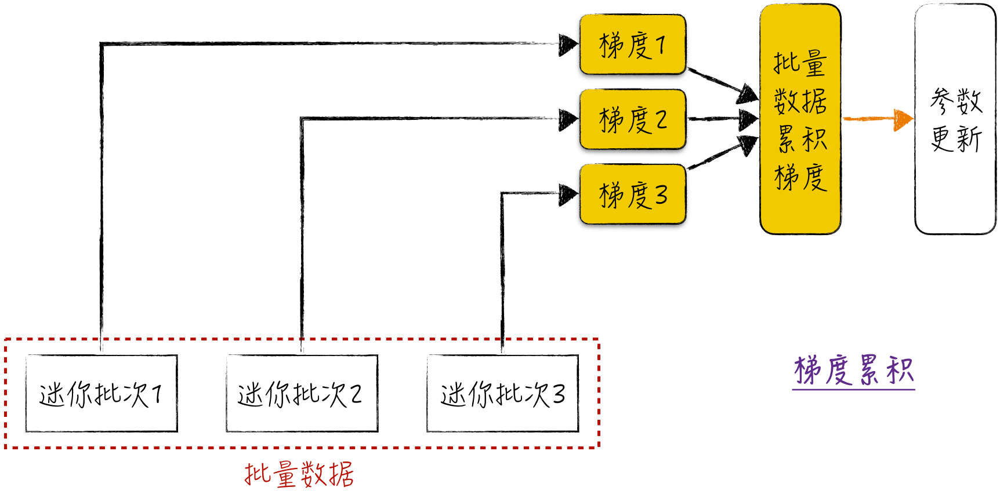
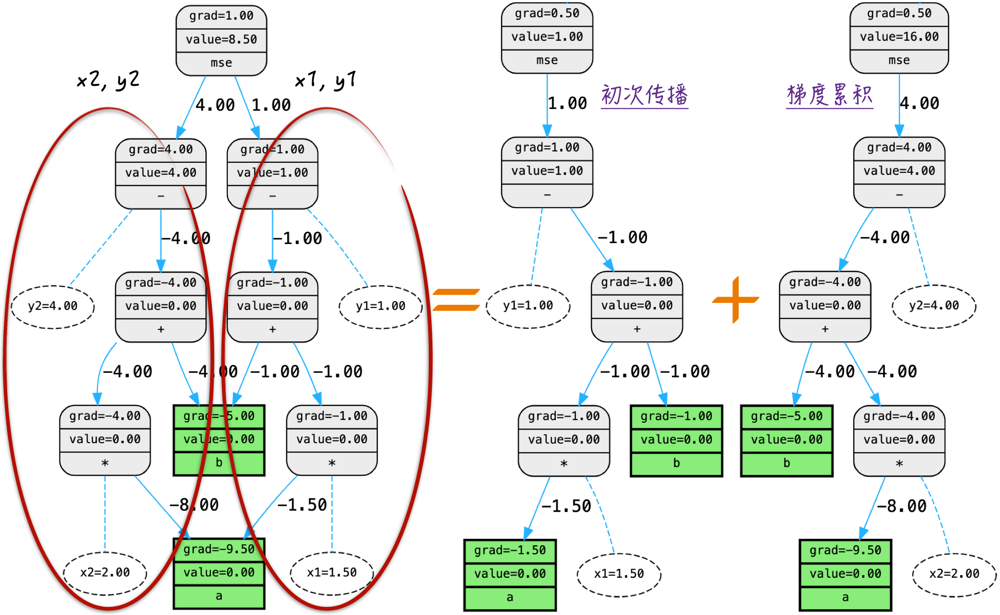
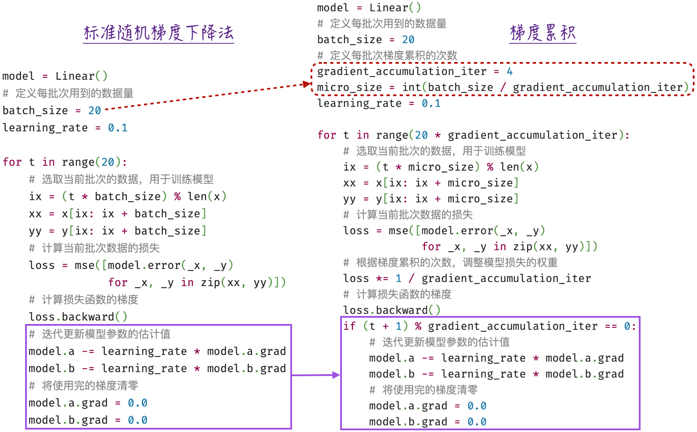
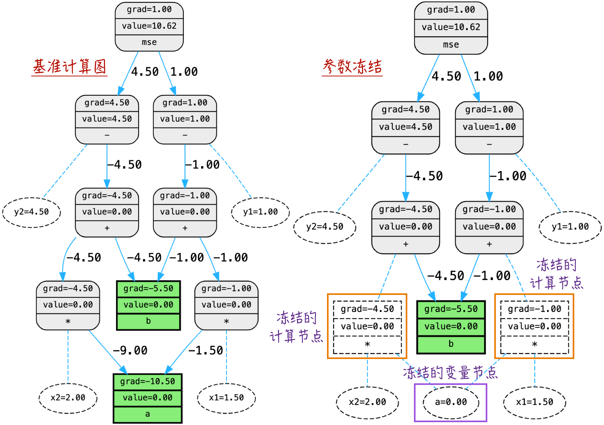
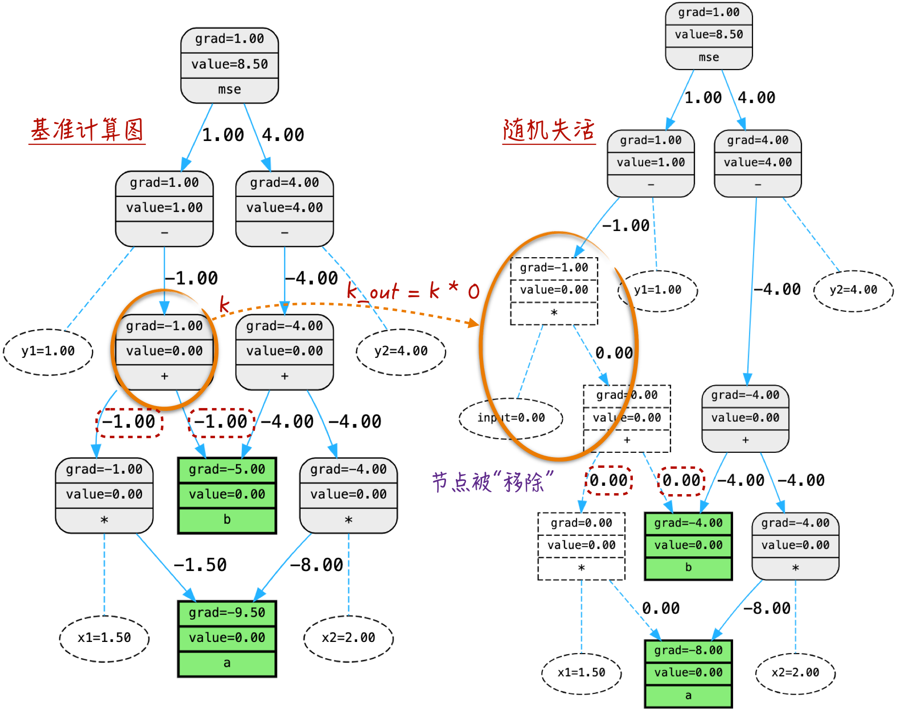
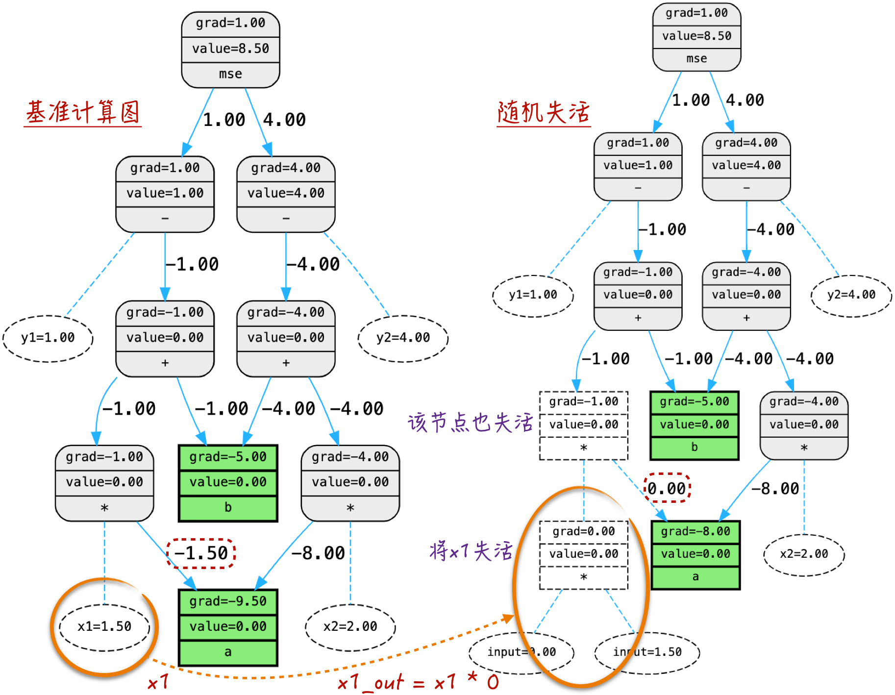

## 7.4 动态优化

基于上一节的讨论，可以观察到一个重要的现象：在模型训练过程中，所用数据对应的计算图是动态生成的。这样生成的计算图被称为“基准计算图”。在基准计算图上进行向前传播和反向传播的操作，之后计算图会被销毁，这是标准的构建和清空计算图的过程。我们可以在这个基础上根据特定需求，在进行传播之前对基准计算图做进一步的优化。这方面的研究很多，涉及的方法多种多样。由于篇幅所限，本节只讨论其中最经典的 3 种优化方法：梯度累积、参数冻结和随机失活。

需要注意的是，本节讨论的方法都基于计算图，也就是说，这些方法适用于所有使用随机梯度下降法进行训练的模型。然而，在实际生产中，这些方法通常被应用于神经网络，特别是深度学习领域。这是因为，这些方法所要应对的问题通常出现在模型庞大、多变且结构复杂的情况下，往往只有神经网络模型才能满足这些要求，才需要使用到这些优化技术。

对神经网络有一定了解的读者可以将下面讨论所基于的计算图想象成神经网络结构，这样理解更加直观。对神经网络不太熟悉的读者也不必紧张，可以首先以计算图为基础进行理解，在后续章节中深入学习关于神经网络的知识后，再回到这里，这样或许能够更加深入地理解这些方法的内涵。

### 7.4.1 梯度累积

在[第 6 章](/books/deconstructing_LLM/chapter-6)中讨论随机梯度下降法时，每次用于训练的数据批量不宜过小，否则可能导致梯度估计过于随机，进而影响训练的稳定性。然而，“计算图膨胀”问题指出，适合的批量大小可能会超出计算机硬件的限制，导致反向传播算法无法顺利执行。这时需要引入梯度累积（Gradient Accumulation）算法来应对这一挑战。

梯度累积是一种优化反向传播过程的技术，可以在不增加内存开销的情况下，使用更大的批量数据来更新模型参数。梯度累积的原理如图 7-14 所示，它将一次完整的反向传播过程拆分为几个独立的子过程来执行。



具体来说，它将一次迭代用到的批量数据拆分成若干迷你批次，然后计算每个迷你批次的梯度，并将梯度累加到一个共享的变量中，而不是立即更新模型参数。所有的迷你批次都处理完毕后，再根据累积的梯度更新模型参数。这种处理方式有两个好处：一方面，对于单台机器来说，这种拆分可以通过牺牲一部分时间来换取更少的内存占用，从而让本来不可能的计算变得可能；另一方面，如果拥有多台机器（在实际应用中往往如此），那么可以将这些子过程分配到不同的机器上并行计算，实现反向传播的分布式计算，从而大幅缩短算法的执行时间。

从计算图的角度来理解梯度累积可能更直观。仔细观察膨胀之后的计算图，会发现它可以被分解为各个数据点的独立子图。在梯度传播过程中，这些子图之间相互独立（从数学上也能很好地解释，因为各数据点的损失是相互独立的）。因此，可以将一个膨胀后的计算图拆分成多个小的计算子图进行传播，如图 7-15 所示。



拆分计算图的具体实现可以参考程序清单 7-7。值得注意的是，由于损失函数通常是一个样本平均值（这对于大多数模型都成立），因此在拆分成小的计算图时，需要适当调整损失函数的系数，如第 14 行和第 17 行代码所示。

#### 程序清单 7-7 梯度累积（[完整代码](https://github.com/GenTang/regression2chatgpt/blob/zh/ch07_autograd/gradient_accumulation.ipynb)）

```python
x1 = Scalar(1.5, label='x1', requires_grad=False)
y1 = Scalar(1.0, label='y1', requires_grad=False)
x2 = Scalar(2.0, label='x2', requires_grad=False)
y2 = Scalar(4.0, label='y2', requires_grad=False)
# 反向传播
model = Linear()
loss = mse([model.error(x1, y1), model.error(x2, y2)])
loss.backward() # model.a.grad = -9.5, model.b.grad = -5

# 梯度累积
model = Linear()
# 使用 x1，y1 传播一次
# 系数 0.5 是因为平均数权重调整
loss = 0.5 * mse([model.error(x1, y1)])
loss.backward()
# 使用 x2，y2 传播一次
loss = 0.5 * mse([model.error(x2, y2)])
loss.backward() # model.a.grad = -9.5, model.b.grad = -5
```

在标准随机梯度下降法基础上，引入梯度累积并不需要进行大规模的改动，它们的区别如图 7-16 所示。使用梯度累积时，每一步都会进行反向传播，但并非每一步都进行参数更新和梯度清零，而是积累一定次数的反向传播后，再进行参数更新和梯度清零，好比吃饭时多次咀嚼才下咽一次。这也是在本章开头强调严格区分反向传播和向后传播的原因。反向传播仅仅表示梯度的计算，而向后传播包括梯度计算和使用梯度来更新模型参数。这两个步骤在某些场景下的对应关系可能会非常复杂，混淆二者会导致产生许多误解。



### 7.4.2 参数冻结

一般情况下，在训练模型时，我们会对所有的模型参数计算梯度，并根据这些梯度来更新参数。这时基准计算图是非常适用的，因为在基准计算图中，反向传播会对所有的节点进行梯度传播，这意味着它会计算图中所有节点的梯度。

然而，在某些特定情况下，需要仅对模型的一部分参数进行更新操作，另一部分参数需要保持不变。在神经网络中，特别是在大语言模型领域，这种方法已经有越来越广泛的应用。这是因为从零开始训练一个大语言模型的成本非常高，通常需要数百台专用服务器和数百万美元的投入成本。因此，在实际应用中，我们常常会对一个预训练好的大语言模型进行一些微小的结构修改，然后使用特定领域的数据来微调模型，使其更好地适应特定的应用场景。在这个过程中，我们只希望调整部分的模型参数，而其他部分保持不变。可以将模型想象成一栋大楼，我们对大楼的大部分结构是满意的，不需要更改（实际上也无力更改，因为成本太高），只希望装修其中一个房间。

实现模型的部分更新并不复杂，只需在每次迭代中将那些不需要更新的参数强制设置为梯度等于 0。在这种情况下，传统的基准计算图变得不再适用，因为很多节点并不需要进行梯度传播。因此，需要一种方法来临时移除不需要计算梯度的节点，以防不必要的梯度传播。为了尽可能地减少不必要的计算，不仅需要移除不需要的变量节点，还需要移除与这些节点相关的计算节点，也就是以这些计算节点为顶点的计算图中不包含任何需要计算梯度的子节点，如图 7-17 所示。

这个过程被称为参数冻结（Parameter Freezing）。算法的实现并不复杂，在代码中，只需要将相应参数的 `requires_grad` 属性设置为 `False`（在 PyTorch 中，实现参数冻结的代码也是如此）。值得强调的是，参数冻结只在计算图进行反向传播时（模型训练阶段）起作用，对向前传播没有任何影响。可以形象地理解为，在向前传播和反向传播时，计算图的结构是不同的。

参数冻结的方法可以灵活地控制哪些参数需要更新，哪些参数需要保持不变，在实际应用中非常有用，特别是在资源有限的情况下，以及需要在特定领域进行微调时。通过冻结部分参数，能够更好地利用已有的模型和数据，更高效地训练和优化模型。完整实现请参考[配套代码](https://github.com/GenTang/regression2chatgpt/blob/zh/ch07_autograd/parameter_freezing.ipynb)。



### 7.4.3 随机失活

在探讨随机失活（Dropout）之前，需要理解什么是“变量的失活”。简而言之，变量的失活指的是将某个变量乘以 0，从而得到一个新的变量，并将这个新变量用于后续的计算。下面来看看这种操作对计算图的影响。

如程序清单 7-8 所示，在定义变量 `k` 之后，在其基础上定义新的变量 `k_out = k * 0`，然后用这个新变量代替 `k` 参与后续计算，具体代码见第 6～8 行。

#### 程序清单 7-8 节点/变量失活（[完整代码](https://github.com/GenTang/regression2chatgpt/blob/zh/ch07_autograd/dropout.ipynb)）

```python
x1 = Scalar(1.5, label='x1', requires_grad=False)
y1 = Scalar(1.0, label='y1', requires_grad=False)
x2 = Scalar(2.0, label='x2', requires_grad=False)
y2 = Scalar(4.0, label='y2', requires_grad=False)
model = Linear()
k = model.forward(x1)
# 令 k 失活
k_out = k * 0
l = y1 - k_out
loss = mse([l, model.error(x2, y2)])
......
```

这一操作导致的变化如图 7-18 所示（计算图由图中左侧的形状变为右侧的形状）。通过对比，可以清楚地观察到，这些节点反向传播的梯度都变成了 0，变量 `k` 和变量 `k_out` 的节点仿佛被完全删除。如果在原有的计算图中移除 `k` 节点，结果也是完全相同的。因此，可以形象地描述为 `k` 节点/变量被失活了。



某个节点失活不仅会影响该节点本身，还可能影响与之直接相关的其他节点，如图 7-19 所示。举例来说，如果节点 $x_1$ 失活，那么与其直接相连的计算节点也会失活。当然，这取决于节点所代表的运算，比如图中的节点表示的是乘法，因此它会受到牵连并导致失活；但如果是加减法节点，则不会导致失活。

在探讨完节点/变量失活之后，下面仔细研究随机失活的设计初衷和算法细节。最优化算法的初衷是计算准确的梯度，并利用它来迭代更新模型参数。但通过使用随机梯度下降法，会发现在梯度中引入一些随机性反而能够提升模型的训练效果。这引发了一个有趣的问题：是否可以通过进一步增加梯度计算过程中的随机性来优化模型？

从计算图的角度考虑随机梯度下降法，算法的随机性实际上源于计算图没有完全膨胀（因为只使用了部分训练数据），但整个计算图的结构仍然与最初定义的理论计算图相似，或者说反向传播算法得到的仍然是“准确”的梯度。为了引入更多的随机性，需要考虑在计算图中随机进行剪裁。这样，每次反向传播得到的梯度就不再是“准确”的，而是在其附近随机扰动的值。更进一步，如果在每次传播时，剪裁的部分也是随机的，那么梯度的随机性就更强了。



随机失活是一种实现上述思想的算法。具体而言，在模型训练期间，每次迭代开始时，随机选择计算图中的一些节点并将它们失活。更准确地说，在计算图的构建阶段，随机挑选一些变量，将它们乘以 0 来创建一组新的变量，并将这些新变量用于后续计算。然后，进行反向传播，以获取梯度信息，并使用这些梯度信息来更新模型的参数。需要注意的是，随机失活仅在模型训练过程中起作用。在使用已经训练好的模型进行预测时，所有节点都会按照正常的计算方式进行赋值，不再受到随机失活的影响。

在实际应用中，随机失活并不是直接应用在计算图上，而是应用在神经网络上，这意味着我们会选择性地对神经网络中的某些节点进行失活操作。在后文关于神经网络的讨论中会提到，神经网络最终也被表示为计算图。因此，神经网络的失活实际上意味着对计算图中某些特定层的节点进行失活，其在本质上是相同的。随机失活不仅能像随机梯度下降法那样，避免陷入局部最优的困境，还可以有效地解决神经网络过拟合的问题，提升模型的鲁棒性和泛化能力，使得模型能够更好地适应新的、未见过的数据。具体的细节将在 [9.1.4 节](/books/deconstructing_LLM/chapter-9/9-1#section-9-1-4)中探讨。
