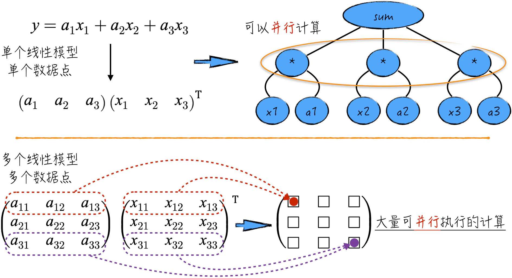
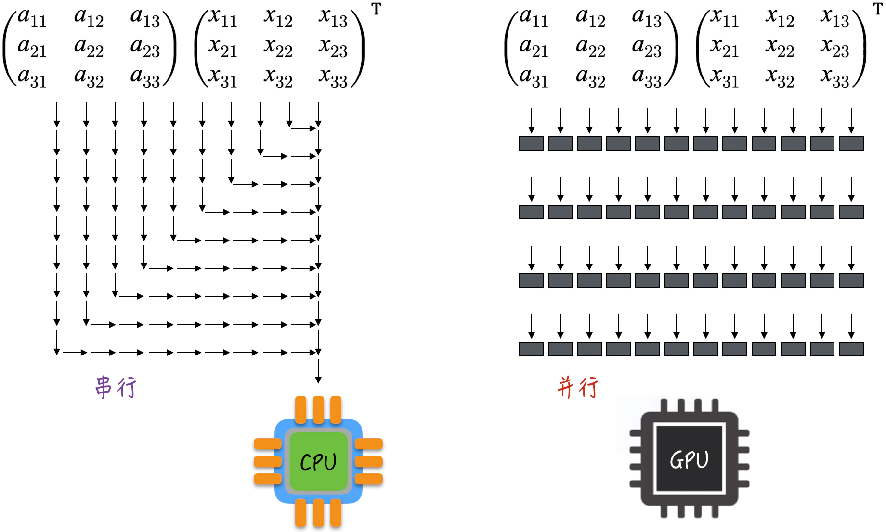
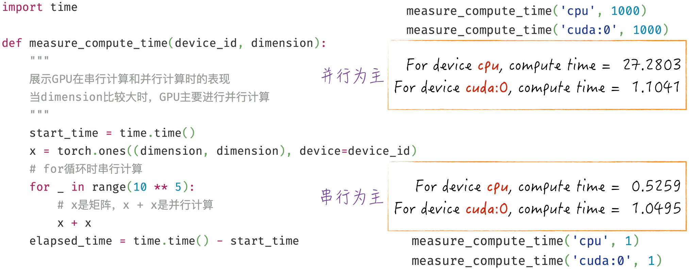
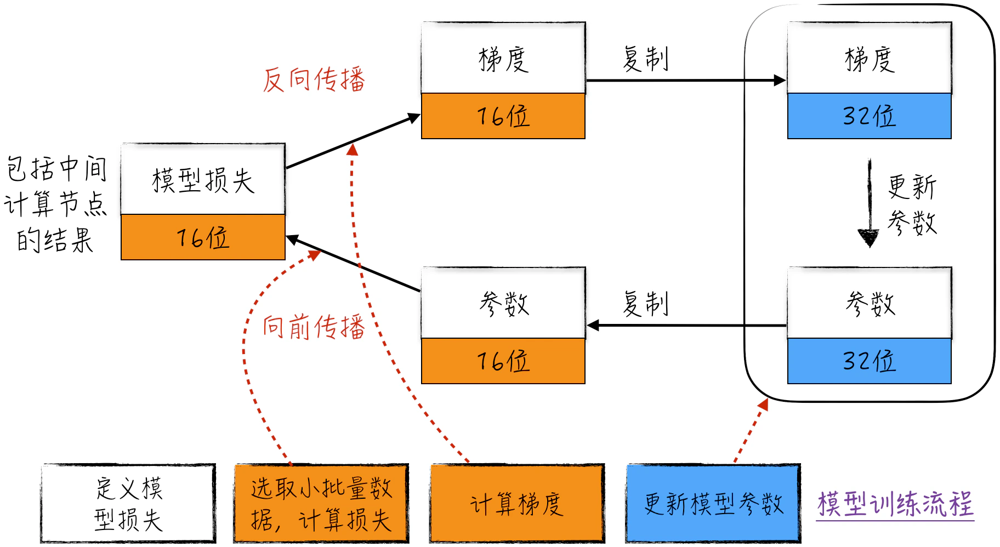
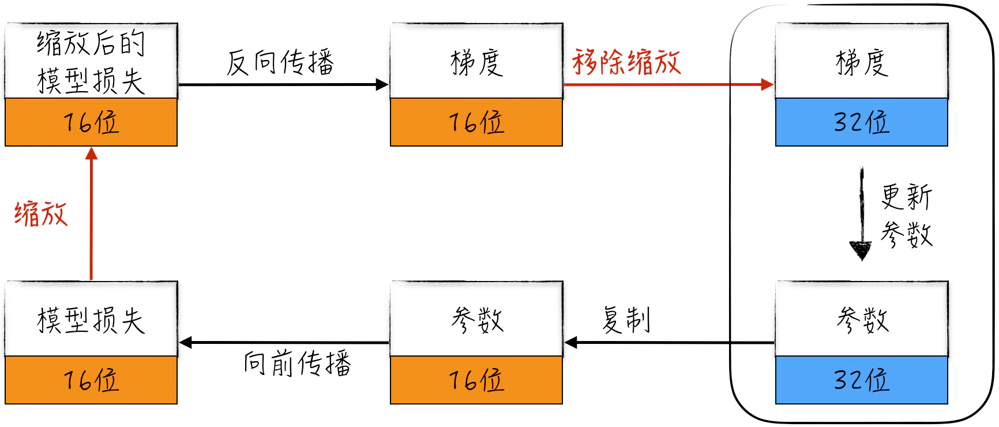
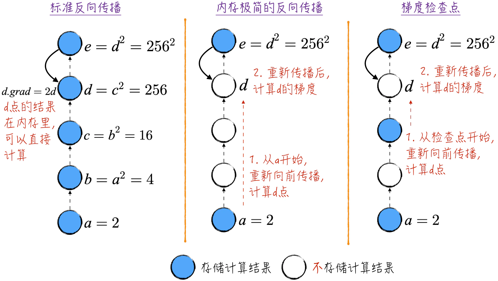
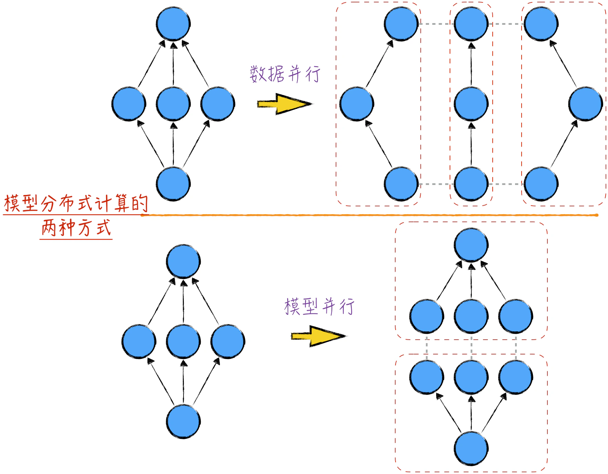
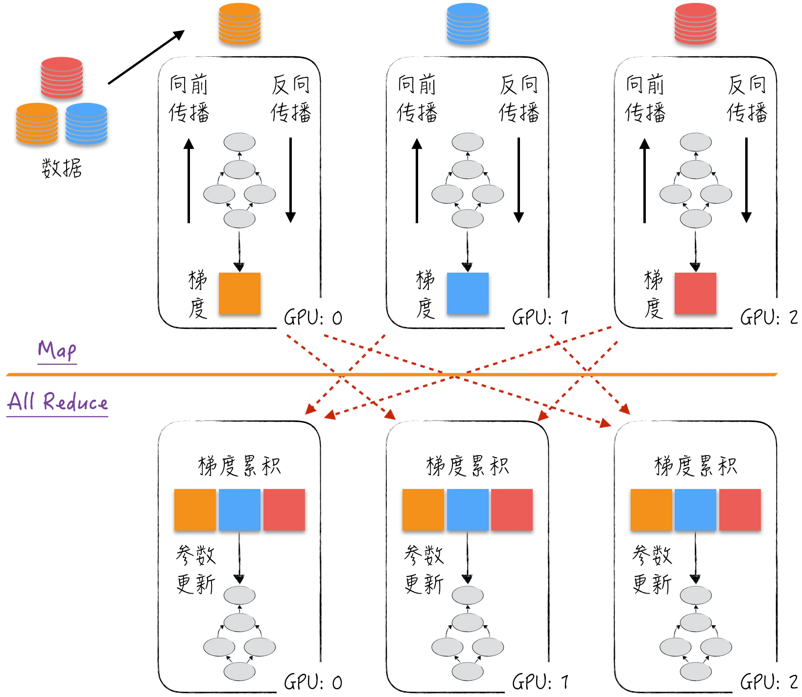
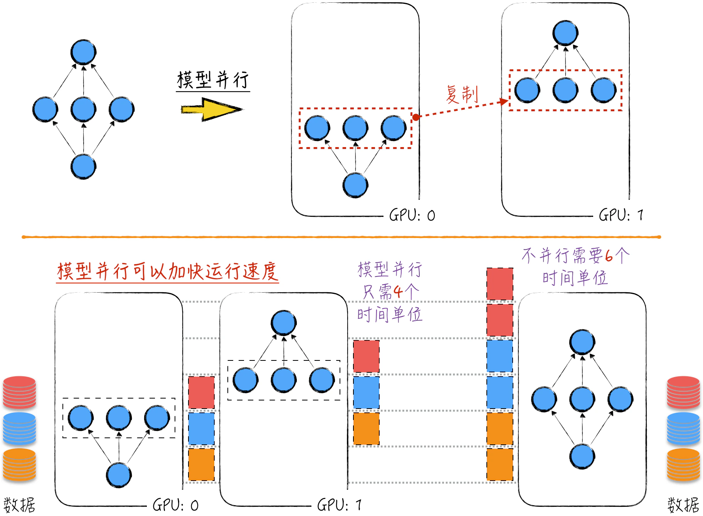

## 7.5 真实世界：针对大规模模型的优化技巧

为了更深刻地理解反向传播算法的核心原理、参数估计的整个过程以及相关的优化方法，本节将用代码实现一个简化版的计算图，以及基于该图的向前传播和反向传播。这些操作能够将抽象的理论知识与实际代码编写紧密结合。在实际应用中，通常会使用现成的第三方算法库来完成这些任务。这些库的实现原理与本章的计算图类似，但它们更加高效、全面，并提供了针对大规模模型的优化方法。下面将突破之前的讨论范围，深入探讨在实际生产中关于模型参数估计的常用技巧和方法。

### 7.5.1 GPU 计算

在人工智能领域，模型运算通常涉及大量可以并行执行的操作。以简单的线性回归模型为例，如图 7-20 所示，在单个数据点的模型运算中，相应的计算节点之间并没有依赖关系，每个乘法操作都可以并行执行。从数学角度来看，这样的运算可以表示为张量的矩阵乘法，产生单一的数值输出。



对于只有一个输出值的矩阵乘法，都可以使用并行计算来提高执行速度。更进一步，如果考虑多个模型对多个数据点的运算，相应的矩阵乘法输出是一个张量，而这个张量中的每个元素的运算都是相互独立的，这使得并行执行更加可行。类似地，张量的其他运算，例如加法和减法，也可以通过并行执行来加速计算。在神经网络领域，这一点尤为重要，因为神经网络中包含多个线性模型。整个运算过程中涉及大量的张量运算，如何有效加速这些运算过程成为这个领域工程实现中要考虑的首要问题。

默认情况下，在提到计算机运算时，通常指的是由中央处理器（CPU）作为计算核心执行的运算任务。然而，CPU 的设计原则使它并不擅长处理并行计算。举个例子，考虑矩阵乘法，如图 7-21 所示，CPU 会按顺序逐个元素相乘，导致整个运算过程时间过长。虽然我们可以利用多核 CPU 进行并行计算以加速任务，但多核 CPU 价格昂贵，在实际应用中难以普及。



与 CPU 不同，GPU（图形处理器）最初是为图形处理而设计的，属于边缘计算组件。它通常拥有大量的计算核心（有时高达上千个），可以并行地执行大量的简单计算任务。因此，使用 GPU 进行张量运算能够显著缩短运算时间。对于神经网络而言，这一点具有重要意义，它使得构建更大、更复杂的模型成为可能（使用 GPU，模型训练时间可以从几年缩短到几天）。事实上，GPU 的大规模应用是神经网络，尤其是深度学习得以迅猛发展的原因之一。因此，在涉及神经网络模型的实际应用中，总是优先考虑使用 GPU 作为计算的核心（这是编程领域一次重大的范式转变）。随着神经网络的迅猛发展，业界甚至在考虑重新设计计算机架构来提升 GPU 在硬件中的地位，以便更好地适应这一快速发展的领域。

借助 PyTorch（基于 CUDA[^cuda]）在 GPU 计算方面的卓越工作，GPU 计算的代码实现并不复杂。如程序清单 7-9 所示，只需简单地将数据移动到相应的 GPU 中即可。与 CPU 的架构设计不同，GPU 无法直接读取在内存（RAM）中的数据进行运算，因此需要将数据复制到 GPU 专用的内存（GPU Dedicated Memory）中。同理，GPU 也不支持跨计算核心的运算。这包括跨 CPU 和 GPU 的计算，因为数据一部分存放在内存中，另一部分存放在 GPU 专用内存中；以及跨不同 GPU 的计算，因为数据分布在不同的 GPU 专用内存中。在实际使用中，面对这样的需求，需要在进行计算之前将数据移动到同一个计算核心上。

#### 程序清单 7-9 GPU 计算（[完整代码](https://github.com/GenTang/regression2chatgpt/blob/zh/ch07_autograd/gpu.ipynb)）

```python
# 检查是否有 GPU
torch.cuda.is_available()       # True
# GPU 的个数
torch.cuda.device_count()       # 1
# 默认情况下，创建的张量存放在内存中，使用 CPU 进行计算
x = torch.randn(2, 3)
print(x.is_cuda)                # False
# 可以使用张量提供的函数，将数据移到 GPU 上
# 当有 n 个 GPU 时，相应的设备 id 是 cuda:0, cuda:0,... ,cuda:n-1
print(x.to('cuda:0').is_cuda)   # True
# 在创建张量时，通过指定 device 将张量移到 GPU 上
y = torch.randn(2, 3, device='cuda:0')
print(y.is_cuda)                # True
print(y.to('cpu').is_cuda)      # False
# 不支持跨计算核心运算
x + y                           # error
```

需要注意的是，与其他示例代码不同，运行程序清单 7-9 需要机器配备 GPU，否则无法正常运行。

想要正确使用 GPU 进行计算，关键是要充分利用其并行计算的特性，而不是仅仅进行串行计算，图 7-22 所示的例子很好地阐述了这个观点。当计算任务主要是串行的时，CPU 往往比 GPU 更具优势。当计算任务能够被有效地并行化时，GPU 的优势才能充分显现出来。



### 7.5.2 混合精度训练

正如之前讨论的，在进行反向传播计算时，必须将经过膨胀的计算图存储在内存中（如果使用 GPU 运算，那么将存储在 GPU 的专用内存中）。然而，这种存储量相当庞大，在整个计算图的存储结构中，数值存储占据了最大的比例。这些数值包括各个节点的计算结果（来自向前传播的输出），以及相应的梯度（这些梯度是来自反向传播的结果）。虽然梯度累积技术可以通过分解计算图来限制计算图的膨胀，从而降低内存的使用，但面对庞大的模型时，即便是单个数据点的计算图，其所需的内存都是巨大的。例如，大语言模型的参数数量可能高达数十亿甚至上百亿。

为了解决这个具有挑战性的问题，需要采取额外的优化策略来降低内存的使用。在深入探讨这些策略之前，我们需要更详细地了解数字在计算机中的存储方式。一般而言，数值计算结果使用 32 位浮点数（需要 4 字节来存储，使用 32 位的二进制数表示）存储。这种存储方式被称为单精度浮点数。那么，如果使用 16 位二进制数表示一个数值，会产生什么影响呢？

这种方法的好处之一是能够立即减少所需的存储空间，同时提升计算速度。然而，这种方法也存在一个明显的缺陷，即能够表示的数值范围受限。为了便于讨论，下面以能够表示的最小正数为例。使用 16 位浮点数，能够表示的最小正数是 $2^{-24}$（相比之下，32 位浮点数能够表示的最小正数为 $2^{-149}$）。当实际的数值小于这个阈值时，计算机会错误地将其视作 0，这就是浮点数下溢（Underflow）。

为了尽可能地减少这类错误的发生，可以使用混合精度训练（Mixed Precision Training）算法。顾名思义，它是指在模型训练过程中使用不同的数值精度来处理不同部分的计算。这一算法包含两个主要部分。

1. **精度分层处理**：在这种训练中，模型本身（模型参数）依然使用 32 位浮点数进行存储，参数更新过程也使用 32 位浮点数。在模型的向前传播和反向传播过程中，转而使用 16 位浮点数进行计算。具体情况如图 7-23 所示。

   

2. **引入比例因子（Scale Factor）**：在数学上，要防止浮点数下溢是相当容易的，只需要将模型损失乘以一个较大的常数 $n$，该常数也被称为比例因子。根据链式法则，这将导致所有节点的梯度都增大 $n$ 倍。这种方法确保了梯度落入 16 位浮点数表示的范围，从而解决浮点数下溢问题。在使用这些梯度进行参数更新时，需要将引入的缩放移除，也就是将梯度除以 $n$。将这个过程与精度分层处理相结合，如图 7-24 所示。

   

混合精度训练方法的优势在于，在保持适当的模型表示能力的同时，显著降低了内存开销。通过将高精度的 32 位浮点数与 16 位浮点数的计算相结合，在不牺牲模型性能的前提下，显著减少内存需求，使计算机能够处理更大规模的模型和数据集。

在实际应用中，PyTorch 已经提供了相应的封装函数，分别是 `torch.cuda.amp.autocast` 和 `torch.cuda.amp.GradScaler`。其中 `autocast` 实现的是第一部分——精度分层处理；`GradScaler` 实现的是第二部分——引入比例因子。借助这两个工具，在优化算法中使用混合精度训练就变得很容易了，限于篇幅，在此不讨论具体的代码细节，读者可以参考 [11.5.1 节](/books/deconstructing_LLM/chapter-11/11-5#section-11-5-1)。

### 7.5.3 梯度检查点

根据梯度的定义，变量的梯度与其本身的值密切相关。因此，要想得到某个变量的梯度，必须先知道这个变量的值。这也是为什么在进行反向传播算法之前，需要先对计算图进行向前传播，并记录每个节点的计算结果，如图 7-25 左侧部分所示。这样在计算节点的梯度时，可以利用这些事先缓存的结果，直接启动反向传播过程，从而得到梯度，如图 7-25 中的节点 $d$ 所示。这种方法也被称为标准反向传播，本章的示例也是按照这个思路实现的。这种方式能够确保梯度计算以最高效的方式进行。

然而，采用标准反向传播算法会造成较大的内存开销。为了在计算过程中尽可能地压缩内存使用，可以采用一种以时间换空间的方法。在这种算法中，一旦向前传播完成，仅会保留顶点的计算结果，而中间节点的结果会被清空（叶子节点的值会保留）。在反向传播遇到中间计算节点没有缓存时，则重新触发向前传播，以获取所需节点的结果。这就是内存极简的反向传播算法。以节点 $d$ 为例，为了计算其梯度，需要首先从节点 $a$ 开始重新触发向前传播直到节点 $d$，并缓存计算结果。然后使用这个缓存的结果以及节点 $e$ 的梯度，计算出节点 $d$ 的梯度。对于其他节点，也采用类似的步骤计算梯度。通过这种方式，在完成反向传播的同时，节省了内存开销。以图 7-25 为例，内存极简算法只需要 3 个存储空间，而标准算法需要 5 个存储空间。



尽管内存极简算法在降低内存开销方面取得了显著成果，但它涉及大量的重复计算，运行时间相对较长。为了在内存使用和运行时间之间取得平衡，下面引入梯度检查点（Gradient Checkpoint）。这一算法的核心思想是选择一些中间节点作为存储点，以便在再次触发向前传播时，以这些存储点作为起点开始传播，避免从头开始重复计算。这种方式在一定程度上减少重复计算，从而提高运行效率。需要注意的是，由于需要存储额外的中间结果，梯度检查点会稍微增加一些内存开销。

关于梯度检查点算法，PyTorch 中已经提供了便捷的封装函数，即 `torch.utils.checkpoint`。这个工具能够帮助我们更方便地应用梯度检查点算法，以平衡内存开销和运行时间。由于篇幅的限制，本书不再讨论具体的使用细节。

### 7.5.4 分布式计算

本节将讨论如何巧妙地借助多台机器来优化模型训练和应用速度。在神经网络领域，常常利用 GPU 进行模型计算，以迅速提高计算效率。然而，正如 [7.5.1 节](/books/deconstructing_LLM/chapter-7/7-5#section-7-5-1)所述，即使在同一台机器上，跨 GPU 的数据也无法直接运算。因此，对于分布式运算，多台机器之间的协作机制相当于不同 GPU 之间（不管它们是否在同一台机器上）的协作机制。为了表述简单，本节后续的讨论都只针对在多个 GPU 之间的分布式计算。

模型计算的基础是计算图，因此，模型的分布式计算实质上就是在计算图层面进行分布式运算。关于这一主题，业界出现了两种截然不同的分布式计算方法，分别是数据并行（Data Parallelism）和模型并行（Model Parallelism）。数据并行，即 [7.4.1 节](/books/deconstructing_LLM/chapter-7/7-4#section-7-4-1)中介绍的梯度累积，根据数据将计算图纵向切分，从而进行并行计算。与之不同，模型并行将计算图的不同层放置在不同的 GPU 上进行计算。这可以被形象地理解为：数据并行将计算图从竖直方向切分，而模型并行从水平方向切分，如图 7-26 所示。



在传统的观念里，模型的分布式计算意味着对数据的并行处理。这种方法的核心思想遵循著名的 Map/Reduce 框架[^map-reduce]模式，如图 7-27 所示。首先，数据被智能地分发到各个 GPU 上。接着，完整的模型被逐一复制到每个 GPU 上。然后，这些 GPU 利用各自的数据进行向前传播和反向传播，这一系列步骤类似于“映射”（Map）操作。随后，执行“归约”（Reduce）操作（更确切地说是“All Reduce”操作[^all-reduce]）。在这一阶段，算法将每个 GPU 上的反向传播梯度传递给其他 GPU。简而言之，每个 GPU 都积累了所有 GPU 计算得出的梯度信息，能够独立地累加梯度，并进行后续的参数迭代更新。由于每个 GPU 上累加的梯度相同，因此在参数更新后得到的模型也是相同的。持续循环，直到得到最终的模型。这个过程确保了模型的并行训练和参数同步。

从每个 GPU 的角度来看，尽管每次迭代只处理批次数据中的一部分，但在 Reduce 阶段，通过梯度的传递，参与模型参数更新的梯度却基于整个批次的所有数据。换句话说，这个阶段汲取了批次中全部数据的智慧。这就好比一份试卷，一个班级的学生各自分工做不同的试题，然后相互交流答案，这样每个学生只解答了部分问题，却获得了全部答案。因此，即使硬件未经升级，GPU 的学习速度也会更快，从而加速整个模型的训练过程。借助这种巧妙的分布式计算方式，我们能够汇聚个体的努力，更迅速地训练模型。



近年来，随着模型规模的持续扩大，针对单个数据的模型计算量变得异常庞大，有时甚至超越了单个 GPU 的处理能力，导致计算难以进行。为了应对这一挑战，业界开始探索一种全新的分布式计算思路，即模型并行。如图 7-28 所示，将计算图的不同层分散到不同的 GPU 上。以神经网络为例，可以将神经网络的各层分配给不同的 GPU。这样，每个 GPU 只需要负责模型的一部分，只有按照正确的顺序将它们串联在一起，才能构建出完整的模型。在计算过程中，前一个 GPU 的计算结果将成为后一个 GPU 的计算图输入，多个 GPU 合作完成一次计算图的计算。通过多个 GPU 的协同合作，我们能够有效地处理单个 GPU 难以胜任的大规模模型的计算。

模型并行不仅可以应对庞大的模型规模带来的挑战，还能够提升模型计算的速度。为了理解这一点，可以将模型并行的过程类比为流水线，GPU 是流水线上的一环。如图 7-28 所示，在 GPU:1 处理第一份数据的同时，GPU:0 已经开始处理第二份数据。通过充分利用流水线的并行原理，整个模型的计算速度得到了显著提升。

上述两种方法并非互斥的选择，而是可以将两者结合使用，以提升计算效率。例如，在数据并行的大框架下，当一台拥有多个 GPU 的机器对相应数据进行计算时，可以采用模型并行的策略将模型分散到不同的 GPU 上，从而进一步提升计算速度。

分布式计算本身相当复杂，除了涉及算法层面的代码实现，还涉及集群层面的构建和维护工作，如机器间的通信和错误恢复等。在这两个方面，PyTorch 提供了出色的支持。在代码方面，PyTorch 提供了 3 个优秀的封装工具[^distributed-tools]，分别是 `torch.distributed`、`torch.multiprocessing` 和 `torch.nn.parallel.DistributedDataParallel`，可以帮助我们快速搭建分布式模型。在集群搭建[^cluster-tools]方面，PyTorch 提供了 `torchrun` 工具，致力于更轻松地配置集群环境。考虑到篇幅有限，本书不再探讨具体的使用细节。



[^cuda]: CUDA（Compute Unified Device Architecture）是由 NVIDIA 开发的并行计算平台和编程模型。它允许开发者利用 NVIDIA 的 GPU 进行通用目的的并行计算，包括科学计算、机器学习、深度学习等领域的任务。CUDA 的出现彻底改变了 GPU 的角色，使其从原本的图形渲染加速变为通用计算的利器。使用 CUDA，开发者可以将计算任务分配到 GPU 上，并利用其大量的计算核心实现并行处理，从而大幅提升计算速度。为了使用 CUDA，开发者需要编写基于 CUDA 的 GPU 核心代码，然后通过相应的编译工具将其与 CPU 代码结合起来，以充分利用 GPU 的计算能力。同时，许多深度学习框架（如 TensorFlow、PyTorch 等）也提供了对 CUDA 的支持，使开发者能够更方便地在 GPU 上进行模型训练和推断。
[^map-reduce]: Map/Reduce 框架是一种经典的分布式计算模式，整个计算过程分为两个关键阶段：Map 和 Reduce。它最初由 Google 提出，并在处理海量数据时取得了巨大成功。这个框架的设计思想旨在将复杂的任务分解成多个简单的子任务，分布在多台机器上并行执行（Map 阶段），然后将结果合并（Reduce 阶段）以得到最终的计算结果。
[^all-reduce]: 在经典的 Map/Reduce 框架中，Reduce 操作只在选定的一台机器上进行，并非在全部机器上执行，因此这里的步骤被称为 All Reduce。
[^distributed-tools]: 这里涉及的 3 个工具都用于数据并行的情况，若要实现模型并行，则需要自行编写代码。幸运的是，具体的实现并不复杂，所涉及的核心流程是 [7.5.1 节](/books/deconstructing_LLM/chapter-7/7-5#section-7-5-1)中讨论的数据复制。
[^cluster-tools]: 对于用于机器学习的专用集群（通常为 GPU 集群），有一些更专业的工具可用于集群的搭建和管理，比如 NVIDIA Bright Cluster Manager、Slurm 等。这些工具旨在优化集群的性能，确保计算资源得到最大限度的利用。
