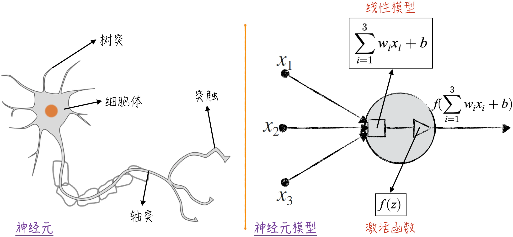
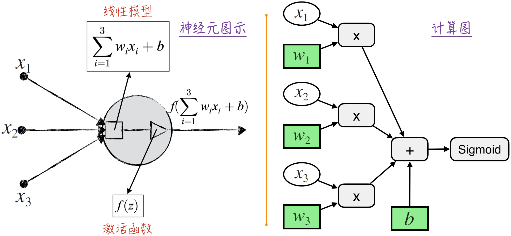
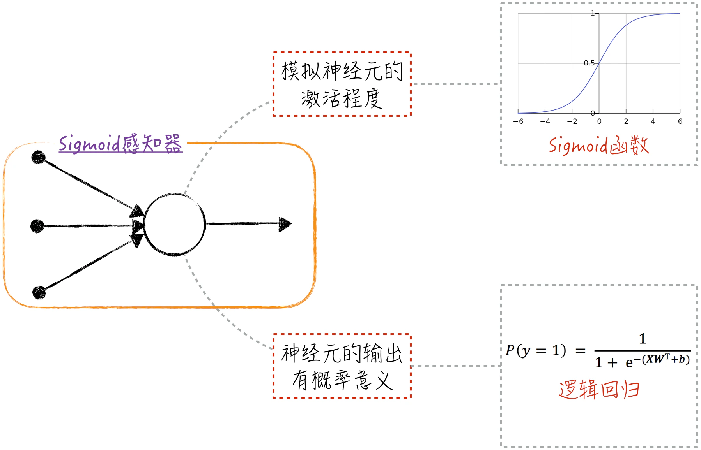
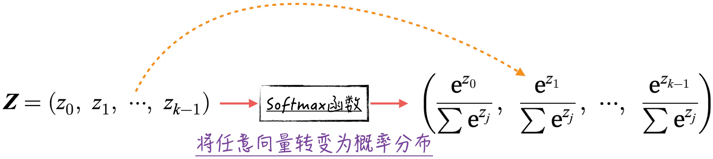
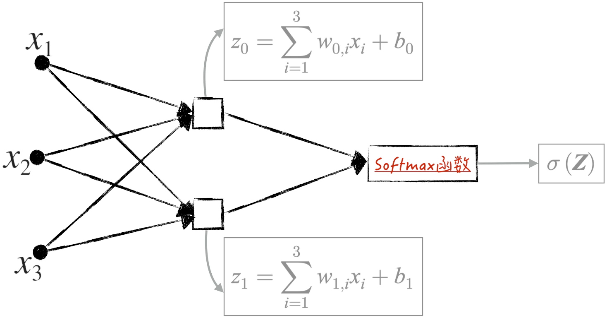

## 8.1 感知器模型

鉴于神经网络的仿真对象是人类的神经系统，为了更好地理解模型，我们需要先从生物学的角度审视人类神经系统的基本特点。

根据生物学的研究，神经系统的基本计算单元被称为神经元。这种神经元能够对环境变化做出响应，并将信息传递给其他神经元。在人脑中，约有 860 亿个神经元相互连接，共同构成了极其复杂的神经网络。这个网络正是人类智慧的生物基础。因此，为了模拟人脑的生物结构，首要任务是构建模型来模仿神经元的行为。

### 8.1.1 神经元的数字孪生

图 8-1 左侧展示了一个典型神经元的结构，它由 4 个基本部分组成，每个部分都发挥着特定的功能。

- 树突：一个神经元拥有多个树突，它们接收来自其他神经元的信号，并将这些信号传递给细胞体。
- 细胞体：细胞体是神经元的核心，它对来自各个树突的信号进行汇总，得到一个综合的刺激信号。
- 轴突：当细胞体内积累的刺激信号超过一定阈值时，神经元的轴突将会发出信号。
- 突触：该神经元发出的信号（如果有的话）会通过突触传递给其他神经元，或者传递给人体内响应神经信号的其他组织。值得注意的是，神经元通常具有多个突触，但它们传递的信号是相同的。

这些组成部分相互协作，赋予神经元信息处理的功能，同时构成了神经网络模型的基础。将上述神经元结构抽象成数学概念，可以得到类似图 8-1 右侧所示的神经元模型。

- 这个模型的输入是数据中的变量（或者特征），比如图中的 $x_1,x_2,x_3$。它们用圆点表示，对应神经元中的树突。
- 输入变量经过一个线性模型进行加权求和，这部分用方框表示。这个线性模型对应神经元的细胞体。需要注意的是，在神经元的线性模型中将权重项和截距项分开表示，用 $w$ 表示权重，用 $b$ 表示截距[^1]。
- 随后，非线性激活函数（Activation Function）$f$ 发挥作用，决定是否向外部发送信号。在图中，这一部分用三角形表示，对应神经元内的轴突。在神经网络领域，通常用一个圆圈来简略地表示线性模型和激活函数，将它们视为整体。本书在针对神经网络的讨论中也使用这种标记方式。
- 将模型的各个组件连接在一起，最终得到输出 $f(\sum_i w_i x_i+b)$。这个值将传递给下一个神经元模型，在图中用箭头表示，对应神经元中的突触。就像生物学中的突触一样，一个神经元可以拥有多个输出连接，但这些连接传递的值都相同。

在神经元模型中，激活函数 $f$ 的非线性特性至关重要。最初的神经元模型[^2]采用了一种直观的方式来定义 $f$。当函数的输入超过某个阈值时，输出 1，否则输出 0。具体表达式如下：

$$
f(x)=
\begin{cases}
1,&x>0\\
0,&x\le 0
\end{cases}
\tag{8-1}
$$

这个模型也被称为感知器（Perceptron），主要用于解决二元分类问题。尽管感知器在某种程度上模拟了神经元轴突的行为，但其处理方式相对简单。在生物学中，神经元的输出是连续的，不是离散的，这限制了感知器的性能。为了改进这一点，学术界引入了[第 4 章](/books/deconstructing_LLM/chapter-4)介绍的 Sigmoid 函数（也称 S 函数）作为神经元的激活函数。这种函数具有连续且非线性的特性，表达式如下：

$$
S(z)=\frac{1}{1+e^{-z}}
\tag{8-2}
$$

通过采用 Sigmoid 激活函数，模型的输出变得平滑且连续。Sigmoid 函数的特性使得输出能够在 0 和 1 之间平稳变化，从而提供更加丰富的信息表达能力，使模型更贴近生物神经元的运作方式。这种改进的模型被称为 Sigmoid 感知器（Sigmoid Perceptron）。这一变化不仅为模型赋予了更强大的表达能力，也在数学上具有可微性。这意味着我们可以使用反向传播算法来计算模型参数的梯度，进而应用之前讨论过的优化算法来迭代地优化模型。这是神经网络发展中的一个重要里程碑[^3]。

### 8.1.2 图示与计算图

在神经网络领域，模型的图示是一种常用且极为重要的工具。它能够以清晰简单的方式展示模型的结构，帮助我们理解和构建这些模型。同时，[第 7 章](/books/deconstructing_LLM/chapter-7)中介绍的计算图是一种计算机用来存储模型运算关系的框架。显然，神经网络同样可以以计算图的形式来表示（实际上，在计算机中也是以这种方式表达的）。因此，本节将以最基本的感知器模型为例，详细讨论神经网络的图示和计算图之间的联系与区别。

如图 8-2 所示[^4]，将神经网络的结构想象成一个经过简化的计算图，这样可以去除不必要的细节，使整体逻辑更加清晰易懂。在神经元图示中，将表示模型参数的变量节点省去，同时将与之直接相关的线性模型部分隐藏起来，使图形简洁。这些隐藏节点在图中不可见，但在进行反向传播时却是算法关键的组成部分。当涉及神经网络中的反向传播时，我们可以在脑海中还原这些隐藏节点，从而更好地理解算法的核心思想。在大多数情况下，我们只需要关注简化后的整体图像即可。在某些更复杂的场景下，比如 [8.4.1 节](/books/deconstructing_LLM/chapter-8/8-4#section-8-4-1)讨论神经元坏死问题以及[10.3.7 节](/books/deconstructing_LLM/chapter-10/10-3#section-10-3-7)讨论随时间反向传播时，我们会再次放大计算图的细节，以深入理解其中的奥妙。

需要强调的是，图 8-2 右侧所示是理论上的计算图，在输入数据后，实际的计算图可能会变得更复杂，几乎无法用肉眼观察清楚。这也是通常只使用神经网络的图示来表示模型的结构和流程的原因。

### 8.1.3 Sigmoid 感知器与逻辑回归

从理论的角度来讲，Sigmoid 函数模拟了两种效应的相互竞争：假设正效应和负效应都和自变量 $\boldsymbol X=(x_1,x_2,\cdots,x_k)$ 是近似线性关系。具体的公式如下，其中，$Y^*$ 表示正效应，$\widetilde Y$ 表示负效应，$\boldsymbol W_1=(w_{1,1},w_{1,2},\cdots,w_{1,k})$、$\boldsymbol W_0=(w_{0,1},w_{0,2},\cdots,w_{0,k})$ 和 $b_1,b_0$ 是模型参数，$\theta$ 和 $\tau$ 是服从正态分布的随机干扰项：

$$
\begin{aligned}
Y^*&=\boldsymbol X\boldsymbol W_1^{\mathrm T}+b_1+\theta\\
\widetilde Y&=\boldsymbol X\boldsymbol W_0^{\mathrm T}+b_0+\tau
\end{aligned}
\tag{8-3}
$$

根据[第 4 章](/books/deconstructing_LLM/chapter-4)的讨论，正效应大于负效应的概率可以被近似为一个 Sigmoid 函数，具体形式如下，其中 $\boldsymbol W=\boldsymbol W_1-\boldsymbol W_0$，$b=b_1-b_0$：

$$
P(Y^*-\widetilde Y>0)\approx S(\boldsymbol X\boldsymbol W^{\mathrm T}+b)
\tag{8-4}
$$

因此，在感知器模型中使用 Sigmoid 函数，相当于为模型的输出赋予了概率的含义。这一设计使模型的理论基础更加坚实，同时使模型适用于解决二元分类问题。例如，当模型的输出大于 0.5 时，预测类别为 1；否则，预测类别为 0。在这种情况下，Sigmoid 感知器实际上等同于二元逻辑回归模型，如图 8-3 所示。

在神经网络的早期，主要致力于为构建的模型寻找坚实的理论基础，因此会尽量汲取之前经典模型的要素。随着时间的推移，整个领域的研究范式发生了巨大的变革，逐渐从试图深入理解模型转向更加高效地模拟和训练模型，模型的可解释性不再是主要关注点。然而，由于现实需求，例如公众或监管机构对模型原理的要求，虽然不再追求整体模型的解释性，但仍然会努力赋予模型输出明确的含义和合理的解释。在这些情况下，类似本节所讨论的对传统模型的类比和借鉴变得尤为重要，这种思路将贯穿于本书后续的内容中。

### 8.1.4 Softmax 函数

在深入探讨神经网络前，本节先介绍一个该领域中至关重要的函数——Softmax 函数。在神经网络中处理分类问题时，Softmax 函数经常被用来定义损失函数。

回顾[第 4 章](/books/deconstructing_LLM/chapter-4)的内容，二元逻辑回归模型的表达式形式如下：

$$
P(y=1)=\frac{1}{1+e^{-\boldsymbol X\boldsymbol W^{\mathrm T}-b}}
\tag{8-5}
$$

在公式（8-5）中，将分子、分母同时乘以指数项，可以得到公式（8-6），其中，$\boldsymbol W=\boldsymbol W_1-\boldsymbol W_0$，$b=b_1-b_0$：

$$
\begin{aligned}
P(y=1)&=\frac{e^{\boldsymbol X\boldsymbol W_1^{\mathrm T}+b_1}}{e^{\boldsymbol X\boldsymbol W_1^{\mathrm T}+b_1}+e^{\boldsymbol X\boldsymbol W_0^{\mathrm T}+b_0}}\\
P(y=0)&=\frac{e^{\boldsymbol X\boldsymbol W_0^{\mathrm T}+b_0}}{e^{\boldsymbol X\boldsymbol W_1^{\mathrm T}+b_1}+e^{\boldsymbol X\boldsymbol W_0^{\mathrm T}+b_0}}
\end{aligned}
\tag{8-6}
$$

实际上，多元逻辑回归的模型公式也可以呈现出类似的结构。基于[第 4 章](/books/deconstructing_LLM/chapter-4)的讨论，假设对于一个具有 $k$ 个类别的分类问题，这些类别分别被标记为 $0,1,\cdots,k-1$，这时多元逻辑回归模型的表达式[^5]可以写为：

$$
\begin{cases}
P(y=1)=\dfrac{e^{\boldsymbol X\boldsymbol\beta_1^{\mathrm T}+c_1}}{1+\sum_{j=1}^{k-1}e^{\boldsymbol X\boldsymbol\beta_j^{\mathrm T}+c_j}}\\[4pt]
P(y=2)=\dfrac{e^{\boldsymbol X\boldsymbol\beta_2^{\mathrm T}+c_2}}{1+\sum_{j=1}^{k-1}e^{\boldsymbol X\boldsymbol\beta_j^{\mathrm T}+c_j}}\\
\quad\vdots\\
P(y=0)=\dfrac{1}{1+\sum_{j=1}^{k-1}e^{\boldsymbol X\boldsymbol\beta_j^{\mathrm T}+c_j}}
\end{cases}
\tag{8-7}
$$

不妨记 $\boldsymbol W_j=\boldsymbol W_0+\boldsymbol\beta_j$，$b_j=b_0+c_j$。在公式（8-7）中，将分子、分母同时乘以 $e^{\boldsymbol X\boldsymbol W_0^{\mathrm T}+b_0}$，可以得到公式（8-8）：

$$
P(y=l)=\frac{e^{\boldsymbol X\boldsymbol W_l^{\mathrm T}+b_l}}{\sum_{j=0}^{k-1}e^{\boldsymbol X\boldsymbol W_j^{\mathrm T}+b_j}}
\tag{8-8}
$$

公式（8-6）和公式（8-8）所涉及的函数实际上就是 Softmax 函数，通常记作 $\sigma(\boldsymbol Z)$。这个函数的输入是一个 $k$ 维行向量，输出也是一个 $k$ 维行向量。其关键特点是，输出向量的每个分量都位于 $(0,1)$ 区间内，而且所有分量之和正好等于 1。Softmax 函数的输出实际上构成了一个概率分布，如图 8-4 所示。Softmax 函数由于具有这一特性，因此在分类问题中扮演着至关重要的角色。一组原始的预测分数经过它的转换，就可以得到每个类别的概率估计，从而实现分类模型。因此，在神经网络中，Softmax 函数常常被应用在网络的最后一层，并参与模型损失函数的定义。

探讨 Softmax 函数在解决分类问题中的重要性之后，下面来看如何在神经网络中更直观地运用这一概念。以二元逻辑回归为例，可以利用 Softmax 函数将其转化为一种新的图形，如图 8-5 所示。

在图 8-5 中，每个方块代表一个线性模型，与图 8-1 中的方块代表的意义一致。将这个模型的图形视为一层神经网络，在这一层网络中有两个带有线性输出的感知器。这些感知器的顶部连接了一个 Softmax 转换器，用于处理输出结果。值得注意的是，图 8-5 中所示的模型与图 8-3 中使用 Sigmoid 函数的感知器模型实际上是等价的，只不过图 8-5 更符合神经网络领域的表达习惯。此外，我们可以很容易地将图 8-5 扩展到多元分类问题中，只需增加方块的数量即可。这种过渡能够更自然地将逻辑回归引入神经网络，或者在已有的神经网络结构中识别逻辑回归的存在。这为在实际应用中引入逻辑回归的可解释性和分析工具提供了便利。

运用 Softmax 函数，可以将逻辑回归模型在第 $i$ 个数据点上的损失表达为更简洁的形式：

$$
L_i=-\sum_{l=0}^{k-1}\mathbf 1\{y_i=l\}\ln\left(\frac{e^{\boldsymbol X_i\boldsymbol W_l^{\mathrm T}+b_l}}{\sum_{j=0}^{k-1}e^{\boldsymbol X_i\boldsymbol W_j^{\mathrm T}+b_j}}\right)
\tag{8-9}
$$

对于 $k$ 元分类问题，假设第 $i$ 个数据的类别是 $t$，用一个 $k$ 维的行向量 $\boldsymbol\theta_i=(\theta_{i,0},\theta_{i,1},\ldots,\theta_{i,k-1})$ 来表示它的类别[^6]：这个行向量的第 $t$ 个维度等于 1，即 $\theta_{i,t}=1$；其他维度等于 0，即 $\theta_{i,j}=0,j\ne t$。

基于这些设定，逻辑回归在该数据点上的损失可以用 Softmax 函数与行向量 $\boldsymbol\theta_i$ 的矩阵乘法来表示（如前文所述，这也被称为交叉熵），如公式（8-10）所示。其中，$\boldsymbol Z_i=(\boldsymbol X_i\boldsymbol W_0^{\mathrm T}+b_0,\ldots,\boldsymbol X_i\boldsymbol W_{k-1}^{\mathrm T}+b_{k-1})$ 是一个包含 $k$ 个元素的行向量，每个元素是线性模型的预测结果，描述了不同类别的“得分”，在神经网络中也常常被称为 Logits[^7]。

$$
L_i=-\boldsymbol\theta_i\ln\sigma(\boldsymbol Z_i)^{\mathrm T}
\tag{8-10}
$$

类似地，整个模型的损失函数也可以写为矩阵乘法的形式，因为 $L=\sum_iL_i$。这种形式在实现神经网络的工程应用中非常有用。在后续的章节中，会经常用到基于这种形式的代码实现。

[^1]: 在神经网络中，线性模型中的截距项具有特殊的生物含义，它通常对应着神经元的激活阈值，因此需要单独处理。
[^2]: 弗兰克·罗森布拉特（Frank Rosenblatt）于 1957 年在康奈尔航空实验室（Cornell Aeronautical Laboratory）设计了第一款人工神经网络。这个最初版的神经网络其实是一台机器：由于当时的计算机还处在比较初级的阶段，因此专门设计了一台机器来实现这个模型。
[^3]: 在[8.4 节](/books/deconstructing_LLM/chapter-8/8-4)中会介绍，尽管在过去的发展中 Sigmoid 函数发挥了关键作用，但在当前的实际生产中，由于多种原因，几乎不再使用 Sigmoid 作为主要的激活函数。
[^4]: 为了方便演示，图 8-2 中的计算图省略了部分细节。完整细节见配套代码 [`ch08_mlp/perceptron.ipynb`](https://github.com/GenTang/regression2chatgpt/blob/zh/ch08_mlp/perceptron.ipynb)。
[^5]: 公式（8-7）与公式（4-33）稍有不同。公式（8-7）将截距项单独列出，主要是为了和神经网络领域中的其他文献保持一致。
[^6]: 这种处理方法在学术上被称为独热编码，详见[10.1.1 节](/books/deconstructing_LLM/chapter-10/10-1#section-10-1-1)。
[^7]: Logits 是统计学、数学和机器学习领域常见的术语，通常表示未经过归一化的模型输出，也可以理解为模型的原始预测值。在分类问题中，Logits 是模型在各个类别上的得分，它们可以通过 Softmax 等函数进行归一化，转化为用于最终分类的概率分布。
