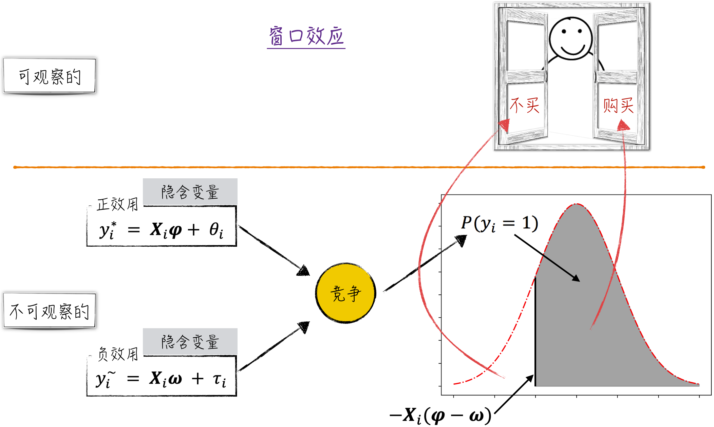
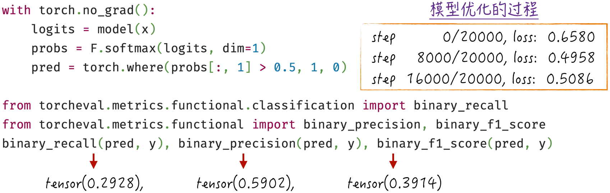
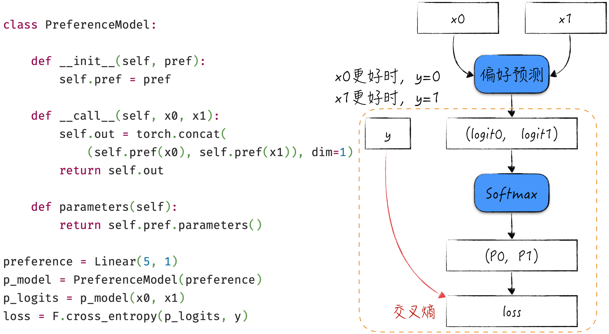

## 8.2 从神经网络的视角重新理解逻辑回归

在 8.1.3 节和 8.1.4 节中，已经提到经典的 Sigmoid 感知器实际上等同于逻辑回归模型，逻辑回归能够被表示为更通用的单层神经网络。下面暂时把第 4 章的内容抛诸脑后，从神经网络的角度出发，用代码从零开始构建一个解决二元分类问题的逻辑回归模型。

### 8.2.1 回顾窗口效应

以购买商品的场景为例，重新审视一下窗口效应。我们能观察到的数据是客户是否购买了特定商品，然而这个结果实际上是客户经过内心思考后做出的决策。在做出这个决策的过程中，客户会经历以下阶段：首先，评估购买该商品所带来的正效用（可视为购买倾向的评分）；接着，评估购买商品可能带来的负效用（可视为不购买倾向的评分）。这两种效用之间形成一种竞争（效用决定了相应行为的概率），最终影响购买决策，即我们观察到的结果，如图 8-6 所示。

这种基于效用和概率的思维模式在处理分类问题时是普适的，即总是从研究对每个类别的偏好开始，然后通过这些偏好构建相应的概率分布，最终根据这些概率分布做出具体的类别选择。



现在，将之前讨论的窗口效应转化为模型表达。

1. 尽管我们现在对效用函数的确切形式尚不清楚，但无须担忧，首先假设正负效用可以通过线性模型来预测。
2. 对于分类问题，模型的输出应该是一个二维概率分布。然而，刚刚构建的两个模型显然无法满足这个要求，因为它们的输出是未受限的实数。这一问题的解决方法也很简单，参考 8.1.4 节中的内容，只需在这两个模型的输出上附加一个 Softmax 转换器。

经过这样的组合之后，模型将以特征 $x$ 作为输入，最终生成一个二维概率分布。尽管没有复杂的数学推导，但通过这种相对机械式的操作，我们成功地构建了一个能够解决二元分类问题的模型。但如果仔细审视就会发现，这个模型与之前讨论过的逻辑回归模型十分相似。当然，在逻辑回归模型中只有一个线性部分，而这个模型包含两个线性部分。

### 8.2.2 代码实现

本节中将使用与第 4 章完全相同的数据，以便演示模型构建的过程，数据的具体细节和字段说明见 4.2 节。此外，为了突出重点，在这个示例中并没有将数据划分为训练集和测试集。

#### 程序清单 8-1 重新搭建逻辑回归模型（[完整代码](https://github.com/GenTang/regression2chatgpt/blob/zh/ch08_mlp/logit_regression.ipynb)）

```python
class Linear:

    def __init__(self, in_features, out_features, bias=True):
        """
        模型参数初始化
        需要注意的是，此次未做参数初始化的优化
        """
        self.weight = torch.randn((in_features, out_features))
        self.bias = torch.randn(out_features) if bias else None

    def __call__(self, x):
        self.out = x @ self.weight
        if self.bias is not None:
            self.out += self.bias
        return self.out

    def parameters(self):
        """
        返回线性模型的参数，主要用于参数迭代更新
        由于 PyTorch 的计算单元就是张量，
        所以此次只需将不同参数简单合并成列表即可
        """
        if self.bias is not None:
            return [self.weight, self.bias]
        return [self.weight]

class LogitRegression:

    def __init__(self, neg, pos):
        self.pos = pos
        self.neg = neg

    def __call__(self, x):
        self.out = torch.concat((self.neg(x), self.pos(x)), dim=1)
        return self.out

    def parameters(self):
        return self.neg.parameters() + self.pos.parameters()

# 定义模型
pos = Linear(5, 1)
neg = Linear(5, 1)
model = LogitRegression(neg, pos)

# 使用模型
## 注意，模型输入数据的形状一定要是(n, 2)
logits = model(x[[1]])           # (1, 2)
probs = F.softmax(logits, dim=1) # (1, 2)
pred = torch.where(probs[:, 1] > 0.5, 1, 0)
logits, probs, pred
(tensor([[ 1.2665, -1.7305]]), tensor([[0.9524, 0.0476]]), tensor([0]))

# 计算模型在单点的损失
loss = F.cross_entropy(logits, y[[1]])
# cross_entropy 的具体实现过程
-probs[torch.arange(1), y[[1]]].log().mean(), loss
(tensor(0.0487), tensor(0.0487))
```

代码的实现过程与上一节描述的步骤完全一致，具体实现如程序清单 8-1 所示。

1. 在第 41 行和第 42 行中，定义两个线性模型，分别用于表示正向和负向效用。这些线性模型的定义位于第 1～25 行。需要注意的是，虽然 PyTorch 已经封装了线性模型，可以直接使用，但为了展示模型细节，我们重新实现了 PyTorch 的封装。在线性模型的实现中，模型参数的初始值是随机生成的，这里并没有优化参数的初始化过程。在 [8.5 节](/books/deconstructing_LLM/chapter-8/8-5)中将着重探讨如何优化参数的初始化。
2. 在这两个线性模型上添加 Softmax 转换器，即可得到我们所需的模型。在代码实现中，Logits 的计算位于第 33～35 行，Softmax 转换器的实现位于第 47 行和第 48 行。这样划分是为了遵循神经网络领域的编码习惯，也有助于更便捷地使用 PyTorch 提供的损失函数封装，比如第 54 行的 `cross_entropy`。
3. 实际上，在进行模型训练之前，就已经可以使用这个模型进行预测，如第 45～51 行所示。将某个数据输入模型，通过简单的转换就能获得对两种类别的概率预测。当然，此时模型的预测效果还不佳，因为模型的参数是随机生成的，还没有经过学习和优化。

对于已构建的神经网络，可以采用第 6 章介绍的最优化算法来训练模型，具体实现见程序清单 8-2。这一训练过程与第 6 章的示例实现几乎完全相同，为避免冗余，这里不再展开细节。

#### 程序清单 8-2 训练模型（[完整代码](https://github.com/GenTang/regression2chatgpt/blob/zh/ch08_mlp/logit_regression.ipynb)）

```python
# 标准随机梯度下降法的超参数
max_steps = 20000
batch_size = 3000

for i in range(max_steps):
    # 构造批次训练数据
    ix = torch.randint(0, x.shape[0], (batch_size,))
    xb = x[ix]
    yb = y[ix]

    # 向前传播
    logits = model(xb)
    loss = F.cross_entropy(logits, yb)
    # 反向传播
    loss.backward()

    # 更新模型参数
    ## 学习速率衰减
    learning_rate = 0.1 if i < 10000 else 0.01
    with torch.no_grad():
        for p in model.parameters():
            p -= learning_rate * p.grad
            p.grad = None
```

模型经过训练后的结果如图 8-7 所示，与第 4 章的结果类似。通过训练，逐渐调整模型参数，使其能够更好地拟合数据并提高分类准确度。



### 8.2.3 损失函数为模型注入灵魂

在 8.2.2 节中建立的两个线性子模型分别用于预测数据的正效用和负效用。这种方法适用于比较针对同一事物的不同选择等场景，例如图 8-6 中的购物场景。然而，在实际生活中，还存在另一种常见情况：对不同的事物进行比较。例如，一个问题有多个答案，需要对这些答案进行排序，找出最佳答案。在这种情况下，之前构建的模型就不再适用了。那么，如何在微调模型的情况下达到新的建模目标呢？

整个调整过程其实非常简单。可以建立一个线性模型，用于预测每个答案的评分。由于我们只能观察到某个答案相对于另一个答案更受欢迎，因此对于任意两个答案，首先利用这个模型为它们评分，然后将结果组合成一个二维向量，最后通过 Softmax 转换器将二维向量转换为概率分布，从而定义模型的损失函数，如图 8-8 所示。这样就能启动后续的模型训练，逐步提升模型在预测任务中的表现。



上述模型结构与 8.2.1 节中的模型非常相似。由于 8.2.1 节中的模型等同于逻辑回归，因此可以将图 8-8 中的模型解释为两个答案的竞争过程，模型的输出结果表示当前答案评分更高的概率。

在这个模型结构中，Softmax 扮演了至关重要的角色。在运用 Softmax 函数并结合实际数据来定义损失函数时，就为模型赋予了内在意义。如果将 Softmax 函数从输入到输出的转换（从偏好或评分到概率分布）视为正向过程，那么从反向角度看，Softmax 将从现实世界中获得的分类结果“翻译”成潜在的偏好或评分，然后传递这些信息给模型的上一层进行学习。这样的转变为之前那些缺乏充分理论支持的线性模型（用于预测每个答案的评分）赋予了意义，它们确实在对评分进行建模。

通过这种简洁且巧妙的调整，我们将经典的逻辑回归改造成了一种全新的模型，用于偏好估计。这种新颖的使用方式在大语言模型 ChatGPT 中也有所应用。在优化 ChatGPT 的过程中，需要评估模型生成的每个回答，以不断提升模型的表现。我们往往难以直接获取每个回答的确切评分，而是得到一系列回答的偏好排序。这时可以采用类似的模型架构来估计用户对每个回答的评分（更多模型细节将在 11.5.3 节中讨论）。当然，在实际应用中，我们并不只是简单地使用线性回归模型进行评分预测，而会使用更复杂的神经网络模型，但二者的建模核心思想是一致的。这再次强调了理解经典模型的重要性，尽管在实际生产中很少直接应用它们，但它们的影响无处不在。

### 8.2.4 神经网络的建模文化：搭积木

从本节的讨论中可以明显看出，神经网络的构建方式和之前介绍的经典模型存在显著不同。经典模型的构建流程通常始于对数据的深入理解，在对数据进行洞察和思考后，构思初步的模型框架，然后进行一系列的数学推导和计算，最终得到简洁且优雅的数学形式，将其固化为模型，比如从处理窗口效应到经典的逻辑回归模型。

然而，在神经网络领域，我们采用一种完全不同的思维方式。首先，熟悉构建模型的基础组件，例如线性模型、激活函数、Softmax 转换器等。随后，分析建模场景需要什么样的模型输出，例如分类问题需要一个表示概率分布的输出。构建神经网络就像搭积木一样，只需确保模型的输出在“外观上相符”即可。至于模型的具体形式，实际上有很大的自由度。只要使用合适的组件，模型的预测效果就能满足要求，并且模型的输出（包括中间层的输出）具有实际意义。

这个过程近似于魔术，仿佛计算机在帮助我们完成传统建模中的数学推导和演算。由于中间层也被赋予了意义，因此不仅可以整体使用模型，还可以像处理积木一样将模型的一部分拆解出来单独使用。

就模型训练而言，对于许多经典模型，我们无须过多担忧其整个训练过程。然而，在神经网络领域，模型训练是核心所在，需要我们紧密关注训练进程，并采取适当措施以加速模型的收敛速度。在 8.4 节和 8.5 节中，将深入探讨与此相关的细节。
