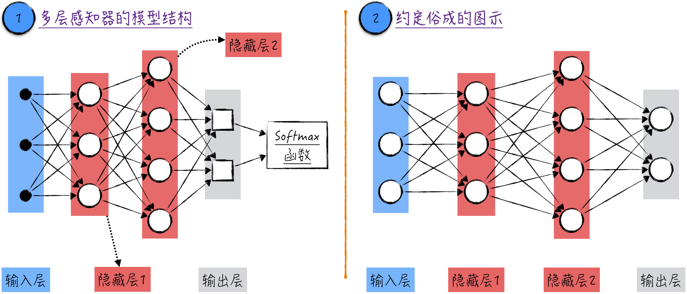
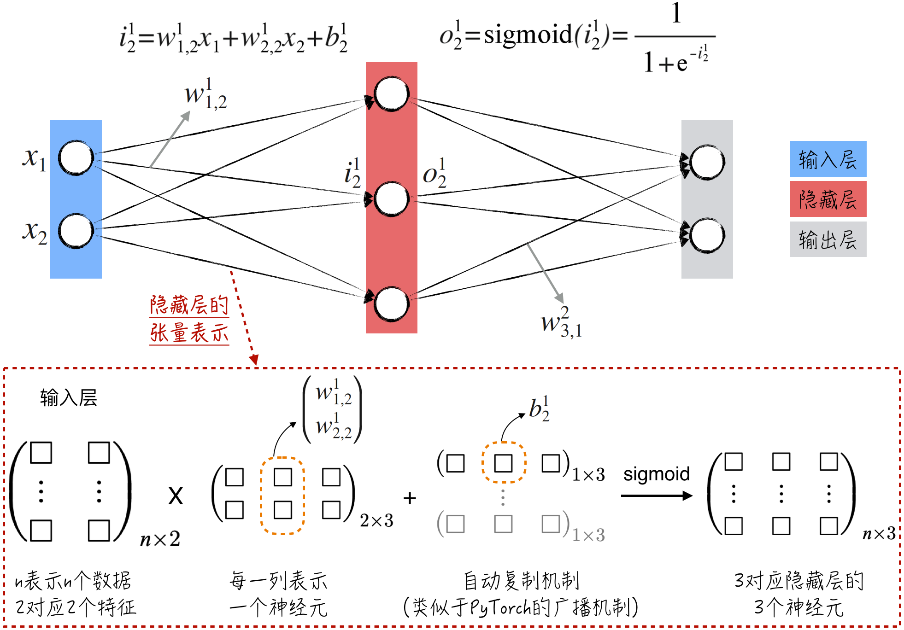
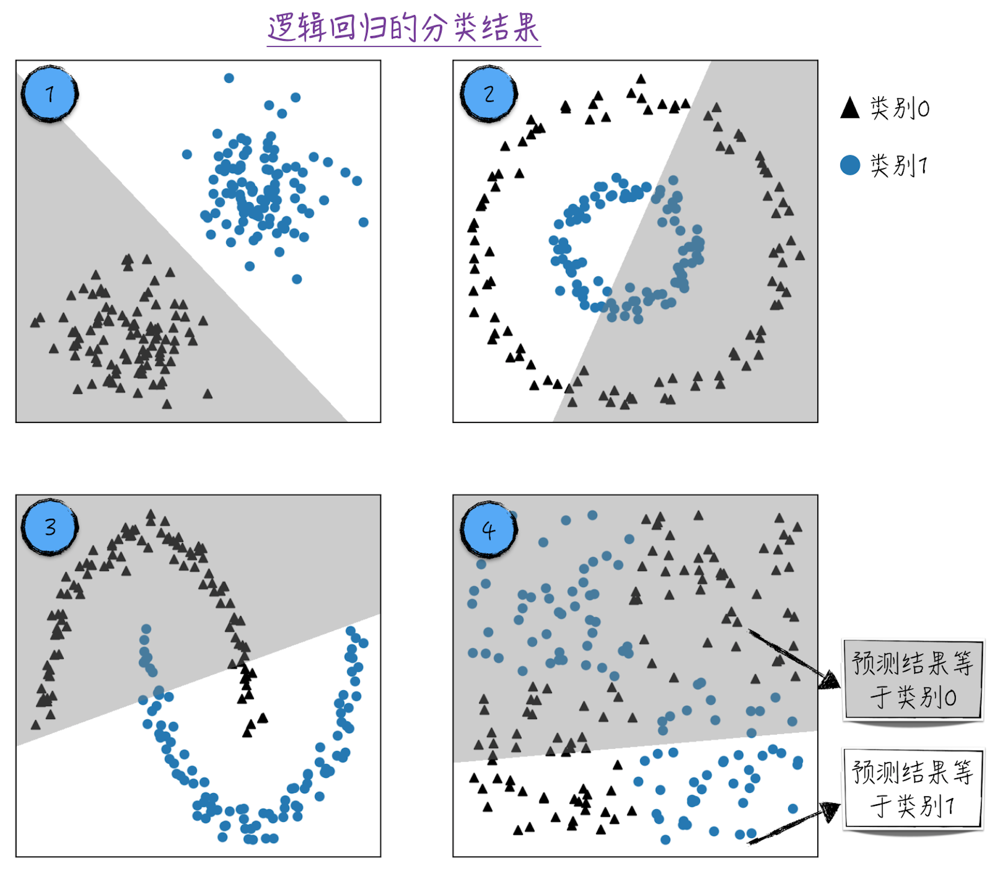
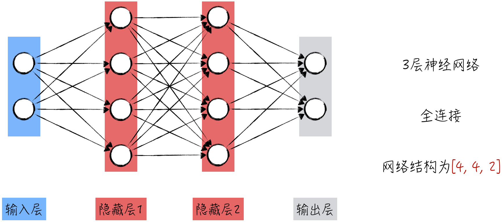
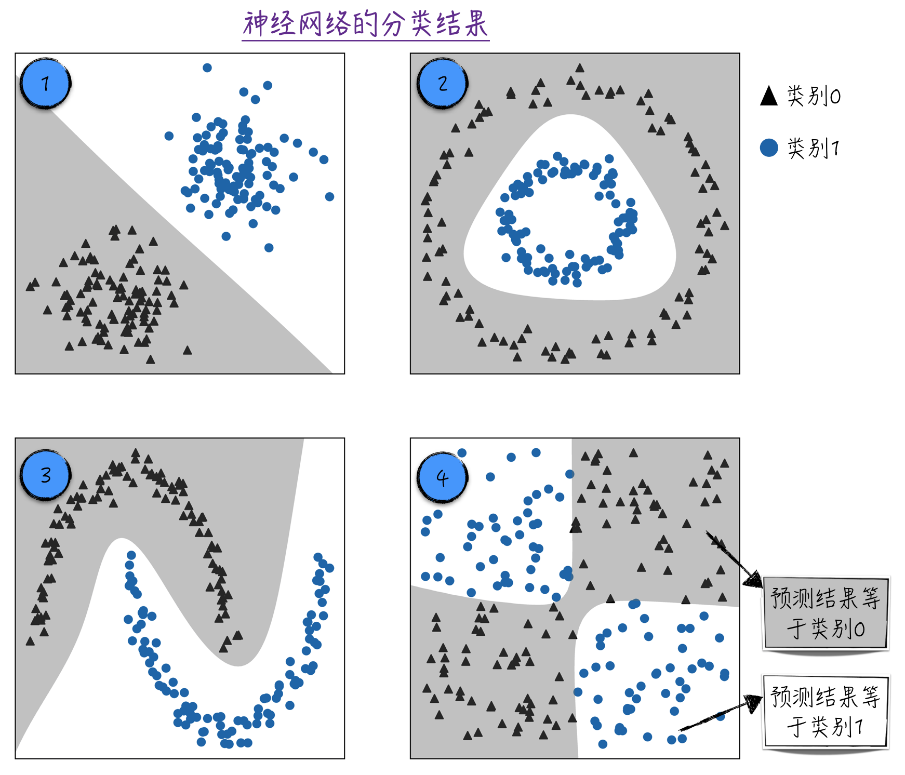
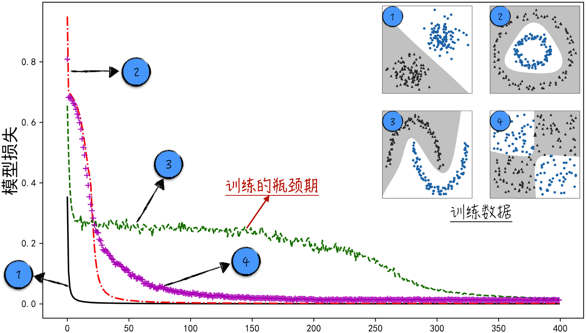
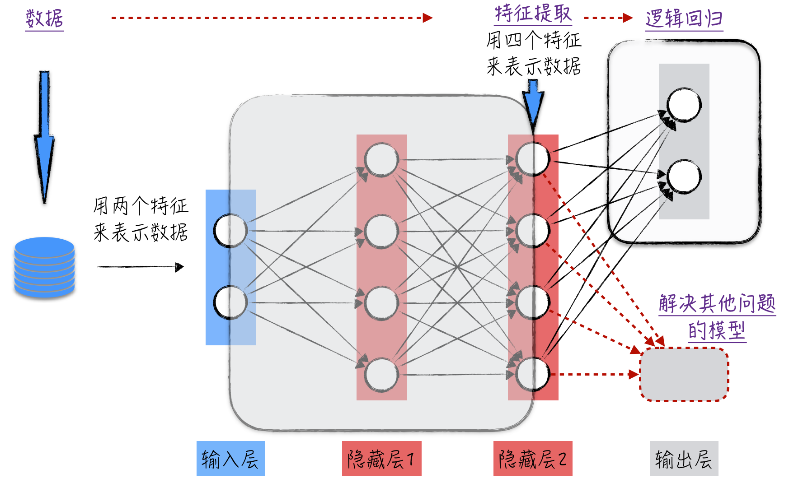

## 8.3 多层感知器

利用单个神经元建立模型的构建过程并不复杂，但单个神经元模型的创新性有限，例如使用 Sigmoid 函数作为激活函数，将得到类似于逻辑回归的感知器模型。

为了提升模型效果，需要再次借鉴仿生学的智慧。在人体结构中，单个神经元的功能相对有限，然而当众多神经元相互交织于一体时，它们共同塑造了人类强大的神经系统。这启发我们将多个神经元模型相互联结，借此构建复杂多样的神经网络结构。这正是本节要重点探讨的内容。

### 8.3.1 图形表示

想要使多个神经元相互联结，一种简单且直观的方式是通过分层组织构建一个无闭环的网络结构，也称非循环图（Acyclic Graph）。在这种结构中，每一层神经元的输出是下一层神经元的输入。学术界将这种神经网络称为多层感知器，其模型的拓扑结构如图 8-9 所示。

这种层级结构有助于信息有序流动，从而为模型提供强大的表达能力。根据不同的问题调整层之间的连接和神经元的数量，以优化多层感知器的性能。多层感知器是极具经典意义的神经网络结构，可以毫不夸张地说，它是所有神经网络的基石。后续的复杂网络要么源自多层感知器的进化，要么在其内部嵌套多层感知器。



在多层感知器的结构中，神经元是按层（Layer）组织的。每一层包含若干神经元，层内部的神经元是相互独立的，也就是说它们之间并不相连；但相邻的两层之间是全连接的（Fully-Connected），即任意两个神经元都有直接的连接。

神经网络中的层次结构按照其功能被划分为三类：输入层（Input Layer）、隐藏层（Hidden Layer）和输出层（Output Layer）。这种层级构造通过输入层接收数据，经过多个隐藏层的计算和特征提取，最终在输出层得到模型的预测结果。

1. 神经网络中只有一个输入层。如图 8-9 中标记 1 所示，黑色的点表示输入层：每个黑色点代表模型的一个输入，即训练数据中的一个特征。如果训练数据具有 $k$ 个特征，那么输入层将包含 $k$ 个黑色点。需要强调的是，输入层不对数据进行任何处理，其主要职责是将信息传递至后续的隐藏层。若网络中没有隐藏层，则将信息直接传递至输出层，此时，神经网络类似于图 8-5 中的逻辑回归模型。
2. 神经网络可以拥有多个隐藏层，如图 8-9 中标记 2 所示为两个隐藏层。隐藏层中的元素即感知器，比如 Sigmoid 感知器，在图中用圆圈表示。需要注意的是，每个圆圈代表一个线性模型和一个激活函数的组合。在多层感知器中，隐藏层的目标是传递和分析数据，以便进行特征提取和数据变换。
3. 神经网络仅包含一个输出层。输出层中的元素与隐藏层中的不同，它仅包含线性模型，在图中用方块表示。尽管输出层名为“输出”，但它可能并不是模型的最终输出结果。如果处理的是分类问题，输出层的结果需要经过 Softmax 函数处理，才能得到最终的模型预测结果，类似于图 8-5 中的逻辑回归模型。

前文提到，不同层次在神经网络中扮演着不同的角色，其中“元素”的具体模型形式也千差万别。在神经网络领域的图示中，大家习惯性地使用圆圈来代表这些“元素”，并将它们总称为神经元（这种表达方式可能会让初学者有些困惑）。同时，尽管在模型的最后一步常常会应用 Softmax 函数来调整输出结果，但在图示中这个步骤往往会被省略掉，如图 8-9 中的标记 2 所示。

图 8-9 中的标记 1 和标记 2 展示了同一个神经网络，其中标记 2 的图示在神经网络领域被广泛接受，因此在后续章节中将采用这种表示方式。神经网络通常以其拥有的层数来命名，不过这并不包括输入层。例如，图 8-9 中的模型被称为 3 层神经网络（3 Layer Neural Network）。需要注意，这种命名方式并不能完全唯一地识别一个神经网络。举例来说，如果将图 8-9 中的隐藏层 1 扩展为拥有 10 个神经元，它仍然是一个 3 层神经网络。

本节探讨了神经网络领域内被广为接受的命名约定和图形表示方法。这种统一的表达方式有助于我们更清晰地展示神经网络的结构，无论是构建模型还是阅读文献，这样的约定都能够使我们更加得心应手。

### 8.3.2 数学基础

神经网络的图形表示很直观，但其所涵盖的数学公式却相当复杂。为了更深入地理解神经网络，下面来深入探讨其图形背后的数学基础。

为了便于讨论，以一个简单的 2 层神经网络为例，假设该网络用于解决分类问题，如图 8-10 所示。其中，输入层包含两个圆圈，代表模型所使用的两个特征，分别用 $x_1$ 和 $x_2$ 表示。

隐藏层中的圆圈代表感知器模型，它由两个主要部分构成：线性模型和激活函数。线性模型将输入的特征与相应的权重相乘并相加，激活函数通过对线性模型的输出进行非线性变换，为神经网络引入了复杂的非线性关系。

1. 在第 $l$ 层（从左到右编号）的第 $m$ 个神经元（从上到下编号）中，使用记号 $i_m^{(l)}$ 表示线性模型的输出，即圆圈对输入进行第一层加工得到的结果；使用记号 $o_m^{(l)}$ 表示激活函数的输出，也就是圆圈的输出。考虑到这个神经网络使用的是 Sigmoid 感知器[^1]，两者之间的关系可以表达为：

$$
o_m^{(l)}=\frac{1}{1+e^{-i_m^{(l)}}}
\tag{8-11}
$$

2. 在图 8-10 中，圆圈之间的箭头代表线性模型中的权重（与[8.1.2 节](/books/deconstructing_LLM/chapter-8/8-1#section-8-1-2)一样，隐藏了表示模型参数的变量节点），用记号 $w_{n,m}^{(l)}$ 表示从第 $l-1$ 层中第 $m$ 个圆圈到第 $l$ 层中第 $n$ 个圆圈的箭头。值得注意的是，为了书写方便，将输入层记为第 0 层。
3. 除了权重，线性模型还包括一个截距项，这也是神经网络中的另一个重要的模型参数。用记号 $b_n^{(l)}$ 表示第 $l$ 层中第 $n$ 个圆圈对应的截距。结合前面的标记，圆圈中线性模型的输出公式如下。值得注意的是，$o_m^{(0)}$ 表示输入层中的第 $m$ 个特征，也就是图 8-10 中的 $x_m$。

$$
i_n^{(l)}=\sum_m w_{n,m}^{(l)}o_m^{(l-1)}+b_n^{(l)}
\tag{8-12}
$$

4. 神经网络隐藏层的数学表示涉及的变量符号相当复杂，如果不仔细整理，很容易使我们在纷繁的数学符号中失去方向感。为了在实际应用中保持简洁和清晰，采用类似图 8-10 下半部分所示的运算方式。这种方法首先利用了张量运算，它是对矩阵运算的扩展（详见[2.1 节](/books/deconstructing_LLM/chapter-2/2-1)和[6.3.1 节](/books/deconstructing_LLM/chapter-6/6-3#section-6-3-1)）。同时，为了更有效地处理不同维度的张量，引入张量自动复制机制，类似于 PyTorch 中广播机制的原理，这一机制极大地提升了操作的便捷性。通过这样的处理，我们能够将注意力从单个参数的数值转移到张量的形状上，确保张量形状与网络结构保持一致。



输出层的圆圈只表示线性模型，尽管圆圈中并未包含激活函数，但为了书写简单，依然用记号 $o$ 表示图 8-10 中输出层的圆圈。

1. 与隐藏层不同的是，输出层中有 $i_m^{(l)}=o_m^{(l)}$（这里 $i_m^{(l)}$ 的计算公式与隐藏层中完全相同，在此不再赘述）。
2. 针对分类问题，相应的损失函数如公式（8-13）所示。其中，$\sigma$ 代表[8.1.4 节](/books/deconstructing_LLM/chapter-8/8-1#section-8-1-4)中讨论过的 Softmax 函数；$\boldsymbol Z_i$ 表示针对第 $i$ 个数据的神经网络输出；$\boldsymbol\theta_i$ 表示第 $i$ 个数据的类别。

$$
L=\sum_iL_i=-\sum_i\boldsymbol\theta_i\ln\sigma(\boldsymbol Z_i)^{\mathrm T}
\tag{8-13}
$$

3. 与隐藏层的情形类似，在实际的实现中，采用张量来组织输出层的计算。

综上所述，神经网络的模型参数可以分为两类：一类是线性模型的权重，另一类是线性模型的截距项。通过这个简单的例子，我们可以初步领略到神经网络在数学上的复杂性。首先，这种模型拥有庞大数量的参数，特别是在网络结构十分复杂的情况下。其次，这些参数共同构建的模型表达式也异常复杂。

不仅如此，与其他模型相比，神经网络的数学表达式并不固定，而是根据结构的定义而灵活变化，同时模型参数在不同层次之间存在紧密的依赖关系。这些特点使得从数学角度推导参数的梯度表达式变得十分困难，几乎成为一项不可能完成的任务。然而，在这样的背景下，反向传播算法展现出了独特的优势。通过巧妙地使用张量，以及合理地定义模型运算，反向传播算法能够自动计算每个参数的梯度，为训练神经网络提供强大的支持。

稍微偏离主题，谈谈使用反向传播算法计算神经网络梯度可能带给我们的启示。上述案例生动地呈现了工程师思维的精髓，正如牛顿所言，“站在巨人的肩膀上”，我们能够看得更远。虽然反向传播算法的诞生与神经网络领域所面临的实际问题紧密相关，但这一算法已经超越了具体问题的复杂性，通过总结和抽象，借助计算图的理念，成为解决梯度计算的“轮子”。

借助反向传播算法，我们能够巧妙地将问题转化为先前已经解决过的范式，否则需要投入大量时间和精力手动计算梯度，但最终成果微不足道。通过总结、抽象和定义普适性问题，再创造解决这些问题的“轮子”，并在实际应用中善加运用，才能够推动科技实现真正的进步，从而为生活带来更多的便利与美好。

“轮子”在应用中常常担当底层技术的角色，承载着深厚的技术内涵，支撑起了所谓的“硬核”科技。它们的重要性毋庸置疑，但是何为“硬核”呢？实际上，科技的每一步都孕育着独特的硬核要素，它们是命运共同体，需要协同工作以实现价值的最大化，缺少任何一环都可能使整个技术链条失去意义。因此，工程师文化的精髓在于深刻理解学科中的基础工具并善加应用。

### 8.3.3 令人惊讶的通用性

前面的讨论聚焦于多层感知器的理论知识，下面将通过一个实例来展示神经网络如何解决分类问题。这个例子旨在更好地揭示神经网络的特点，因此在其中暂不划分训练集和测试集。

分类是人工智能最常见的应用之一。[第 4 章](/books/deconstructing_LLM/chapter-4)中已经深入探讨了解决分类问题的逻辑回归模型。逻辑回归模型的一个主要局限性在于它对数据有明确的假设，只有当数据符合假设时，分类效果才会显著。反之，如果数据的分布与模型的假设不符，分类效果可能会受到影响。

图 8-11 展示了 4 种不同的数据分布类型。使用的数据具有两个特征，分别对应坐标系的横轴和纵轴。数据被分为两类，图中用三角形表示类别 0，用圆点表示类别 1。使用逻辑回归对这些数据进行分类，模型只在标记 1 所示的情况下才表现较好。这是因为在这个情况下，数据的分布服从逻辑回归模型的假设。标记 2、3、4 中的数据情况变得复杂，这些数据的类别与自变量之间呈现非线性关系，如果希望达到较好的分类效果，就需要使用其他的建模技巧。



然而，当运用神经网络来解决分类问题时，整个建模过程会变得更加轻松。可以把它想象成制作千层蛋糕，只需要选择层数和每层的神经元数量即可（设计神经网络的结构）。逻辑回归实际上可以被视为一个单层的神经网络，但在处理复杂数据时效果受限，通用性较弱。因此，需要通过增加网络的深度来提升性能，比如使用 3 层的全连接神经网络，其结构如图 8-12 所示。



利用这一神经网络进行数据分类，所得结果如图 8-13 所示。令人惊叹的是，同一个神经网络结构（尽管具体的模型参数略有不同）在 4 种不同数据分布类型上都表现卓越，这彰显了其强大的通用性。神经网络类似于一把万能钥匙，能够适应各种数据特点，而无须为每种数据分布重新设计一个新的模型。究其原因，可能在于其多层次的结构能够自动地捕捉数据中的复杂关系，就如同人类大脑的工作原理。经过一系列数据转换，神经网络逐渐提取出数据的抽象特征，从而实现更精确的分类。



### 8.3.4 代码实现

按照[8.2.4 节](/books/deconstructing_LLM/chapter-8/8-2#section-8-2-4)中介绍的“搭积木”方式，实现多层感知器的代码编写并不需要过多的创造性，它更像是一种机械化的过程。具体而言，就是逐个实现图 8-12 所示的各个组件，然后按照图中的网络结构将这些组件放置在适当的位置，逐步构建模型。

1. 在实现模型组件时，引入两个新的类，分别是 `Sigmoid` 和 `Sequential`。程序清单 8-3 的第 4～11 行定义了 `Sigmoid` 类，实现了感知器模型中的激活函数；第 13～25 行定义了 `Sequential` 类，负责构建多层感知器的分层连接部分。也就是说，按照层次组织神经元，每一层神经元的输出将成为下一层神经元的输入。
2. 一旦定义好这些组件，构建模型就变得非常简单了，就像是按照说明书组装玩具一样。在第 27～32 行中，我们成功地搭建了整个模型。其中，第 29 行和第 30 行分别对应隐藏层 1 和隐藏层 2，第 31 行表示输出层。

#### 程序清单 8-3 多层感知器（[完整代码](https://github.com/GenTang/regression2chatgpt/blob/zh/ch08_mlp/mlp.ipynb)）

```python
class Linear:
    ......

class Sigmoid:

    def __call__(self, x):
        self.out = torch.sigmoid(x)
        return self.out

    def parameters(self):
        return []

class Sequential:

    def __init__(self, layers):
        self.layers = layers

    def __call__(self, x):
        for layer in self.layers:
            x = layer(x)
        self.out = x
        return self.out

    def parameters(self):
        return [p for layer in self.layers for p in layer.parameters()]

# 定义模型
model = Sequential([
    Linear(2, 4), Sigmoid(),
    Linear(4, 4), Sigmoid(),
    Linear(4, 2)
])
```

关于模型的训练和使用，与之前的讨论大同小异，因此这里不再赘述。需要注意的是，如果在训练过程中记录下模型损失，就可以得到类似图 8-14 所示的图像，其中每条曲线代表不同的训练数据。从中可以观察到，对于不同类型的数据，模型优化的过程并不一致。

从模型损失的下降曲线可以看出，对于较容易分类的数据，例如标记为 1 的数据，模型的性能提升速度较快；对于那些较难训练的数据，如标记为 3 的数据，模型经历了一个较长的训练瓶颈期。在这个阶段，尽管模型尚未达到收敛状态，但在相当长的训练周期内，模型的性能几乎没有明显提升。这种现象是神经网络研究领域中的一个重要挑战，特别是对于深层神经网络而言。



这个例子生动展示了高效训练模型的重要性。当模型的收敛速度逐渐稳定下来时，准确分析背后的原因、找到关键问题所在，并运用适当的技术手段来加速收敛，成为神经网络领域的核心议题。同时，这也是卓越的数据科学家用来展示个人独特价值的绝佳方法。

### 8.3.5 模型的联结主义

在讨论神经网络时，不可避免地要提及模型的联结主义（Connectionism）。这一概念的核心思想是通过工程组装的方式将简单的模型融合成一个功能强大的整体，而神经网络恰好是这一思想的极致体现。就像[8.3.3 节](/books/deconstructing_LLM/chapter-8/8-3#section-8-3-3)介绍的例子，单独采用逻辑回归模型进行数据分类时，效果往往不尽如人意。一旦将多个逻辑回归模型（Sigmoid 感知器）连接成一个网络，模型的性能就会显著提升。

除了神经网络，其他模型也可以以类似的方式进行组装：一个模型的输出作为另一个模型的输入，从而构建出一个强大的整体模型。神经网络的联结主义与其他模型略有不同。在神经网络中，所有的“子模型”都在共同进化、共同提升。相比之下，在其他案例中，“子模型”是独立训练的，最终通过组合和连接来实现结果预测。

并非所有模型连接成网络后，都能获得性能提升。举个例子，如果移除神经元中的激活函数，无论构建多么复杂的连接网络，最终得到的仍然是一个线性回归模型。这是因为在数学上，线性函数的线性组合仍然是线性函数。因此，神经元的激活函数在整个网络中扮演着关键角色，没有它所带来的非线性转换，神经网络这门学科将难以存在。你可以将神经网络想象成一个多层的奶油蛋糕：线性模型是蛋糕的主体，非线性变换犹如涂抹在蛋糕表面的奶油。这些非线性变换赋予了神经网络强大的建模能力，正如奶油赋予了蛋糕独特的风味。

什么是神经网络？从不同角度回答，有不同的答案。从数学的角度来看，神经网络是一系列数学运算（线性变换和非线性转换）的逐层叠加。站在这个视角，我们可以逆向理解神经网络解决问题的思路：通过层层的非线性变换，将原本复杂的非线性问题转化为近似的线性问题。

从结构上重新审视[8.3.3 节](/books/deconstructing_LLM/chapter-8/8-3#section-8-3-3)中讨论的多层感知器模型。在搭建模型时，使用两个特征来描述数据，然后通过神经网络获得最终的分类预测。神经网络可以被重新分解为两个层级：原本的输出层作为第二层，输出层之前的所有层合并为第一层，如图 8-15 所示。这时，将表示原始特征的二维数组输入至第一层，可以得到一个四维数组作为输出，这对应着表示当前数据的四个新特征。换言之，第一层实际上执行了数据的特征提取；第二层其实就是逻辑回归，其作用在于解决具体的分类问题。



这种划分方法可以推广至任何神经网络模型，即每个神经网络都由两个子模型构成。第一个子模型负责特征提取，从原始数据中提取出有意义的特征，从而形成新的表示。第二个子模型则专注于特定的建模任务。一般情况下，我们会将这两个子模型结合在一起使用，但也可以将它们分开单独应用。例如，只使用负责特征提取的那部分，然后将提取出的特征应用于其他建模任务中。这正是[8.2.4 节](/books/deconstructing_LLM/chapter-8/8-2#section-8-2-4)中搭积木式思维的一种实际应用：首先构建一个完整的模型，然后从中拆解出一部分来单独使用。

通过一个具体的例子来加深理解。在大语言模型中，会在预训练（Pretraining）阶段构建一个基础模型（Base Model）。这个模型的任务是根据给定的文本背景，预测下一个出现的文字是什么。例如，给定的背景是“我爱我的祖”，那么基础模型可能会预测下一个文字是“国”。

尽管基础模型在文字预测方面表现强大，但当需要执行其他任务，比如对文本进行分类时，它就显得力不从心了。在这种情况下，可以通过模型联结来充分利用基础模型的能力：利用基础模型的第一层提取文本特征，在此基础上选择其他合适的模型完成分类任务。例如，在[第 13 章](/books/deconstructing_LLM/chapter-13)中的决策树或者之前提到的逻辑回归。需要注意，此处逻辑回归的任务是对文本进行分类，而不是预测下一个文字是什么。

对大语言模型不太熟悉的读者，可能觉得上述例子有些抽象，难以理解，但请不要过于担心，[11.4 节](/books/deconstructing_LLM/chapter-11/11-4)将会详细阐述这些细节，这里只是提前做一些铺垫。

[^1]: 如果使用其他的激活函数，公式（8-11）会发生变化，常见的激活函数可以在[8.4.5 节](/books/deconstructing_LLM/chapter-8/8-4#section-8-4-5)中找到。
