## 8.4 训练优化的关键：激活函数

正如 8.3.4 节中讨论的，训练神经网络是一项相当复杂的任务。神经网络的模型结构复杂，我们在理论方面对其了解有限，例如它的工作原理以及如何解释预测结果等。因此，学术界和业界将主要的关注点放在了如何高效地训练神经网络上。

世界上有很多工具，我们不必完全掌握其原理就能够使用，就好比人类虽然并没有彻底理解人脑的运作方式，但这并不妨碍利用它来获取知识并推动进步。在某种意义上，神经网络就是一种新的智能体，类似于人脑，尽管我们不能完全理解其内部的工作机制，但一直在努力发掘其潜力。正是因为对模型的理论了解相对有限，导致很多训练技巧带有浓厚的经验主义色彩。这些技巧能够在实际应用中改善模型性能，但在很多情况下我们并不确切地了解其背后的原理。

在 8.3.5 节中，我们了解到激活函数的非线性特性对于神经网络的预测能力至关重要。激活函数不仅影响着模型的预测能力，还在模型训练过程中扮演着重要的角色。这正是本节将要深入探讨的核心内容。

本节和 8.5 节所探讨的优化方法主要适用于复杂的深度神经网络，因此它们的理论可能显得有些晦涩难懂，相关内容也有点零散。但这些优化技术在实际生产中被广泛应用，尤其在大语言模型等领域。为了帮助读者更轻松地理解这些优化技术的核心概念，我们将它们安排在本章，并使用相对简单的多层感知器模型来详细解释其细节。

### 8.4.1 坏死的神经细胞

所谓模型训练，实际上是指根据最优化算法和训练数据迭代更新模型参数的过程。以标准随机梯度下降法为例，看看模型参数的迭代公式是怎样的。为了避免与本章中的数学记号混淆，这里使用变量 $a$ 表示模型参数，$a_k$ 表示该参数在第 $k$ 次迭代时的数值。

$$
a_k=a_{k-1}-\eta\frac{\partial L}{\partial a_{k-1}}
\tag{8-14}
$$

从公式（8-14）中可以清楚地看到，在模型训练过程中，模型参数的梯度起着至关重要的作用。如果参数的梯度很小，那么参数的更新幅度也会受限。在极端情况下，如果梯度为 0，那么将不会产生任何更新。接下来，从两个角度深入探讨激活函数对参数更新过程的影响：首先，借助第 7 章中介绍的计算图，通过一个具体的例子直观地理解激活函数的作用；随后，在 8.4.2 节中详细呈现相关的数学解释。

8.1.2 节中已经探讨了神经网络图示与计算图之间的联系。以此为基础，我们将深入研究激活函数在反向传播中的影响。为了更清晰且简明地呈现，我们将目光聚焦在隐藏层中的一个神经元上，同时假设这个神经元只涉及一个权重参数 $w$ 和一个截距参数 $b$。

如图 8-16 左侧所示[^1]，当激活函数的输入（线性模型的输出）绝对值较小（在 0 附近）时，能够正常地获得参数梯度，并且参数值不为 0。当激活函数的输入较大时，激活函数可能会变得“过热”，导致梯度溢出至 0。在反向传播中，这会导致相关参数的梯度也变为 0，如图 8-16 右侧所示。更严重的是，由于这一现象发生在神经网络中，它将影响该神经元的所有子节点，即通过这一神经元反向传播的梯度都会被设为 0。

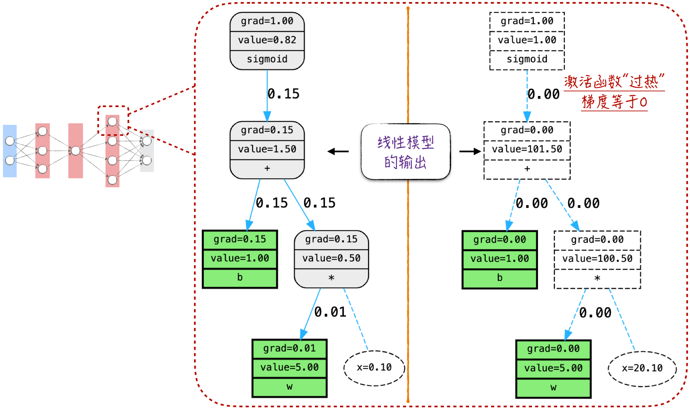

当利用数据来训练模型时，计算图会出现膨胀现象。在这种情况下，每个数据点所代表的路径都是相互独立的。因此，只要数据点的激活输入适当，参数的梯度就不会为 0。也就是说，模型参数将继续迭代更新，如图 8-17 左侧所示。

当激活函数对所有数据点都变得“过热”时，这个神经元就会永久性“失活”，如图 8-17 右侧所示。这是因为在这种情况下，与之对应的参数永远不再更新，也就是说，这个神经元的学习过程停滞不前了。类比人脑中的情况，坏死的神经元会影响其子节点的学习效率。这将导致神经网络看似复杂，但实际上某些部分完全无效或效率极低，从而拖累整个网络的预测效果。

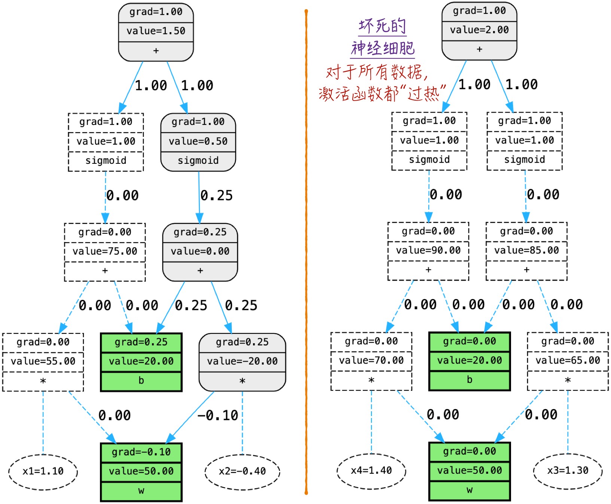

### 8.4.2 数学基础

本节将深入探讨导致神经元“坏死”的数学基础。首先，介绍一下 Sigmoid 函数的性质。

Sigmoid 函数在理论上是一个不错的选择，但在工程实现中却存在一些不太友好的特点。特别是当输入的值远离 0 时，函数的导数会迅速接近 0，如图 8-18 所示。这便是著名的激活函数“过热”现象，确切地说，它包括过度激活和过度抑制两种情况，在这两种情况下，激活函数的导数都近似为 0。在理论上，接近于 0 并不等于 0，然而在计算机中，计算结果受到精度限制的影响，很容易出现数值溢出的问题，从而被错误地识别为 0。尤其是在使用 GPU 进行计算时，通常会采用 7.5.2 节中的混合精度训练技术，这会进一步降低存储精度。

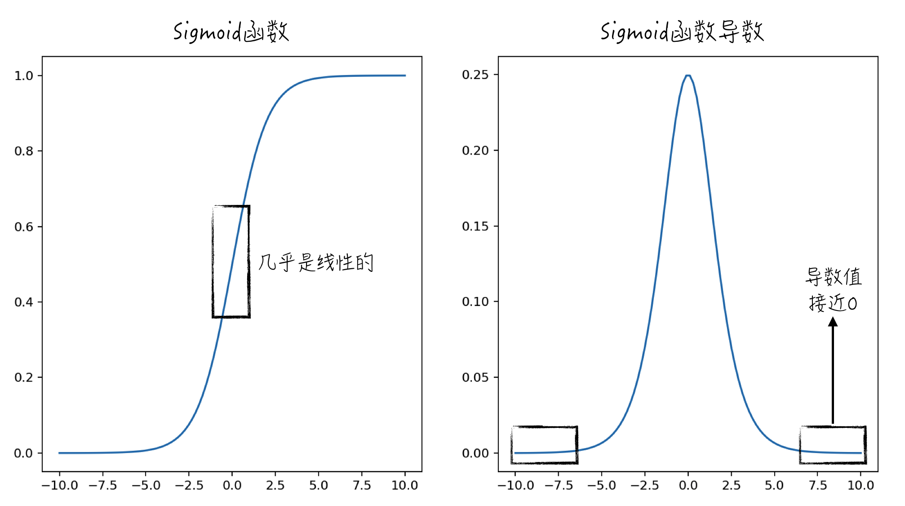

接下来，深入探讨参数梯度的数学表达式，具体的公式如图 8-19 所示（有关所使用数学符号的详细解释，请查阅 8.3.2 节）。从表达式中可以观察到，激活函数的导数以乘法的方式直接参与参数梯度的计算[^2]。因此，当激活函数导数因为溢出而被错误地当作 0 时，参数的梯度也会变成 0。

即使没有数值溢出问题，过小的激活函数导数也可能导致参数梯度过于接近 0，使得参数几乎得不到更新，从而降低学习的效率。在这种情况下，模型的学习速度会变得异常缓慢，训练过程会变得相当艰难。

前面的讨论已经说明，当 Sigmoid 的输入远离 0 时，神经元很难有效地学习。如果激活函数的输入非常接近 0，我们能够如愿以偿得到高效率的学习吗？实际情况并不尽如人意。更深入地观察 Sigmoid 函数的图像，会发现在接近 0 的范围内，Sigmoid 函数实际上近似于一条直线，如图 8-18 所示。在这种情况下，Sigmoid 函数变得线性化，将使整个神经网络退化成一个线性模型，等同于在训练一个线性模型。这不仅会导致预测效果不佳，还会显著降低学习效率。

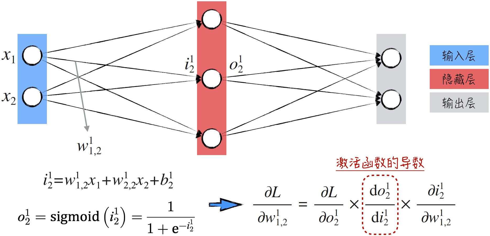

因此，在神经网络中，激活函数输入的均衡性至关重要。我们希望激活函数的输入能够均匀分布，既不过于偏离 0，也不过于靠近 0，实现一种平衡状态。这样不仅有助于提升预测效果，还能保持高效的学习效率。如果激活函数的输入偏离了这种平衡状态，就需要采取相应的调整措施，以优化学习效率。因此，我们将激活函数输入的分布视为监测神经网络训练进展的关键工具。

从数学角度来看，激活函数的输入与输出之间存在函数映射的关系，因此可以通过监测激活函数的输出来达到与监测输入相同的目的。在实际应用中，也更偏向于监测激活函数的输出，它在工程上更容易提取和分析[^3]。接下来将重点讨论如何有效地监控模型训练。

### 8.4.3 监控模型训练

8.4.1 节详细讨论了激活函数的“过热”现象对模型训练的负面影响。通过选择一个神经元，并结合计算图，详细地观察其状态。尽管这种方法很直观，但在应用中却不切实际。原因在于，现实中的模型参数异常庞大，逐个观察它们几乎是不可能完成的任务。举个例子，大型神经网络至少含有数亿个参数，即使每秒观察一个参数，也需要约 1157 天才能完成对 1 亿个参数的观察。

如 8.4.2 节所述，激活函数的输出在这一过程中起着至关重要的监控作用。通过观察这些输出，我们能够轻松判断激活函数是否出现了“过热”现象。因此，在实际应用中，通常通过检查这些输出的分布情况来评估模型的训练状态，具体操作如程序清单 8-4 所示[^4]。按照神经网络的层次逐层统计激活函数输出的分布情况，并用直方图的形式直观地呈现出来。本节使用的数据集为 8.3.3 节的图 8-11 中标记为 3 的“双月湾”数据集。

这一方法的代码实现相对简单，如第 13～20 行所示。首先遍历神经网络的各个层，提取激活函数的输出，然后进行统计，最后绘制出分布的直方图。除了常规的平均值和标准差，这里还引入了一个额外的过热指标 `saturation`，具体定义如第 17 行所示。当 Sigmoid 函数的输出大于 0.99 或小于 0.01 时，激活函数就被判定为存在“过热”现象。

#### 程序清单 8-4 激活函数输出的分布情况（[完整代码](https://github.com/GenTang/regression2chatgpt/blob/zh/ch08_mlp/activation_monitoring.ipynb)）

```python
import matplotlib.pyplot as plt
# 为了讨论的方便，将神经网络扩大
n_hidden = 100
model = Sequential([
    Linear(2, n_hidden), Sigmoid(),
    Linear(n_hidden, n_hidden), Sigmoid(),
    Linear(n_hidden, n_hidden), Sigmoid(),
    Linear(n_hidden, n_hidden), Sigmoid(),
    Linear(n_hidden, 2)
    ])
......

for i, layer in enumerate(model.layers):
    if isinstance(layer, (Sigmoid)):
        t = layer.out
        # 激活函数的输出大于 0.99 或者小于 0.01 时，激活函数“过热”
        saturation = ((t - 0.5).abs() > 0.49).float().mean()
        hy, hx = torch.histogram(t, density=True)
        plt.plot(hx[:-1].detach(), hy.detach())
        ......
```

在最优化算法运行的每一步中，利用上述代码，都可以获得描述当前激活函数状态的统计信息和直方图。这些信息是随着迭代过程动态变化的，因此如果我们跟随迭代的步伐，持续运行上述代码，将得到一段展示激活函数状态变化的“电影”。然而在书面上，这种动态变化无法实时展示，因此，为了方便讨论，我们首要关注模型初始化时激活函数的状态，对应的结果如图 8-20 左侧部分所示。

从图中可见，激活函数的状态并不尽如人意。除第一层外，其他层的激活函数大多陷入“过热”状态，这必然降低了神经网络的学习效率。理想情况下，激活函数的输出应均匀分布，过热指标 `saturation` 应较小。与“过热”状态相对应的是，激活函数反向传播的梯度会过度集中于 0，具体情形见图 8-20 右侧部分。

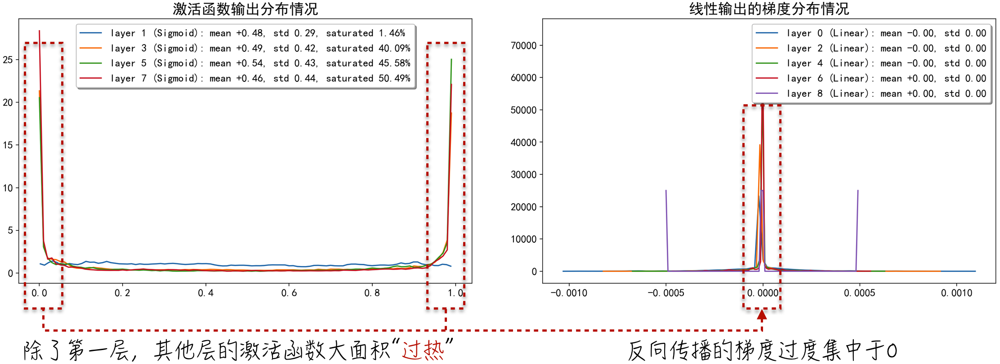

除了关注激活函数的状态，也可以直接研究参数梯度的分布情况。具体实现方式如程序清单 8-5 所示。其中，一个常用的指标是梯度标准差与参数标准差的比值，我们称之为 `grad_ratio`，如第 8 行代码所示。

#### 程序清单 8-5 权重参数的梯度分布情况（[完整代码](https://github.com/GenTang/regression2chatgpt/blob/zh/ch08_mlp/activation_monitoring.ipynb)）

```python
# 观察参数梯度的分布情况
for i, layer in enumerate(model.layers):
    if isinstance(layer, (Linear)):
        # 只观察权重参数，也就是 w
        p = layer.parameters()[0]
        g = p.grad
        # 统计梯度标准差与参数标准差的比例
        grad_ratio = g.std() / p.std()
        hy, hx = torch.histogram(g, density=True)
        ......
```

运行上述代码，将得到如图 8-21 左侧部分所示的图像。直接观察梯度分布图，会发现存在两个问题。首先，参数的梯度往往过度集中于 0，这与图 8-20 中的现象一致。其次，将图像在 0 附近进行放大，可以获得如图 8-21 右侧部分所示的情况。从中能够明显看出，各层的梯度分布并不统一。例如，第 6 层的梯度比第 8 层更接近 0。这种差异是一个相当不利的现象，被称为梯度消失。

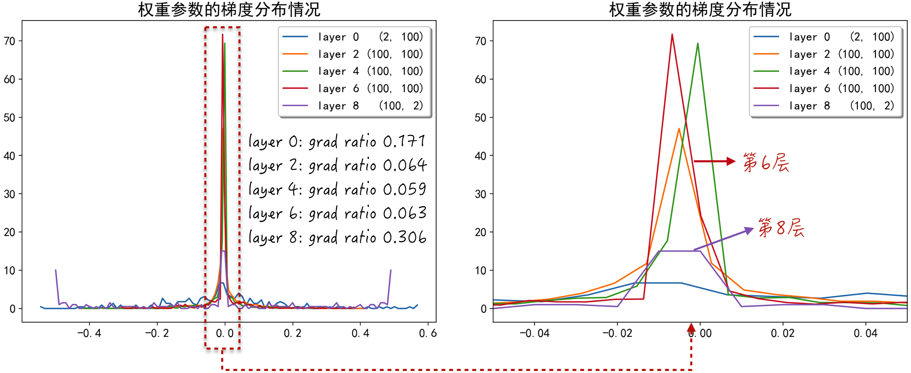

为了定量评估这一现象，需要运用代码中定义的 `grad_ratio`。根据上述讨论，我们真正关心的是每次参数更新的幅度与参数值的比值。这个指标可以通过公式（8-15）来描述。这个比值既不能过大，也不能过小，在实践中，其绝对值稳定在千分之一左右是最理想的。

$$
\frac{a_k-a_{k-1}}{a_{k-1}}
=-\eta\frac{\partial L/\partial a_{k-1}}{a_{k-1}}
\tag{8-15}
$$

在探索神经网络领域时，有一个至关重要的发现：在网络的各个层中，参数值近似服从正态分布，而分布的中心接近于 0，同时，这些参数的梯度也以近似正态分布的形式分布在 0 的两侧。这意味着参数和参数梯度的期望都大致为 0[^5]。因此，`grad_ratio` 这一指标近似等同于公式（8-15）等号右侧部分除以学习速率后的绝对值期望，即参数梯度与参数值之比的绝对值的平均值。

除了设定合适的学习速率，`grad_ratio` 还可以用来监测训练过程中是否出现偏差。我们可以在模型训练期间记录每层参数的更新情况（用 `grad_ratio` 与学习速率的乘积来衡量参数的更新幅度，参考图 8-22 中的代码）。根据图 8-22 的结果，因为随着迭代次数的增加，更新幅度逐渐减小，远离了理想的基准线 0.001，这可能意味着学习效率在逐渐降低，可以判断模型的训练状态并不理想。

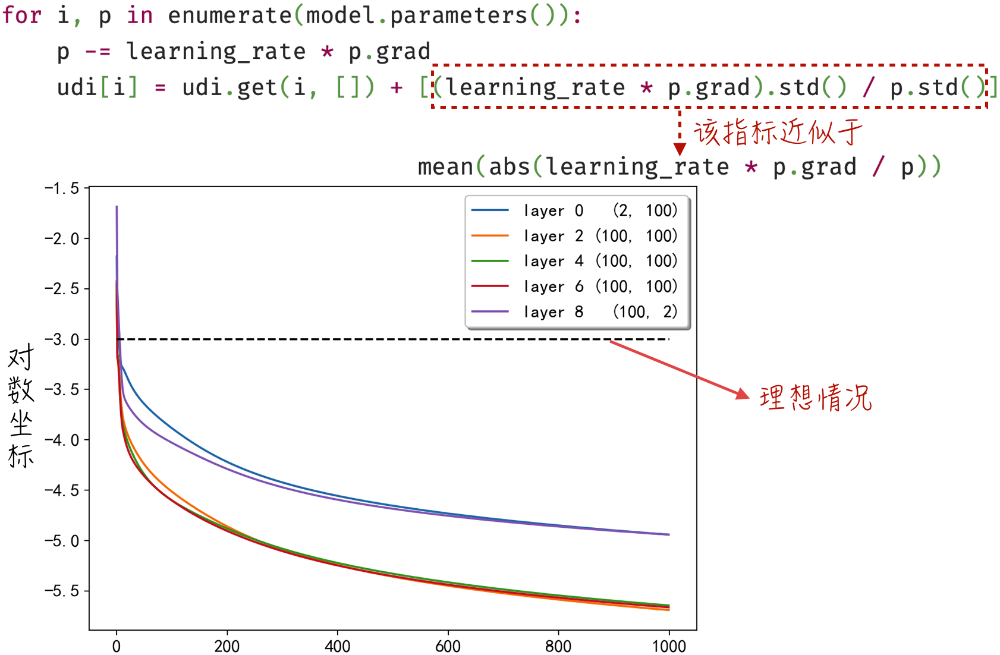

本节讨论了 3 个关键图表，这些图表在监测模型训练过程中扮演着重要的角色。通过仔细分析这些图表中的指标，可以清楚地了解到神经网络的学习状态并不尽如人意。这一观察与图 8-14 中的结果相吻合。然而，请不要过于担心，接下来的章节将详细探讨如何调整网络的学习状态，以达到最佳的训练效果。

### 8.4.4 不稳定的梯度

8.4.3 节中提及了一个重要的问题——梯度消失。如图 8-21 右侧部分所示，这个问题可直观地表现为神经网络各层参数的梯度分布不一致。这种不一致性源自神经网络的结构及反向传播算法，会极大影响神经网络的学习效率，使深度神经网络的训练变得异常艰难。造成这一现象的根本原因可以归结为两个方面，在学术界分别被称为梯度消失问题（Vanishing Gradient Problem）和梯度爆炸问题（Exploding Gradient Problem）。

梯度消失问题在深度神经网络中尤为常见，在反向传播的过程中，梯度会逐层减少，导致前面几层的梯度几乎为 0，这些层无法有效学习和适应数据的特征，从而影响整个网络的性能。为了更好地从数学上理解这一问题，我们可以看一个简单的神经网络示例。如图 8-23 所示，这个神经网络包含 4 层，每层只有一个神经元。通过数学推导，可以得到图中的参数梯度的数学表达式。

值得注意的是，参数所在的层越靠前，其梯度表达式中就包含越多的乘积运算，这些乘积运算涉及激活函数的导数。通常情况下，这个值小于 1，举例来说，Sigmoid 导数的最大值为 0.25。另外，在神经网络中，参数值通常较小，近似正态分布在 0 附近。这会进一步导致乘法项的绝对值较小。如果每项都约等于 0.1，那么前层参数的梯度就可能只有后层参数梯度的千分之一。

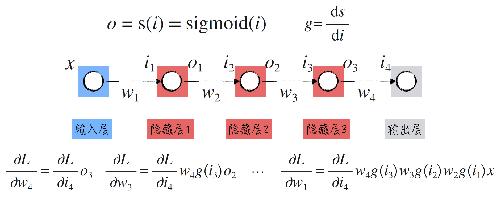

与此相反的情况是梯度爆炸问题。在这种情况下，梯度逐层递增，可能导致某些层中的梯度异常大，从而影响参数的稳定更新。这可能引发训练过程的不稳定，甚至导致模型无法收敛。通过前面的分析，可以看到梯度消失和梯度爆炸实际上是同一个问题的两个不同侧面。从反向传播算法的角度来看，梯度沿着神经网络的反方向逐层传播，每经过一层，都可能被衰减或放大。当网络层数增多或网络规模变大时，各层的参数梯度很难同时保持适当。

解决梯度消失和梯度爆炸问题主要有两种思路。一种思路是使梯度在每一层传播时尽量不发生衰减或放大。为了实现这一目标，可以使用改进后的激活函数，这些函数的导数在接近 1 的范围内变化，或者引入特殊的层来调整梯度的大小，这就是归一化层（Normalization Layer）。另一种思路是允许梯度在反向传播的过程中可以“越过”几层，通过有意构建的“捷径”直接传递到前面层的参数。这一创新的方法被称为残差连接。

激活函数的改进将在 8.4.5 节详细讨论，归一化层将在 8.5 节探讨，残差连接将在 9.3.1 节中深入探讨。

### 8.4.5 激活函数的改进

在选择 Sigmoid 作为激活函数时，会遇到两个主要问题。首先，当输入远离 0 时，Sigmoid 的导数接近 0，甚至在接近 0 时，最大导数也只有 0.25，这可能导致梯度消失问题。其次，Sigmoid 的输出总是正数，没有以 0 为中心的特性，这并不是理想的状况。从经验来看，以 0 为中心的激活函数由于具有对称性，更有助于神经网络的训练。为了修复这两个不理想的特性，学术界提出了许多新的激活函数，下面详细介绍其中最经典的两个。

- Tanh（Hyperbolic Tangent）函数的曲线与 Sigmoid 函数非常相似，可以把它看作 Sigmoid 函数向下平移一段并稍做“拉升”，这样函数的中心点就位于 0，而且最大导数也等于 1，如图 8-24 所示[^6]。相比于 Sigmoid 函数，Tanh 的主要改进在于它在 0 附近的导数值约等于 1，而且函数值以 0 为中心。但当自变量远离 0 时，Tanh 的导数值仍然接近 0，这限制了它在提高模型学习效率方面的优势。

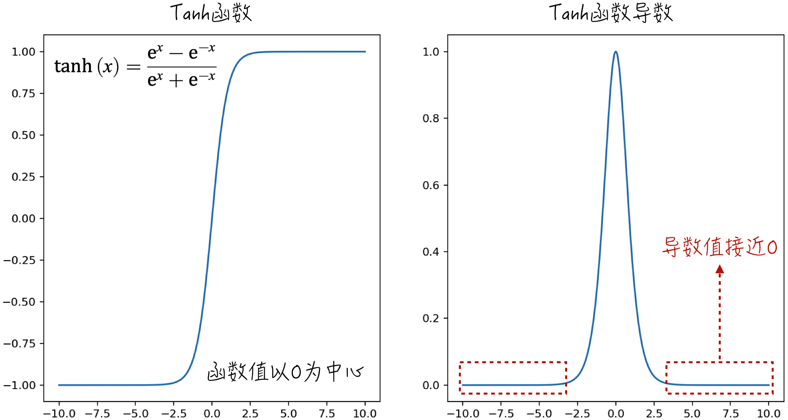

- ReLU（Rectified Linear Unit）是深度学习中广泛使用的激活函数，它在某种程度上和人类神经元的行为非常相似，如图 8-25 所示。ReLU 函数的一个显著改进是它的导数具有两个取值：当输入小于 0 时，导数为 0；当输入大于 0 时，导数为 1[^7]。这个简单的特性已经被证明能够大幅提升神经网络的学习效率，尤其是在深度神经网络中更加显著。

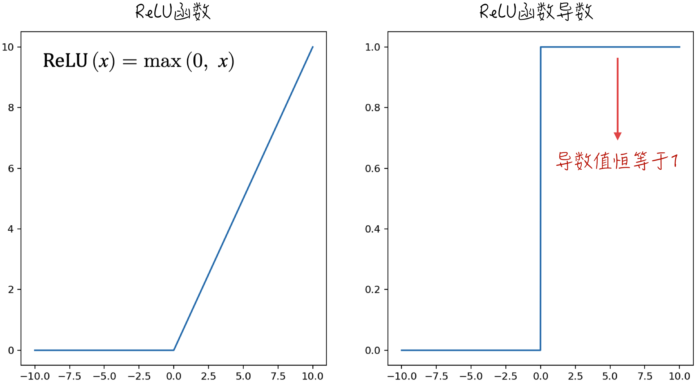

尽管 ReLU 函数在许多情况下表现出色，但它也存在一些缺陷。特别是当输入值小于 0 时，ReLU 函数的输出一直保持为 0，导数也为 0。这会导致神经网络中的神经元容易陷入“坏死”状态。为了解决这个问题，研究人员提出了一系列改进的激活函数，包括 ELU（Exponential Linear Unit）、GeLU（Gaussian Error Linear Unit）和 SiLU（Sigmoid Linear Unit）等[^8]。在此不详细讨论这些激活函数的数学细节，只给出它们的函数图像和导数图像，如图 8-26 所示，以帮助读者建立对它们的直观印象。

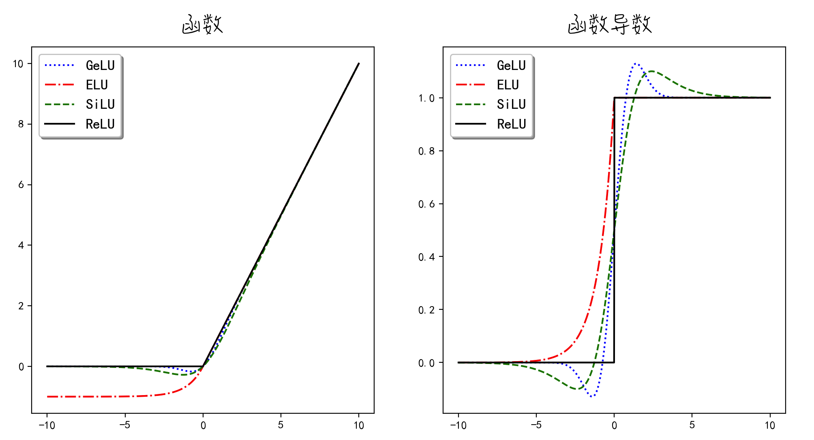

[^1]: 完整实现见配套代码 [`ch08_mlp/saturated_activation_function.ipynb`](https://github.com/GenTang/regression2chatgpt/blob/zh/ch08_mlp/saturated_activation_function.ipynb)。
[^2]: 正是基于这个原因，Sigmoid 函数才容易导致梯度消失问题，更多细节请查阅 8.4.4 节。
[^3]: 对于本节讨论的多层感知器模型，激活函数的输入即为线性模型的输出。在更复杂的网络结构中，可能会在线性模型之后添加其他层，例如 8.5.4 节中讨论的归一化层。因此，通常情况下，分析激活函数的输出更加简单明了。
[^4]: 本节和 8.5.4 节的部分内容参考自 Andrej Karpathy 的课程“Neural Networks: Zero to Hero”。
[^5]: 感兴趣的读者可以尝试下载开源的大型神经网络模型，比如使用 transformers 库下载 GPT-2 等大语言模型，以验证上述观点。
[^6]: 完整实现见配套代码 [`ch08_mlp/activation_functions.ipynb`](https://github.com/GenTang/regression2chatgpt/blob/zh/ch08_mlp/activation_functions.ipynb)。
[^7]: 从严格的数学角度来看，ReLU 激活函数在 0 点没有定义导数值，但在实际应用中，通常会将其在 0 点的导数值设定为 0。
[^8]: 激活函数是神经网络研究中一个备受关注的话题。除了正文中提到的激活函数，还有一些常用的激活函数，如 Leaky ReLU、GeLU_New，以及 Maxout 等。
