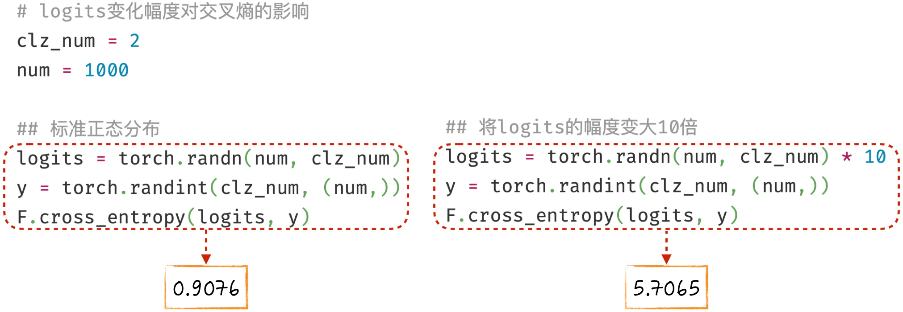
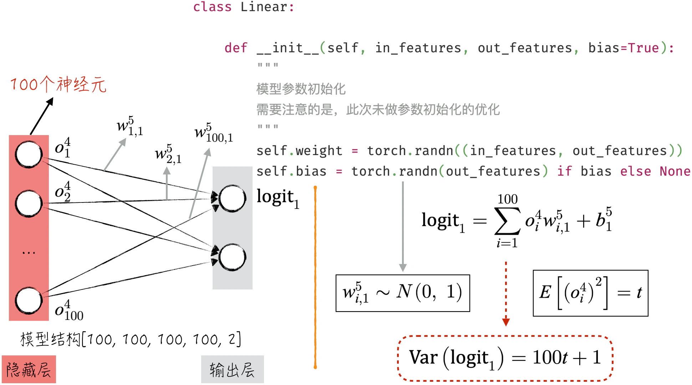
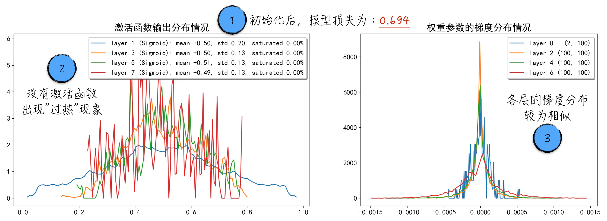
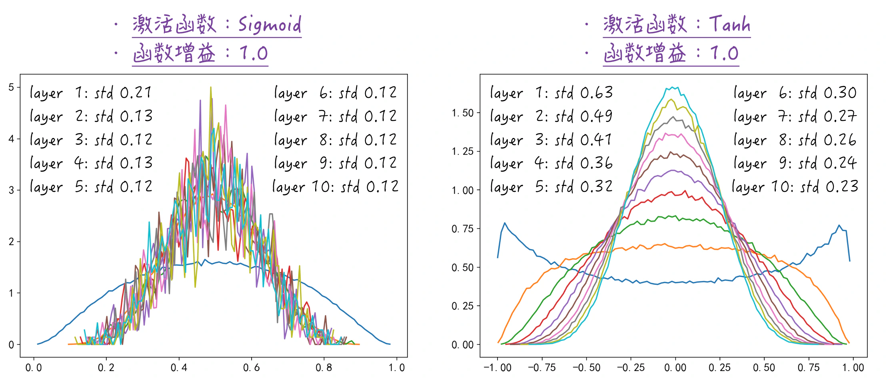
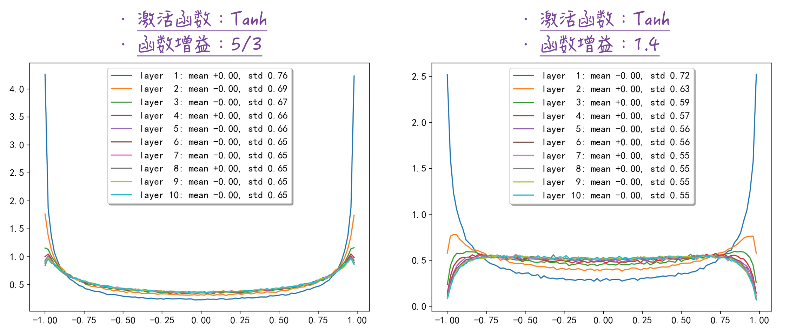
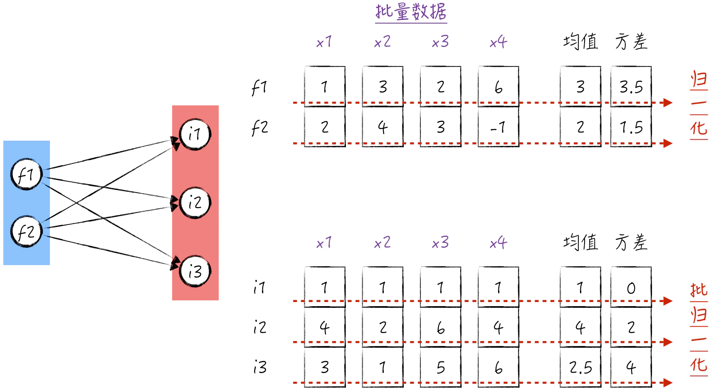
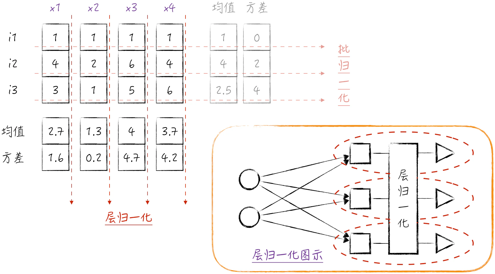

## 8.5 从第一步开始优化训练

[8.3.4 节](/books/deconstructing_LLM/chapter-8/8-3#section-8-3-4)中介绍了多层感知器在解决各种分类问题时的应用，然而从图 8-14 中可以明显看到，当面对标记为 3 的“双月湾”数据时，多层感知器的学习效率并不令人满意，经历了相当长时间的停滞期。

为了更深入地理解模型学习效率低下的原因，[8.4.3 节](/books/deconstructing_LLM/chapter-8/8-4#section-8-4-3)探讨了一些常用于监控模型训练进展的工具。这些工具就像“医生”一样，能帮助我们找到效率低下的根本原因。根据这些“诊断结果”，[8.4.5 节](/books/deconstructing_LLM/chapter-8/8-4#section-8-4-5)探讨了改进激活函数的方法，采用更高效的激活函数可以显著提高模型的学习效率。然而，这并非唯一的改进途径。本节将根据监控工具提供的信息，进一步讨论一些独立于激活函数的改进方法。

### 8.5.1 模型损失的预估

在人工智能领域，模型训练的核心目标是降低模型的损失。因此，在训练过程中，通常会绘制出模型损失随训练进展的变化曲线。之前的讨论着重于曲线的趋势，如下降速度等，但对于具体的损失数值（特别是分类问题），并没有深入探讨其含义。例如，在一个二分类问题中，如果模型的损失是 1.6，这具体代表了什么意义？仅从这个数值上来看，应该如何理解模型的预测效果呢？

事实上，对于二分类问题，如果没有额外的背景知识，那么最基本的预测方法就是随机猜测。这意味着预测某个数据点属于类别 0 的概率为 0.5，属于类别 1 的概率也为 0.5。首先，这是一种通用的方法，对任何二分类问题都可以采用这种方法。其次，这也是一种相对较差的方法，因为它没有利用任何关于数据的信息或知识。这种方法可以被视为一个基准，任何模型都不应该比这个基准方法更差。如果模型比随机猜测的预测效果还差，意味着它存在明显的问题。

如果采用随机猜测方法，模型的损失会是多少呢？在二分类问题中，一个数据点的损失可以用公式（8-16）来表示，约为 0.69。因此，无论应用于哪个具体的数据集，这种随机猜测方法的损失都是固定值 0.69。这意味着，对于任何二分类模型，基准损失值都是 0.69。

$$
L_i=-\left(y_i\ln 0.5+(1-y_i)\ln 0.5\right)=-\ln 0.5\approx 0.69
\tag{8-16}
$$

有了这个认知，我们能够在模型训练过程中更好地理解模型的预测质量，或者说，将模型损失这个抽象的数值翻译成更容易理解的语言。例如，如果模型训练后的损失约为 0.2，那么平均来看，模型对正确类别的预测概率大约为 0.82（$e^{-0.2}\approx0.82$），这是一个相当不错的预测结果。

### 8.5.2 参数初始化的初步优化

基于上面的讨论，二分类模型的基准损失值是 0.69。然而，在[8.4.3 节](/books/deconstructing_LLM/chapter-8/8-4#section-8-4-3)中，模型在初始化阶段的损失值约为 4.16[^1]。这意味着模型在初始化时犯了相当严重的错误，从这种错误的起点开始学习，显然会降低学习效率，甚至可能导致模型无法正确收敛。下面将研究如何纠正这一错误。

模型在初始化时为什么会出现如此严重的错误呢？下面用一个小实验来帮助理解。如图 8-27 所示，对于二分类问题，如果模型的 Logits（模型输出的未归一化分数）服从标准正态分布，那么在随机情况下，相应的交叉熵，即模型损失，大约是 0.91，与基准损失相近。然而，如果增大 Logits 的变化范围，将其标准差设定为 10，那么相应的交叉熵也会急剧增加，达到可怕的 5.71。



受实验结果的启发，我们发现在初始化阶段，模型损失异常高的主要原因在于模型输出的 Logits 变化幅度过大。为什么会出现这种情况呢？来看模型初始化的代码，如图 8-28 所示。



在输出层中，权重参数的初始值通常服从标准正态分布。在这种情况下，输出的 Logits 的方差会是怎样的呢？对于输出层的一个特定输入 $o$，显然它与模型的参数是独立的（因为模型参数是随机生成的）。此外，对于模型参数 $w$，有期望值 $E[w]=0$ 和方差 $\operatorname{Var}(w)=1$。对于输出层的这个输入，通过适当的数学推导，可以得到公式（8-17）[^2]。为了简化表达，在公式中省略了变量的上下标，但这并不影响理解。

$$
\operatorname{Var}(ow)
=\operatorname{Var}(o)\operatorname{Var}(w)
+\operatorname{Var}(w)(E[o])^2
=\operatorname{Var}(w)E[o^2]
=E[o^2]
\tag{8-17}
$$

基于这个公式，可以进一步合理地假设对于输出层的任何输入，其分布都是一致的。通过这个公式可以得出，模型输出的 Logits 方差与模型隐藏层的神经元数量成正比。如果我们希望 Logits 方差保持为 1，那么只需要将参数 $b$ 的值设定为 0，然后将权重参数服从的正态分布的标准差调整为 $1/\sqrt M$，其中 $M$ 表示输出层的输入神经元个数。这样就可以有效地标准化 Logits 方差，从而避免初始化阶段的问题。

这种处理方式不仅适用于输出层，还需要应用到其他层。否则，隐藏层的线性输出变化幅度会非常大，这也是[8.4.3 节](/books/deconstructing_LLM/chapter-8/8-4#section-8-4-3)的图 8-20 中大多数激活函数表现过热的原因。如程序清单 8-6 所示，按照上述方法对参数的初始化进行优化[^3]，其中的核心代码是第 16～19 行。

为了清晰地呈现参数初始化优化的前后逻辑和优化效果，我们特意在实现线性模型 `Linear` 时未进行初始化的优化，而是在后续使用模型时再添加相应的优化步骤。在实际应用中，成熟的第三方算法库（如 PyTorch）通常已经在线性模型的实现中包含了一定程度的初始化优化。因此，读者在使用这些库时需要仔细查阅相关文档，并根据算法库的实现和自己的需求适当进行优化和调整。

#### 程序清单 8-6 参数初始化优化（[完整代码](https://github.com/GenTang/regression2chatgpt/blob/zh/ch08_mlp/initialization.ipynb)）

```python
# 使用同 8.4.3 节中一样的模型
n_hidden = 100
model = Sequential([
    Linear(      2, n_hidden), Sigmoid(),
    Linear(n_hidden, n_hidden), Sigmoid(),
    Linear(n_hidden, n_hidden), Sigmoid(),
    Linear(n_hidden, n_hidden), Sigmoid(),
    Linear(      n_hidden, 2)
    ])

# 参数初始化优化
with torch.no_grad():
    for layer in model.layers:
        if isinstance(layer, Linear):
            in_features, out_features = layer.weight.shape
            # 将权重项的方差变小
            layer.weight *= 1 / in_features ** 0.5
            # 将截距项设置成 0
            layer.bias = torch.zeros(out_features)
```

在经过参数初始化的优化之后，可以明显看到模型的损失下降到了一个合理的范围内，具体来说，损失值为 0.694。此外，激活函数的表现也得到了显著改善，梯度分布变得更加合理，如图 8-29 所示。基于以上结果，即使在实际运行最优化算法之前，也可以确定模型的学习效率已经得到了显著提升[^4]。



### 8.5.3 参数初始化的进一步优化

上面讨论的参数初始化优化策略都是针对 Sigmoid 函数而言的。虽然这些策略在 Sigmoid 函数下表现良好，但如果选择其他的激活函数，是否需要额外的优化技巧呢？

为了更好地解答这个问题，需要明确参数初始化优化的目标：确保各层输出的分布相似。由于激活函数的数学表达式相对复杂，为了更清晰地探讨这个问题，在[8.5.2 节](/books/deconstructing_LLM/chapter-8/8-5#section-8-5-2)中，我们将焦点放在如何确保各层的线性输出分布相似上。这点非常重要，因为激活函数的输入和输出之间存在函数映射的关系，这就意味着激活函数的输出分布应该也是相似的。这种相似性有助于确保反向传播时各层的梯度也保持相似，从而使模型能够更好地学习。

一旦我们明确了优化的目标，就可以有针对性地着手解决这个问题。方法是在代码中只进行向前传播，然后记录各层输出的分布情况，这样就可以清晰地观察模型在初始化后是否实现了既定目标。具体的实现方法可以参考程序清单 8-7，其中核心代码位于第 16～18 行。第 16 行对应于[8.5.2 节](/books/deconstructing_LLM/chapter-8/8-5#section-8-5-2)中讨论的方法，第 18 行则涉及本节的重点内容，即增益值（Gain Value）的处理。当将增益值设置为 1.0 时，相当于只执行了初步优化。

#### 程序清单 8-7 统计各层输出的分布情况（[完整代码](https://github.com/GenTang/regression2chatgpt/blob/zh/ch08_mlp/initialization.ipynb)）

```python
@torch.no_grad()
def layer_stats(func, calculate_gain):
    """
    只做向前传播，并记录每一层输出的分布情况
    参数
    ----
    func : 激活函数
    calculate_gain : 函数增益
    """
    ......
    x = torch.randn(300, 1000) # 批量大小是 300
    for i in range(10):
        l = Linear(1000, 1000, bias=False)
        in_features, _ = l.weight.shape
        # 做初步优化
        l.weight *= 1 / in_features ** 0.5
        # 进一步优化
        l.weight *= calculate_gain
        x = func(l(x))
        # 记录输出的分布情况
        hy, hx = torch.histogram(x, density=True)
        ......
```

通过执行上述方法，能够比较不同的激活函数，例如 Sigmoid 和 Tanh，结果如图 8-30 所示。对于 Sigmoid 函数而言，仅执行初步优化已足够。无论网络有多深，每一层输出的标准差都相对稳定。但如果选择 Tanh 作为激活函数，我们会观察到每一层的标准差逐渐减小，这并非理想情况。这表明我们在参数限制方面可能过于严格，导致每一层的输出受到了过多约束，从而影响了模型的表达能力。因此，需要在保持初步优化的基础上，略微放宽一些限制，以扩大参数的变化范围。这对应代码中的第 18 行，即增益值的调整。



针对 Tanh 函数，什么样的增益值才是比较合理的呢？答案是一个神奇的数字：$5/3$。这个数字并非通过精确理论推导得出，而是通过实践经验总结而来。需要指出的是，这个数字并不是特别敏感的，如果稍微调整它，比如改成 1.4，同样可以得到相似的稳定输出分布，如图 8-31 所示。

另一个常用的激活函数 ReLU 与 Tanh 类似，需要在初步优化的基础上稍微扩大参数的变化范围。然而，对于 ReLU 函数，我们使用的增益值是 $\sqrt 2\approx1.41$。需要注意的是，PyTorch 已经记录了常用激活函数的增益值[^5]，读者可以通过 `torch.nn.init.calculate_gain` 来获取它们。



### 8.5.4 归一化层

参数初始化优化的方法众多，上面讨论的只是两种经典且富有启发性的方法。整个初始化过程需要非常精细且巧妙的设置，就像走钢丝一样需要高超的技巧，稍有不慎就可能无法达到预期的目标。然而，即使经过如此精细的初始化调整，也只能确保模型在初始阶段处于较好的学习状态。随着模型的深度训练，这些初始化技巧的影响逐渐减弱，可能导致学习状态下降。那么如何确保模型在整个训练过程中都保持较好的状态呢？

要保持良好的学习状态，关键在于确保各层的输出相似，或者说，在各层之间，激活函数的输入具有相似的分布。因此，我们可以考虑在激活函数之前增加一层特殊的操作，该层的作用就是进行归一化，这样可以在模型训练的过程中确保激活函数的输入始终具有相似的分布。这正是归一化层（Normalization Layer）所能实现的功能，可以显著提高模型训练的稳定性。有了归一化层后，深度神经网络的训练变得更加工程化和高效[^6]。

需要注意的是，归一化层的概念与输入层、隐藏层类似，着重强调最后一个“层”字，也就是该组件是网络结构中的一层。层的具体计算方式有两种，分别是：按批量数据进行计算，称为批归一化层（Batch Normalization Layer）；按神经元的层级进行计算，称为层归一化层（Layer Normalization Layer）。后续讨论中将“批归一化层”简称为批归一化（Batch Normalization），将“层归一化层”简称为层归一化（Layer Normalization），它们都是归一化层的具体实现。

那么如何对激活函数的输入进行归一化呢？为了解答这个问题，需要回顾数据特征的归一化处理过程：首先，针对每个特征，计算数据集的均值和方差（标准差的平方），然后对每个数据点减去均值并除以标准差，如图 8-32 所示。假设神经网络的第一个隐藏层有 3 个神经元。对于一个数据点，当它经过神经元的线性变换后，实际上得到了一个三维向量。我们可以将这个向量视为对当前数据点的新特征表示。因此，对这一层进行归一化可以直接参照对原始特征进行归一化的方法。这个概念可以扩展到任何隐藏层，任何一个隐藏层的激活函数输入都可以使用这种方法进行归一化。



当涉及具体算法设计时，我们并不计算整个数据集中数据的均值和方差，而是只对批量数据进行计算。这一方法在学术界被称为批归一化，其算法实现如程序清单 8-8 所示。同样的代码也可以用于对原始特征进行归一化处理，以及用于在线性输出之后对激活函数的输入进行归一化。

1. 为了处理数据方差等于 0 的极端情况，引入一个超参数 `eps`，具体使用方式如第 20 行代码所示。
2. 如果仅仅进行归一化，意味着这一层的每个神经元的输出都会非常相似，从而影响模型的表达能力。为了保证模型的表达能力，引入两个模型参数，分别是 `gamma` 和 `beta`。这两个参数类似于线性模型中的权重项和截距项，如第 21 行代码所示。它们的存在可以使不同神经元的激活程度有所不同。
3. 值得注意的是，由于在进行归一化时会减去数据的均值，因此线性部分的截距项变得毫无意义，因为无论它是什么值都会随着均值的减去而消失。因此，在构建神经网络时，如果要使用批归一化，那么相应的线性模型部分就不需要设置截距项。

#### 程序清单 8-8 批归一化（[完整代码](https://github.com/GenTang/regression2chatgpt/blob/zh/ch08_mlp/normalization.ipynb)）

```python
class BatchNorm1d:

    def __init__(self, dim, eps=1e-5, momentum=0.1):
        # 用于处理方差等于 0 的极端情况
        self.eps = eps
        # 模型参数
        self.gamma = torch.ones(dim)
        self.beta = torch.zeros(dim)
        # 用于表示是否在模型训练阶段
        self.training = True
        ......

    def __call__(self, x):
        if self.training:
            # 计算期望和方差
            xmean = x.mean(0, keepdim=True)
            xvar = x.var(0, keepdim=True, unbiased=False)
        ......
        # 归一化处理
        xhat = (x - xmean) / torch.sqrt(xvar + self.eps)
        self.out = self.gamma * xhat + self.beta
        ......
        return self.out

    def parameters(self):
        return [self.gamma, self.beta]
```

初次接触批归一化的读者可能会有一些疑问。例如，如果在模型训练中使用的批量大小等于 1 会发生什么情况？另外，在使用模型进行预测时，并没有批量大小的概念，那么这一层是如何处理的呢？

对于第一个问题，在使用批归一化时，模型训练的批量大小必须大于 1；对于第二个问题，解决方法是额外计算整个数据集的均值和方差（对每个神经元分别计算），然后在预测时使用这些值进行相应的处理[^7]。换句话说，这一层在模型训练和模型预测时的计算方式是不同的，这与本章讨论的其他层有很大不同，但与[7.4.3 节](/books/deconstructing_LLM/chapter-7/7-4#section-7-4-3)中讨论的随机失活有一定的相似之处。

从向前传播和反向传播的角度来看，以前在训练神经网络时，每个数据点的向前传播和反向传播结果都相互独立，与同一批次的其他数据无关。一旦引入了批归一化，在模型训练时，各个数据点的结果都与批量数据的选择相关。这看似不可思议，但在实践中却有助于提高模型的性能，因为批归一化无意中引入了一种正则化效应。在训练过程中，每个数据点在不同批次下的计算结果略有不同，就像对数据进行了一些随机扰动，有助于避免出现过拟合问题。

然而，批归一化在大型神经网络中存在一个重要问题，即各个数据点在计算图中的路径不再相互独立。这意味着无法像[7.4.1 节](/books/deconstructing_LLM/chapter-7/7-4#section-7-4-1)中介绍的梯度累积那样进行分布式反向传播计算。为了解决这个问题，学术界引入了一种新的归一化技术：层归一化[^8]。

层归一化的核心假设是每一层包含大量神经元（如果某一层神经元数量较少，通常无须进行归一化）。因此，在进行归一化时，计算均值和方差所依据的数据不再是批量数据，而是来自同一层中其他神经元的线性输出，如图 8-33 所示。在传统的多层感知器模型中，同一层的不同神经元是相互独立的。层归一化引入了一种全新的处理方式，使同一层中的神经元相互影响。



尽管图示略显复杂，但相应的代码实现却非常简单。只需将程序清单 8-8 中的第 16 行和第 17 行修改为按照第一维度计算均值和方差即可[^9]。值得注意的是，与批归一化不同，在使用层归一化时，模型在训练和预测时的计算方式保持一致，无须进行额外的处理。

在实现层归一化时，PyTorch 提供了两个常用的封装，分别是 `torch.nn.LayerNorm` 和 `torch.nn.BatchNorm1d`。关于如何使用这些封装，请读者参考 PyTorch 的文档和示例代码，在此不做赘述。

[^1]: 这个结果已经包含在配套代码 [`ch08_mlp/activation_monitoring.ipynb`](https://github.com/GenTang/regression2chatgpt/blob/zh/ch08_mlp/activation_monitoring.ipynb) 的第 4 个代码块中。
[^2]: 推导公式（8-17）的数学基础请参考[2.2.3 节](/books/deconstructing_LLM/chapter-2/2-2#section-2-2-3)。
[^3]: 这种优化方法在学术上被称为 Xavier Initialization。完整实现见配套代码 [`ch08_mlp/initialization.ipynb`](https://github.com/GenTang/regression2chatgpt/blob/zh/ch08_mlp/initialization.ipynb)。
[^4]: 尽管激活函数的状态有所改进，但结果仍然不尽如人意。Sigmoid 函数的最大梯度为 0.25，因此即使激活函数没有出现“过热”，仍然会出现梯度消失。具体结果见 `initialization.ipynb` 中的第 9 块和第 12 块。
[^5]: Tanh 激活函数的增益值在理论上没有确凿的解释。对于 ReLU 激活函数，有更详细的理论推导可以解释其增益值。[8.5.4 节](/books/deconstructing_LLM/chapter-8/8-5#section-8-5-4)讨论的归一化层几乎完全取代了增益值，因此不必过多关注这个细节。
[^6]: 归一化层的完整实现及优化结果见配套代码 [`ch08_mlp/normalization.ipynb`](https://github.com/GenTang/regression2chatgpt/blob/zh/ch08_mlp/normalization.ipynb)。
[^7]: 完整实现见配套代码 `ch08_mlp/normalization.ipynb`。
[^8]: 批归一化不仅难以实现分布式计算，还会影响循环神经网络的模型效果（请参考[10.4.4 节](/books/deconstructing_LLM/chapter-10/10-4#section-10-4-4)），这也是引入层归一化的主要原因。
[^9]: 相应的实现是 `xmean = x.mean(1, keepdim=True)` 以及 `xvar = x.var(1, keepdim=True, unbiased=False)`。
