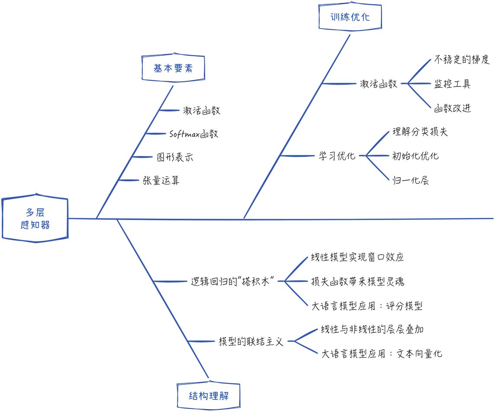

## 8.6 本章小结

### 8.6.1 要点回顾

本章涵盖了神经网络领域最基础、最经典的多层感知器模型。通过深入研究这个相对简单的模型，可以更好地理解神经网络领域的核心思想。实际上，本章的大部分内容超越了多层感知器模型，适用于几乎所有的神经网络模型。

在本质上，神经网络是一系列线性和非线性变换的层层叠加。构建神经网络模型就像搭积木一样，具有较高的灵活性。因此，除了理解已有的经典模型，更重要的是学会自己构建模型。为此，我们需要掌握以下三个核心要点：基本要素、结构理解和训练优化。

在基本要素部分，本章涵盖了以下关键内容：数学基础、图形表示，以及代码实现。其中，重要的知识点包括激活函数的数学特性、Softmax 函数与分类损失的关联，以及将网络图示转化为实际代码的过程。

神经网络不仅可以作为一个整体使用，还可以将其各个组件拆分出来并独立应用。为了实现这一点，我们需要借鉴经典模型的启发，从不同的角度重新理解神经网络的结构。在实际应用中，许多创新的方法都源于此思路。例如，通过重新审视损失函数，我们可以获得在大语言模型中被广泛应用的评分模型；通过重新思考特征提取的方法，我们可以利用预训练的大语言模型实现文本向量化。

神经网络的核心挑战在于工程实践，即如何有效地训练模型。神经网络由于具有复杂的模型结构，其在训练时常受到不稳定梯度的干扰，这会显著降低模型的学习效率。为了应对这一问题，本章探讨了用于监控模型训练状态的工具，并根据监控结果提出了一些改进方案，其中包括更高效的激活函数、初始化优化和归一化层。这些技术将有助于提升神经网络的学习性能。

### 8.6.2 常见面试问题

针对本章讨论的内容，常见的面试问题如下。

1. 激活函数
   - 什么是激活函数？为什么神经网络中需要使用激活函数？
   - 请写出常见的激活函数及其导数，并简要解释它们的特点和用途。
   - 为什么 Sigmoid 和 Tanh 激活函数会导致梯度消失的现象？
   - ReLU 系列的激活函数的优点是什么？它们有什么局限性以及如何改进？
2. 多层感知器
   - 什么是多层感知器？它与单层感知器的主要区别是什么？
   - 请解释什么是 Softmax 函数。它在神经网络中有哪些应用场景？
   - 请写出多层感知器的平方误差和交叉熵损失函数，及其分别适用的场景。
   - 请根据损失函数的定义，推导出多层感知器模型各层参数更新的梯度计算公式。
3. 训练优化
   - 请解释什么是不稳定的梯度。如何减轻或解决不稳定梯度的问题，特别是在深度神经网络中？
   - 在训练神经网络时是否可以将参数全部初始化为 0？
   - 为什么在神经网络中需要重点考虑模型初始化？请列举一些常用的权重初始化算法和优化方法，并简要描述它们的工作原理。
   - 什么是归一化层？它在神经网络中的作用是什么？请讨论批归一化和层归一化之间的差异及优劣势。
