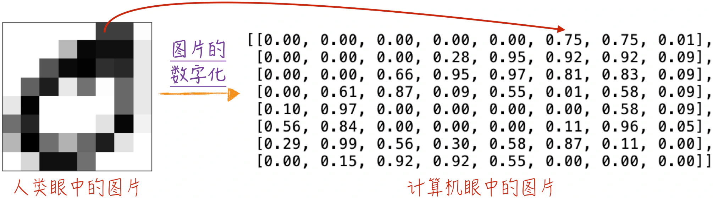
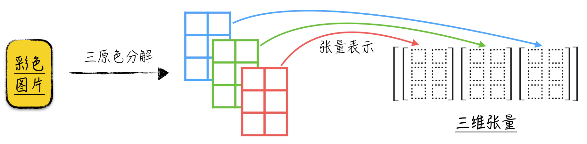
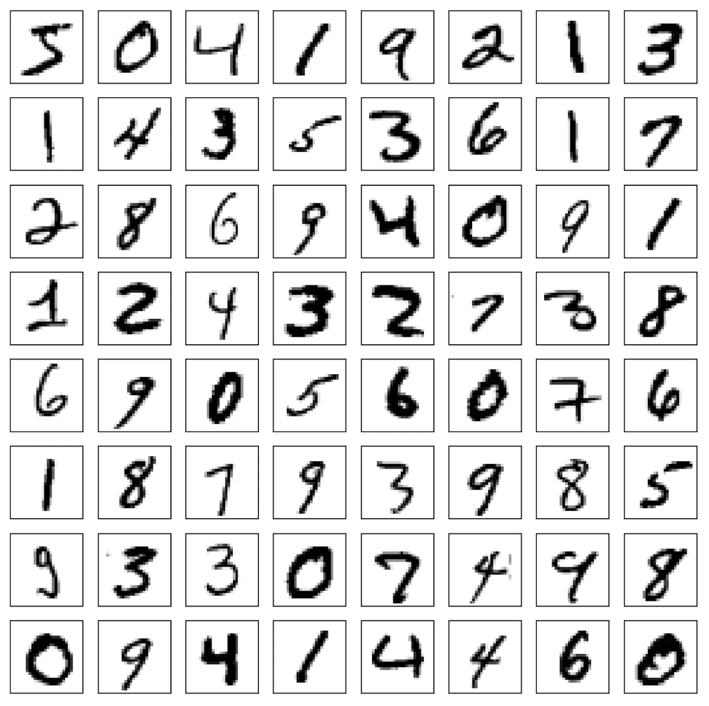
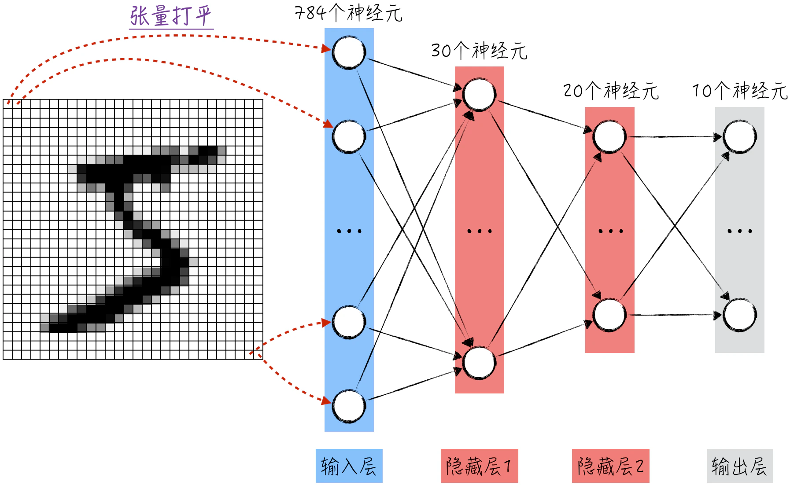
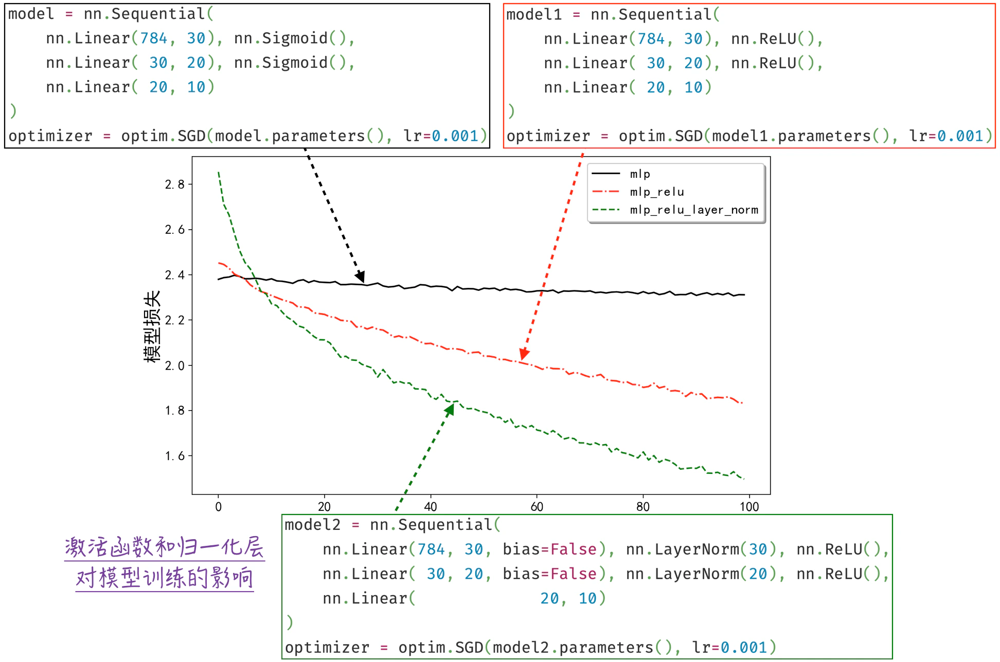
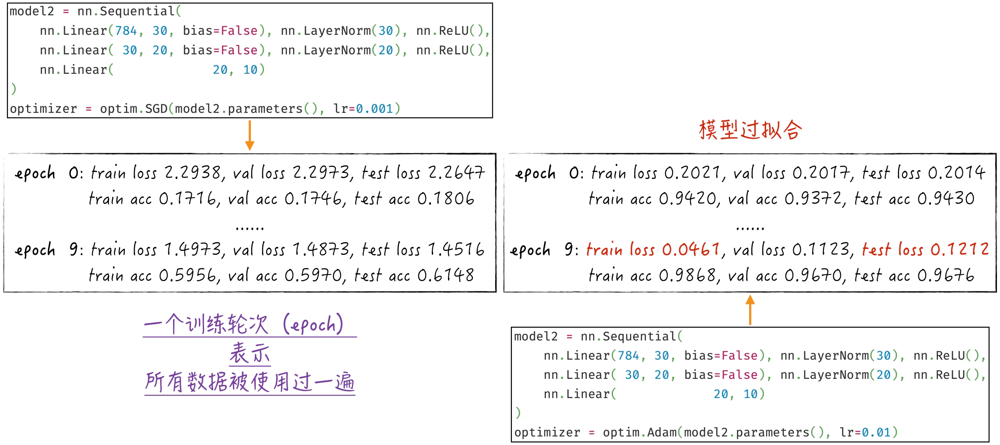
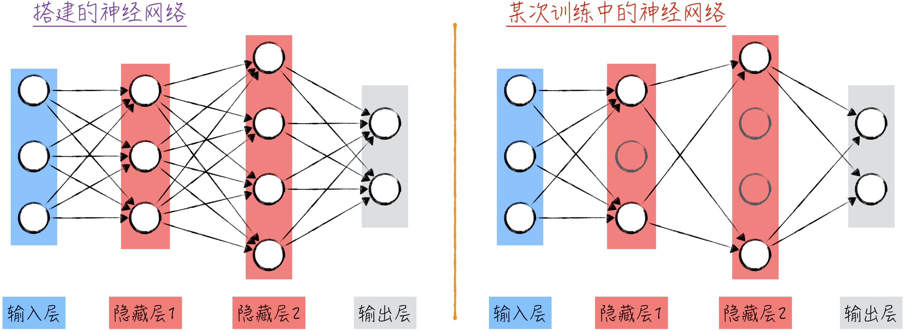
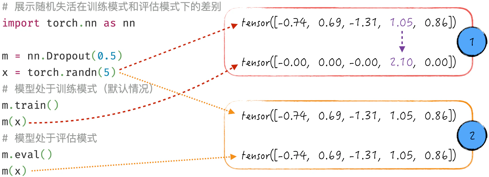
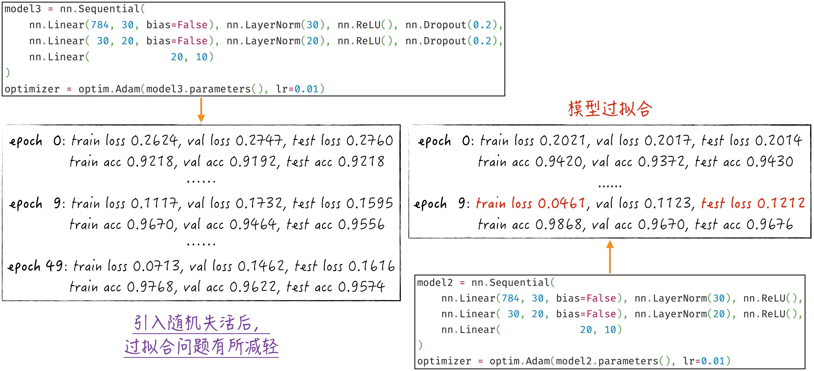

## 9.1 利用多层感知器识别数字

在[第 8 章](/books/deconstructing_LLM/chapter-8)中，通过使用二维合成数据生动展示了多层感知器的关键特性。现在将注意力转向更接近现实世界的场景，即如何利用多层感知器这一基础神经网络模型进行图像识别。在模型的训练过程中，我们将逐步使用一些优化技术来加速模型的训练并提升模型的性能。这些技术包括[第 6 章](/books/deconstructing_LLM/chapter-6)中的高效最优化算法、[第 7 章](/books/deconstructing_LLM/chapter-7)中的随机失活，以及[第 8 章](/books/deconstructing_LLM/chapter-8)中的归一化层和改进后的激活函数。通过本节的实例，读者将更清晰地理解这些技术如何在实际问题中发挥重要作用。

### 9.1.1 视觉对象的数字化

在计算机领域，图像实际上是由一个个像素点构成的。具体来说，对于黑白图像，可以在图像水平和垂直方向分别划分为 $n$ 和 $m$ 等份，从而将图像分割成一个 $n \times m$ 的小方格网格。每个小方格的颜色深度可以用介于 0 到 1 之间的数字来表示，其中 0 表示最亮，1 表示最暗。因此，从计算机的角度来看，图像本质上是一个矩阵，其中的值都是介于 0 到 1 之间的实数，如图 9-1 所示。



需要强调的是，这只是对黑白图像进行了初步的数字化处理，还不能被称为图像的特征表示，主要有以下两个原因。

1. 特征提取的核心任务是从原始数据中提取出与建模目标相关的抽象特征表示。然而，图像的像素表示与图像内容之间的关系并不直观。例如，图像中的物体、边界等概念与像素值之间的关联并不明显。
2. 为了便于展示，这里对图像进行压缩处理，仅使用 64 个像素来表示整个图像。在实际生活中，普通图像的像素数量通常在千万级别[^9-1]（例如，主流手机摄像头通常具有千万像素），但使用模型直接学习千万级别的特征是不切实际的。

在计算机中，通常使用三原色光模式（RGB Color Model）来表示颜色。这意味着任何一种颜色都可以通过红色、绿色和蓝色叠加得到。有了这个基础概念后，结合之前讨论的黑白图像的数字化，可以轻松理解如何将彩色图像数字化。实际上，一张彩色图像可以用 3 个相同形状的矩阵来表示，每个矩阵分别代表红、绿、蓝三原色的深浅程度，如图 9-2 所示。这样就可以用数字矩阵精确地描述彩色图像的内容和色彩变化[^9-2]。



在神经网络领域，通常如何组织这 3 个形状相同的矩阵呢？矩阵本质上是一种二维张量，因此在神经网络领域，这 3 个形状相同的矩阵被表示为一个三维张量。其中，第一个维度的长度等于 3，代表 3 个原色通道。第二维度和第三维度形成的矩阵对应某一原色通道上的像素表示。这种维度提升的处理方式可能对人类来说有些抽象，因为它让我们对图像的直观理解从二维转化为更抽象的三维数据结构。然而，对于神经网络模型而言，图像本身就是一个三维数据结构，它并不直观地理解这个数据结构中的 3 个维度是如何叠加的。因此，我们需要借助算法来引导模型，使它能够将三维张量理解成二维图像。如果将模型比作某种智能生物，那么可以说它生活在比人类高一个维度的世界中。

此外，为了确保数据处理的一致性，即使针对黑白图像，也采用类似的三维张量来表示。只不过在这种情况下，第一个维度的长度为 1，因为它仅包含一种颜色通道。这种统一的数据结构简化了图像数据的处理过程，使得模型能够使用相同的方法来处理不同类型的图像。

### 9.1.2 搭建模型

下面搭建多层感知器来识别 MNIST 图片集[^9-3]。MNIST 图片集包含从 0 到 9 的手写数字图片，如图 9-3 所示，总共有 60000 张训练图片和 10000 张测试图片。



不同于我们日常生活中接触到的图片，为了便于建模，MNIST 中的图片已经被转换为数字形式。具体来说，MNIST 中的每张图片在横向上有 28 个像素点，纵向上也有 28 个像素点。由于这些图片是黑白的，每个像素点都由一个数值表示，该数值表示该点的黑白程度。因此，在建模之前，每张图片都被转换为一个 $1 \times 28 \times 28$ 的张量[^9-4]。

多层感知器的模型架构是固定的，现在我们需要讨论的是如何让模型与图像数据进行适配。这其中的关键在于理解神经网络建模的要点——外观上的相似性，正如[8.2.4 节](/books/deconstructing_LLM/chapter-8/8-2#section-8-2-4)中讨论的那样。

具体来说，首先，多层感知器的输入层是一排神经元，每个神经元对应一个变量。因此，从外观上看，模型的输入应该是一个 $1 \times n$ 的张量。为了实现这一点，需要将图像数据的张量展平，变成一个 $1 \times 784$ 的向量。相应地，模型的输入层需要包含 784 个神经元。接下来，考虑到分类问题有 10 个可能的结果，那么输出层将包括 10 个神经元。为了获得每个类别的预测概率，输出层还会连接一个 Softmax 转换器。至于神经网络的其他层，我们有一些自由度。在这里，我们选择构建两个隐藏层，其神经元数量分别为 30 和 20。整个模型的架构如图 9-4 所示。



### 9.1.3 代码实现

在[第 8 章](/books/deconstructing_LLM/chapter-8)中，为了更深入地理解模型的细节，我们按照 PyTorch 的设计思路重新实现了一系列模型组件，包括线性模型和激活函数等。遵循工程师文化，从本章开始，代码实现将更贴近实际生产应用：利用 PyTorch 提供的封装来构建所需的神经网络模型。

在构建多层感知器模型时，通常有两种方法，如程序清单 9-1 所示。一种是具有较高自由度的方式，如第 6～18 行所示，这种方式常用于构建复杂的神经网络；另一种方式的代码量较少，更简洁，如第 23～27 行所示。

1. 第一种实现方式，需要继承 `nn.Module` 这个类，并实现两个重要的函数：`__init__` 和 `forward`。首先，在第一个函数中，定义模型所需的各个组件，例如多层感知器中的线性模型（也可以在此定义所需的激活函数 Sigmoid）。接下来，在 `forward` 函数中实现向前传播，即如何将模型的输入转换为模型的输出。
2. 第二种实现方式将依赖 PyTorch 提供的 `nn.Sequential`。在这种方式中，我们将一系列模型组件传递给 `nn.Sequential` 的初始化函数，而它将按照组件的顺序依次调用每个组件的 `forward` 方法，从而得到最终的模型输出。这种方式适用于简单的模型构建，但在处理复杂模型或需要跨层级调用[^9-5]的情况下，会显得不够灵活。

#### 程序清单 9-1 构建多层感知器（[完整代码](https://github.com/GenTang/regression2chatgpt/blob/zh/ch09_cnn/mlp.ipynb)）

```python
# 两种常见的实现方式
import torch.nn as nn
import torch.nn.functional as F

## 自由度更高的实现方式
class MLP(nn.Module):

    def __init__(self):
        super().__init__()
        self.hidden1 = nn.Linear(784, 30)
        self.hidden2 = nn.Linear(30, 20)
        self.out = nn.Linear(20, 10)

    def forward(self, x):
        x = F.sigmoid(self.hidden1(x))
        x = F.sigmoid(self.hidden2(x))
        x = self.out(x)
        return x

model = MLP()

## 更简洁的实现方式
model = nn.Sequential(
    nn.Linear(784, 30), nn.Sigmoid(),
    nn.Linear(30, 20), nn.Sigmoid(),
    nn.Linear(20, 10)
)
```

在使用最优化算法训练模型时，每次迭代都需要随机选择一组数据进行训练。在之前的实现中，我们通常需要自己编写代码生成这些批量数据。其实针对这一需求，PyTorch 提供了一个非常便捷的工具，叫作 DataLoader。它可以将数据划分为指定的批量大小 `batch_size`，以便在训练过程中使用，如程序清单 9-2 所示。其中，第 14～16 行展示了如何依次获取这些划分好的批量数据。模型所用的图像用一个三维张量来表示，具体的形状是 $1 \times 28 \times 28$。因此，如果有 500 张这样的图片，那么它们的张量形状就是 $500 \times 1 \times 28 \times 28$。

#### 程序清单 9-2 数据准备（[完整代码](https://github.com/GenTang/regression2chatgpt/blob/zh/ch09_cnn/mlp.ipynb)）

```python
from torchvision import datasets
from torch.utils.data import DataLoader, random_split

# 准备数据
dataset = datasets.MNIST(...)
# 将数据划分成训练集、验证集、测试集
train_set, val_set = random_split(dataset, [50000, 10000])
test_set = datasets.MNIST(...)
# 构建数据读取器
train_loader = DataLoader(train_set, batch_size=500, shuffle=True)
val_loader = DataLoader(val_set, batch_size=500, shuffle=True)
test_loader = DataLoader(test_set, batch_size=500, shuffle=True)
# 获取一个批量的数据
x, y = next(iter(train_loader))
x.shape, y.shape
# torch.Size([500, 1, 28, 28]), torch.Size([500])
```

模型的训练和评估代码与前文类似，不再重复说明。但在进行模型评估时，务必注意正确切换模型的运行模式。关于这一重要细节的详细解释，请参考[9.1.4 节](/books/deconstructing_LLM/chapter-9/9-1#section-9-1-4)。

为了清晰展示激活函数和归一化层对训练的影响，本节搭建了 3 个不同的模型，具体的训练结果如图 9-5 所示。



如前文所述，采用更高效的 ReLU 激活函数和归一化层可以显著提升模型训练速度。

另外，选择更高效的最优化算法也能够明显加速模型训练。例如，[6.4.3 节](/books/deconstructing_LLM/chapter-6/6-4#section-6-4-3)中介绍的 Adam 算法相比于标准随机梯度下降法的加速效果如图 9-6 所示。Adam 算法的加速效果非常显著，而且不会影响模型性能。因此，在实际生产中，我们几乎不再使用标准随机梯度下降法来训练模型，而是普遍采用更高效的最优化算法。

不过，如图 9-6 右侧所示，在加速模型训练后，普遍会出现一个问题——模型开始出现过拟合（Overfitting）[^9-6]。过拟合在神经网络中很常见，特别是在没有采取任何防范措施的情况下。接下来将详细探讨如何有效地解决过拟合问题。



### 9.1.4 防止过拟合之随机失活

[7.4.3 节](/books/deconstructing_LLM/chapter-7/7-4#section-7-4-3)探讨了随机失活的设计原理和具体算法。随机失活是一种计算图构建技巧，其思想是：在图中随机选择一些变量，并将它们乘以 0，从而生成新的变量，这些新变量将替代旧变量参与后续的计算。由于神经网络本质上也是一种计算图（见[8.1.2 节](/books/deconstructing_LLM/chapter-8/8-1#section-8-1-2)），因此随机失活自然也适用于神经网络。唯一的区别在于，尽管从技术角度来看，可以对计算图中的任何变量应用失活，但在神经网络中，通常只对神经元的输出进行失活，这被称为神经元失活。

下面来看随机失活算法对模型训练的影响以及具体的实施细节。为了更好地理解其影响，可以从模型的图示入手。

1. 首先，需要明确神经元失活在图示中的对应关系。当某个神经元被失活时，其向前传播的值和反向传播的梯度都会变为 0。这实际上等同于从神经网络中删除了该神经元及其相关连接[^9-7]，如图 9-7 所示。
2. 其次，随机失活应用在模型训练阶段。每次训练迭代时，会随机选择网络中的一些神经元[^9-8]，将它们失活。这意味着每次训练所依赖的网络结构都不同，是在原有结构的基础上随机删除后生成的（正如第 1 点中提到的，失活等于删除）。在这个修改后的网络结构上进行反向传播和参数更新，会在很大程度上引入随机性，这有助于有效解决过拟合问题。



在实施细节方面，需要注意的是，随机失活算法在模型训练和模型评估（或者预测）阶段的表现不同（[8.5.4 节](/books/deconstructing_LLM/chapter-8/8-5#section-8-5-4)中讨论的批归一化也有类似特性）。在训练阶段，随机失活的作用如前文所述。但在评估阶段，随机失活不再起作用，如图 9-8 中标记 2 所示。

此外，在神经网络中应用随机失活还有一个关键细节，即算法会使未被失活的变量变大，如图 9-8 中标记 1 所示。由于以 0.5 的概率进行随机失活，因此未失活的变量会被放大为原来的 2 倍（0.5 的倒数）。这一设计旨在确保模型每一层输出值之和在应用算法前后保持一致，实践证明，这一细节对于模型的训练非常有益。



在模型的训练过程中，常常需要评估模型的性能，这意味着要将模型从训练模式切换到评估模式。因此，在编写相应的性能评估函数时，务必注意在进行性能评估前后，及时切换模型的运行模式，如程序清单 9-3 中的第 11 行和第 16 行所示。

#### 程序清单 9-3 切换模型的运行模式（[完整代码](https://github.com/GenTang/regression2chatgpt/blob/zh/ch09_cnn/mlp.ipynb)）

```python
@torch.no_grad()
def _loss(model, data_loader):
    """
    计算模型在不同数据集下面的评估指标
    """
    ...

def estimate_loss(model):
    re = {}
    # 将模型切换至评估模式
    model.eval()
    re['train'] = _loss(model, train_loader)
    re['val'] = _loss(model, val_loader)
    re['test'] = _loss(model, test_loader)
    # 将模型切换至训练模式
    model.train()
    return re
```

引入随机失活后，模型的过拟合问题有了一定程度的改善，如图 9-9 所示。然而，随着训练的进行，模型仍然会在一段时间后遇到过拟合问题。需要注意的是，在第 10 个训练轮次之后，验证集和测试集的性能指标没有明显改善。这时，我们可以合理推测模型已经达到了性能极限，如果希望进一步改进模型效果，就要改进模型的结构，而不仅仅是继续训练模型。



### 9.1.5 防止过拟合之惩罚项

与其他模型类似，我们也可以通过在神经网络的损失函数中引入惩罚项来抑制过拟合。在实际应用中，通常会将惩罚项与随机失活结合在一起使用，以获得更理想的效果。[3.3.3 节](/books/deconstructing_LLM/chapter-3/3-3#section-3-3-3)中讨论了如何在线性模型中应用 L2 和 L1 惩罚项，神经网络中的惩罚项与之类似。下面简要回顾惩罚项的细节。

- L2 惩罚项。不妨假设神经网络原本的损失函数为 $L$，定义新的损失函数 $\bar{L}$，如公式（9-1）所示。其中，$\lambda$ 为惩罚项的权重，是模型的超参数；$\boldsymbol{W}$ 表示神经网络中的模型参数，不妨记为 $\boldsymbol{W}=(w_1,w_2,\cdots,w_N)$，则 $\lVert\boldsymbol{W}\rVert_2^2=\sum_i w_i^2$。

$$
\bar{L}=L+\lambda\lVert\boldsymbol{W}\rVert_2^2 \tag{9-1}
$$

- L1 惩罚项。与 L2 惩罚项相似，在神经网络的损失函数中添加 L1 惩罚项。使用相同的符号表示，可以得到如公式（9-2）所示的新损失函数，其中 $\lVert\boldsymbol{W}\rVert_1=\sum_i |w_i|$。

$$
\bar{L}=L+\lambda\lVert\boldsymbol{W}\rVert_1 \tag{9-2}
$$

直观上来看，上述两种惩罚项抑制过拟合问题的原理在于使模型参数更接近于 0，这与线性回归模型中的情况类似。通过增加惩罚项，可以防止训练数据的偏差导致模型过于依赖某些变量（对应的模型参数绝对值很大）。

这两种惩罚项的区别在于：L1 惩罚项更倾向于获得“稀疏”的模型参数，也就是说，只有少量模型参数不等于 0。从宏观角度来看，这意味着神经网络实际上只使用了部分变量，因此具有较强的抗噪声能力（噪声变量的权重通常被估计为 0）。L2 惩罚项更倾向于获得接近于 0 但非 0 的参数估计值。从宏观角度来看，这意味着模型会利用几乎所有的变量，但每个变量对最终结果的影响都相对较小。

这两种惩罚项各有优缺点，需要根据具体的应用场景进行选择。此外，还可以将它们综合起来，形成所谓的弹性网络正则化（Elastic Net Regularization）。弹性网络正则化的具体公式如公式（9-3）所示，其中，$l$ 为模型的超参数，取值范围是 0～1，表示 L1 惩罚项的权重。为了找到最佳的超参数取值，可以使用网格搜索（Grid Search）等方法。

$$
\bar{L}=L+\lambda\left[l\lVert\boldsymbol{W}\rVert_1+(1-l)\lVert\boldsymbol{W}\rVert_2^2\right] \tag{9-3}
$$

在代码中实现上述讨论的惩罚项非常简单，基本上只需直接翻译上述公式。程序清单 9-4 是一个简单示例，展示了如何在代码中实现这些惩罚项，其中，第 11～14 行对应公式（9-3），$\lambda l=\lambda(1-l)=0.001$。

#### 程序清单 9-4 增加惩罚项的简单示例（[完整代码](https://github.com/GenTang/regression2chatgpt/blob/zh/ch09_cnn/mlp.ipynb)）

```python
# 定义 L1 和 L2 惩罚项
def l1_loss(model, weight):
    w = torch.cat([p.view(-1) for p in model.parameters()])
    return weight * torch.abs(w).sum()

def l2_loss(model, weight):
    w = torch.cat([p.view(-1) for p in model.parameters()])
    return weight * torch.square(w).sum()

logits = model(inputs.view(B, -1))
loss = F.cross_entropy(logits, labels)
# 增加惩罚项
loss += l1_loss(model, 0.001)
loss += l2_loss(model, 0.001)
loss.backward()
...
```

在程序清单 9-4 中，模型的所有参数都参与了惩罚项的定义。但在实际应用中，我们可以选择性地对模型部分参数进行惩罚。例如，只对网络中的线性变换做限制，甚至更进一步，只对其中的权重项进行惩罚。这样的设计可以保证权重项接近 0，同时允许其他参数相对自由地变化。在一些文献中，对权重项的惩罚称为 Kernel Regularizer，对偏置项的惩罚被称为 Bias Regularizer。

除了对模型参数的惩罚，我们还可以对神经网络中特定层的输出执行类似操作。事实上，对参数增加惩罚的目的之一就是避免神经元输出远离 0。然而，随着神经网络的规模扩大，由于存在累积效应，即使参数接近 0，某些神经元的输出仍然可能偏离 0。在这种情况下，直接对输出施加惩罚将产生更好的效果。具体的实现与上面非常类似，只需将惩罚项中的模型参数替换为特定层的输出即可。在某些文献中，这种方法被称为 Activity Regularizer。

[^9-1]: 正因为庞大的原始数据很难处理，所以建模的第一步通常是对图片、视频等进行压缩。这个细节超出了本书的讨论范围，本章所用到的数据都是已经压缩好了的。图 9-1 和图 9-3 的代码见本书[配套代码](https://github.com/GenTang/regression2chatgpt/blob/zh/ch09_cnn/mnist.ipynb)。
[^9-2]: 有了对图像数字化的理解，我们可以轻松地解决视频的数字化问题。视频实际上是一系列图像的连续叠加。以电影为例，经典电影通常以每秒 24 帧的速度呈现，即每秒显示 24 张图像。因此，对视频的数字化处理也变得非常自然和直观。
[^9-3]: MNIST 图片集是神经网络研究领域最常用的数据之一，常被用来评估不同模型的效果。
[^9-4]: 虽然张量能够方便地表示高维数据，但所有张量都以一维数组的形式存储。高维度的信息实际上是通过张量的元数据来管理的。具体来说，张量的元数据包含一个名为 `stride` 的属性，它告诉计算机在一维数组中查找当前维度的下一个元素时需要跨越多远的步幅。例如，如果有一个张量 `m = torch.randn(3, 4, 5)`，那么 `m.stride() = (20, 5, 1)`。它表示在第一个维度上跨越 20 个元素，在第二个维度上跨越 5 个元素，在第三个维度上不需要跨越（跨越 1 个）。因此，高维度张量并没有什么神秘之处，是通过巧妙地在一维数组中查找和组织数据来实现的。尽管对人类来说，改变张量的形状可能很复杂，但这对计算机来说几乎是轻而易举的任务。
[^9-5]: 例如[9.3.1 节](/books/deconstructing_LLM/chapter-9/9-3#section-9-3-1)将讨论的残差连接。
[^9-6]: 如果使用标准随机梯度下降法，在经过较长时间的训练之后，同样会出现过拟合问题。过拟合问题与最优化算法无关，高效的算法只是加速了它的出现。
[^9-7]: 在图 9-7 中，神经元之间的连接代表乘法操作，即神经元的输出与权重项的乘积。在这种情况下，以这个神经元为起点的连接会失去作用，因为此时反向传播到权重项的梯度等于 0。更详细的相关信息，读者可以参考图 7-19。与此同时，作为终点的连接也同样失去了作用，这个原因可以参考图 7-18。
[^9-8]: 对于每个数据点，失活的神经元都是独立随机选择的。这意味着每个数据点都会使用不同的网络结构。
