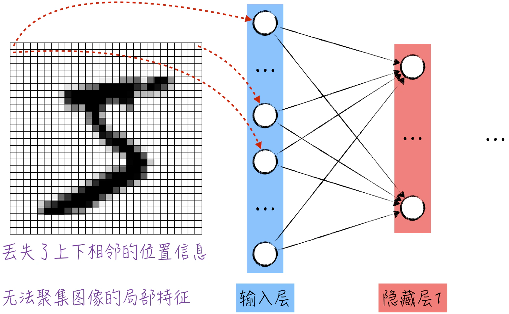
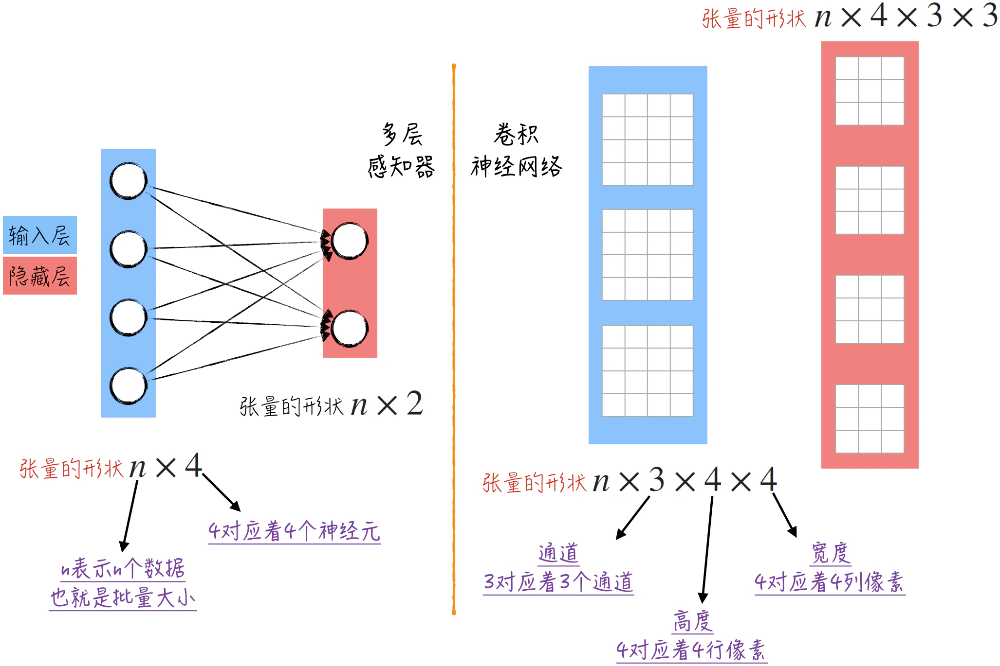
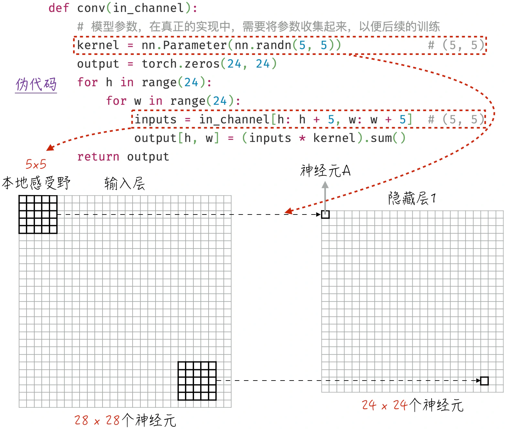
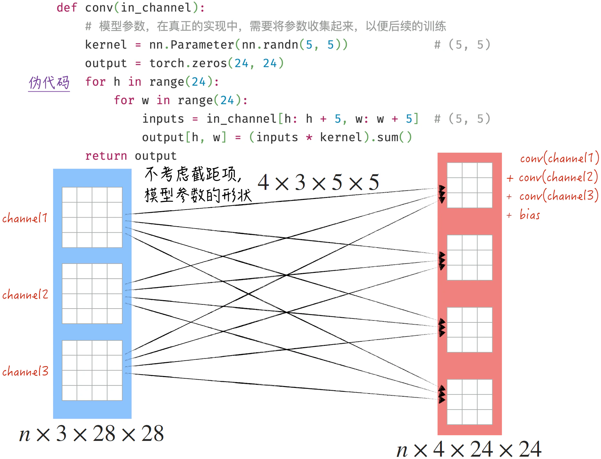
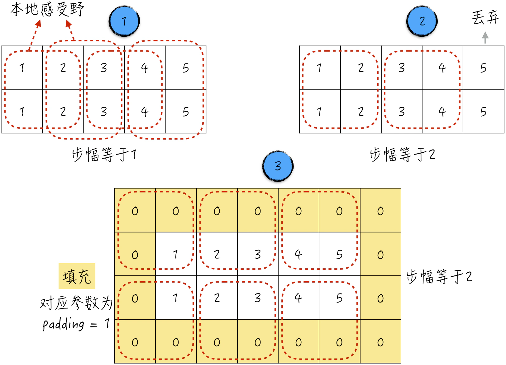
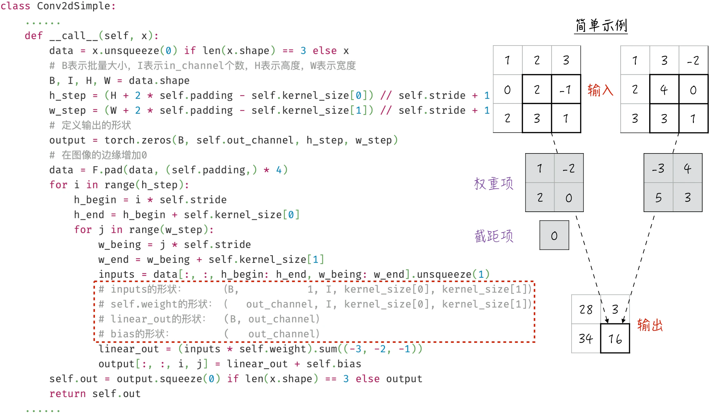
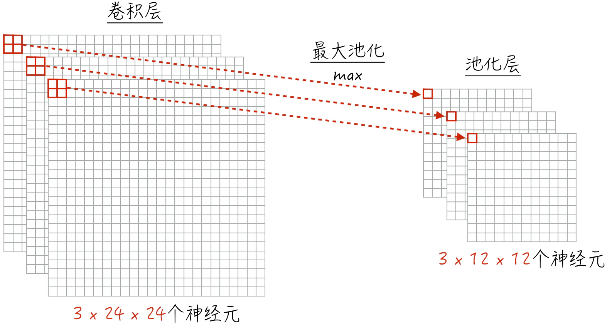
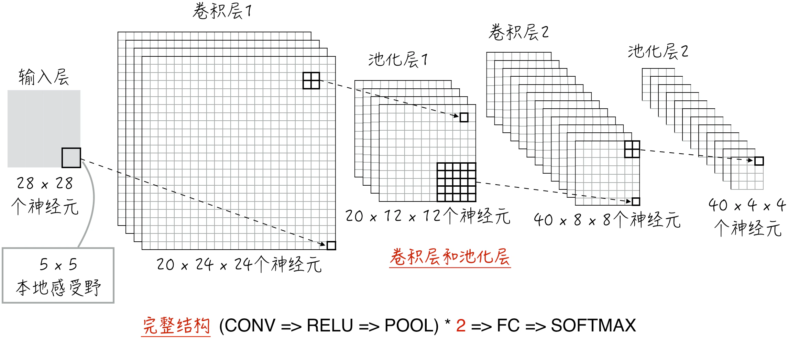
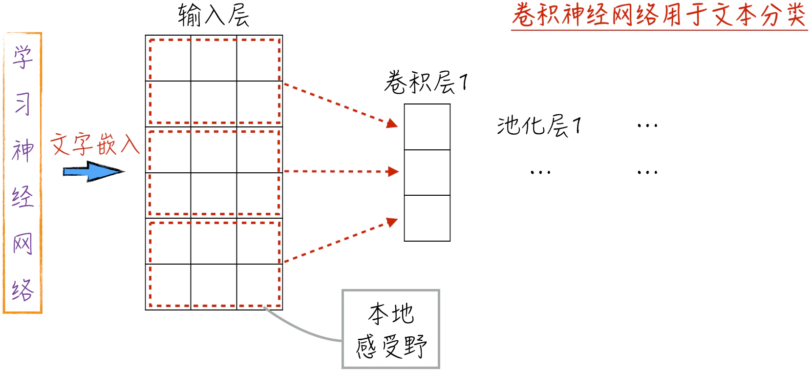

## 9.2 卷积神经网络

虽然多层感知器在图像分类任务中取得了不错的效果（准确率约为 95%），但在处理位置关系、颜色信息及像素合并等方面，它与人类的图像识别能力仍存在差距。

首先，人类在识别图像时，不仅关注每个像素点的颜色，还重视像素点之间的空间位置关系。人通常特别关注图像的局部信息，即相邻像素点之间的关联性，因为相距越近的像素点，它们之间的相关性越高。然而，全连接神经网络没有明确考虑图像像素点的位置关系。如图 9-10 所示，在处理输入层时，将图像的张量打平，转换为一维向量，以适应神经元排列的一维结构。这种处理丢失了图像上下相邻的位置信息，导致多层感知器难以捕捉到这一重要信息。虽然左右相邻位置信息在一定程度上得以保留，但模型并未有效利用这些信息。



其次，人眼在处理彩色图像时，实际上是将多种颜色的像素表示叠加进行识别。如果仍然采用多层感知器来处理彩色图像，只能将所有颜色的张量打平并拼接成一个大的一维向量，然后传递给模型。这种处理方式不仅导致位置信息丢失，还会丢失颜色信息，因此，模型效果一定不会特别理想。

最后，人眼在识别图像时通常会对局部区域进行模糊处理，即将非常接近的像素点合并成一个像素点进行处理。这种模糊处理实际上可以提升人类的图像识别能力。然而，多层感知器模型却缺乏这种特性的设计。

为了克服上述 3 个缺陷，学术界引入了卷积神经网络，下面将深入讨论这一模型的细节。

### 9.2.1 神经元的组织方式

在多层感知器中，神经元被分层组织，卷积神经网络也遵循着类似的思路。为了更有效地处理图像数据，卷积神经网络对同一层的神经元采用了一种全新的排列方式。由于图像数据通常由 1 个或 3 个矩阵表示，受此启发，卷积神经网络摒弃了一字排开的一维线性排列，而是将神经元排列成多个二维网格的形式，如图 9-11 右侧所示。其中，每个小方格代表一个神经元，可以将它们类比为多层感知器图示中的圆圈。



这种排列方式使得卷积神经网络非常适合处理图像数据。以输入层为例，如果处理的是彩色图像，那么将输入层设计成 3 个二维网格，这样输入层与图像数据之间就建立了直观的一一对应关系，无须额外的转换，就可以直接将数据输入模型。

将上述概念转化为计算机实现可能更容易理解。在多层感知器模型中，神经元按照一字排开的方式组织，每一层的输出对应一个形状为 $n \times k$ 的张量，其中 $n$ 表示批量数据的个数，$k$ 表示神经元的数量（具体细节可参考图 8-10）。然而，在卷积神经网络中，神经元被组织成若干个二维网格，每一层的输出是一个四维张量。四维张量的第一维仍然表示批量大小，第二维通常被称为通道或输出通道（Channel/Out Channel），第三维和第四维分别被称为高度（Height）和宽度（Width）。因此，卷积神经网络每一层的输出对应着一个形状为 $n \times c \times h \times w$ 的张量。

在这 4 个维度中，通道这个概念可能有点抽象，这个概念借鉴自彩色图片的原色通道。在输入层中，通道直接对应原色通道。例如，对于彩色图像，输入层的这一维长度等于 3，代表红、绿、蓝 3 个通道。在隐藏层中，通道通常表示不同的局部特征。在本节的后续内容中，当深入探讨卷积神经网络的细节时，将更容易明确这一概念的含义。

### 9.2.2 卷积层的网络结构

细心的读者可能留意到，[9.2.1 节](/books/deconstructing_LLM/chapter-9/9-2#section-9-2-1)中讨论了神经元的排列方式，但还未涉及层与层之间神经元的连接方式，也就是它们之间的运算关系。这将是[9.2.2 节](/books/deconstructing_LLM/chapter-9/9-2#section-9-2-2)至[9.2.4 节](/books/deconstructing_LLM/chapter-9/9-2#section-9-2-4)的核心内容。卷积神经网络引入了两种全新的神经元连接方式——卷积层和池化层，它们分别模拟了人类视觉捕捉局部特征和进行模糊处理的特性。下面首先讨论卷积层（Convolution Layer）。

卷积层的完整处理涉及多个维度，可能有些抽象。为了易于理解，下面将从一个简单的例子入手，将注意力集中在输入层和第一个隐藏层上，并假设这两层的通道都为 1，如图 9-12 所示。在卷积层的处理过程中，需要注意两个要点。

1. 本地感受野[^9-9]（Local Receptive Field）：在卷积神经网络中，每个隐藏层的神经元只关注输入数据的一个局部区域，这个区域称为本地感受野。不同于多层感知器，隐藏层的神经元不与整个输入数据连接，而只与一个小窗口（通常是一个 $5 \times 5$ 的正方形）连接。这种设计允许神经元仅处理局部信息，从而更好地捕捉图像的位置信息和局部特征。
2. 共享参数（Shared Weights And Bias）：与多层感知器类似，卷积神经网络中神经元之间的连接也可以对应线性组合。这意味着本地感受野与隐藏层 1 中的神经元之间的关系可以用公式（9-4）来表示（或参考图 9-12 中的代码），其中 $o$ 表示隐藏层 1 中神经元的输出，$w_m$ 是权重项，$i_m$ 是输入数据中的本地感受野。值得注意的是，在卷积神经网络中，每个通道专门负责提取一种局部特征。因此，同一隐藏层（同一通道）中的不同神经元都共享相同的模型参数，例如在图 9-12 中，它们使用相同的 25 个权重项（暂时不考虑截距项），这就是所谓的共享参数。

$$
o=\sum_m w_m i_m \tag{9-4}
$$



通过滑动输入层中的本地感受野，可以逐步计算隐藏层 1 中每个神经元的输出[^9-10]。在图 9-12 中，本地感受野的移动步幅等于 1，因此会得到一个 $24 \times 24$ 的神经元输出矩阵。这种设计允许神经元独立处理输入数据的不同局部区域，从而构建出整个输入数据的特征表示。这不仅赋予了模型捕捉局部特征的能力，还显著减少了模型的参数数量。在上述例子中，如果使用全连接的多层感知器，需要的模型参数总数为 $567 \times (784+1)=445095$。但在卷积神经网络中，仅需 25 个参数就能获得更出色的性能。大幅节省参数是卷积神经网络成功的重要原因之一。

上面讨论了输入层和隐藏层只有 1 个通道的情况。但如果存在多个通道，应该如何处理呢？

- 在隐藏层中，每个通道仅能表示一种局部特征。如果需要提取多个不同的局部特征，可以简单地增加更多通道，每个通道使用相同的处理方式但具有不同的模型参数。
- 如果输入层有多个通道（比如彩色图像），那么对每个输入通道采用相同的处理方法，然后将多个通道的结果相加。这是因为在现实世界中，不同通道的颜色叠加在一起才能形成最终的图像，模型将处理结果相加正是模拟了这一过程。多输入通道的处理也可以推广到隐藏层与隐藏层之间，用于模拟不同局部特征的叠加。此外，如果需要，可以在结果相加之后添加截距项。对于每个输出通道，不论输入通道是一个或多个，都只有一个截距项，与权重项一样，截距项也是共享的。

综上，完整的卷积层结构如图 9-13 所示。其中，可以将通道视为“神经元”，将本地感受野的映射视为“神经连接”，这使得卷积层与之前讨论的多层感知器非常相似，都是一种“全连接”的结构。这个设计能够有效捕捉图像的不同局部特征，是卷积神经网络的关键组成部分。



### 9.2.3 卷积层的细节处理与代码实现

在深入讨论卷积层的网络结构后，本节将探讨卷积操作中的两个重要细节，以及如何在代码中实现这些细节。卷积操作通过滑动本地感受野来逐步计算各个神经元的输出，在滑动的过程中，需要考虑两个关键点[^9-11]：滑动的步幅和边界值的处理。

在[9.2.2 节](/books/deconstructing_LLM/chapter-9/9-2#section-9-2-2)的例子中，本地感受野滑动的步幅（Stride）被设置为 1。实际上，这个步幅是可以调整的，如图 9-14 所示。理论上，步幅可以是任意整数，但在实际应用中，步幅通常不会大于本地感受野的边长，以免在滑动过程中出现遗漏部分图像信息的情况。卷积操作中的步幅决定了输出特征图的尺寸，较大的步幅会导致输出尺寸较小，较小的步幅则会导致输出尺寸较大。



当卷积操作中的步幅大于 1 时，会引发一个边界问题，可能导致部分信息丢失，因为边界上的数据不足以构成一个完整的本地感受野，如图 9-14 中标记 2 所示。这个问题可以通过填充（Padding）来解决。填充是指在输入数据的周围添加额外的值（通常是 0），以扩展输入数据的尺寸，如图 9-14 中标记 3 所示[^9-12]。这样做可以更好地支持卷积层的计算，确保信息不会在边界丢失。

下面我们可以着手实现一个简单版本的卷积层。核心代码如图 9-15 所示（[完整代码](https://github.com/GenTang/regression2chatgpt/blob/zh/ch09_cnn/conv_example.ipynb)）。从代码的角度看，卷积层的实现并不复杂，主要涉及本地感受野的滑动操作，这里采用双重循环来实现（需要注意，这并不是最优的实现方式）。重新实现卷积层有两个目的：一是帮助读者更好地理解卷积层的技术细节，通过亲自编写代码，能够深入了解神经网络组件的运行方式，消除对其的神秘感；二是突出神经网络实现中的关键步骤——核对运算涉及的张量形状，如图 9-15 中虚线框所示。这个步骤不仅对于卷积层的重新实现至关重要，对于开发其他神经网络组件也同样重要。



### 9.2.4 池化层

在讨论完如何利用卷积层提取图像的局部特征之后，下面来探讨如何在神经网络中模拟人眼对图像的模糊处理。假设图像中的 4 个点 A、B、C、D 构成一个正方形，当距离较远时，我们会将其看作一个点。将这个过程“翻译”成数学表示，如果用一个值（例如这 4 个像素点的最大值）来代表这 4 个像素点，那么实际上将这 4 个点模糊地合并成一个点，就实现了对眼睛模糊处理的模拟。如果不考虑生物学的启发，仅从图像数据处理的角度来看，上述过程实际上是对图像数据的一种压缩操作，即用更少的像素来表示图像。这种压缩过程有助于降低计算复杂性，提取关键信息，同时保留图像的主要特征，有效提高模型的效率和性能。

将这个思路应用到卷积神经网络中，就引入了池化层（Pooling Layer），要点如下。

1. 池化层的运算与卷积层有一定的相似之处，它同样对输入数据的局部区域进行运算，这个区域被称为池化窗口，类似于之前提到的本地感受野。
2. 与卷积层类似，池化层可以使用步幅来控制池化窗口在输入上的移动。步幅决定了输出特征图的尺寸，具体操作如图 9-16 所示。
3. 不同于卷积层，池化操作并不是线性组合。通常有两种主要的池化方式，即最大池化（Max Pooling）和平均池化（Average Pooling）。这些操作分别在局部区域内选择最大值或平均值，并用所选值代表该区域。因此，池化层没有任何模型参数。最大池化通常用于突出输入中的显著特征，平均池化用于平滑输入并降低噪声。

在卷积神经网络中，通常会交替堆叠多个卷积层和池化层，逐渐减小空间尺寸并提取更抽象的特征表示。引入池化层有助于神经网络实现对输入数据的压缩并增加抗干扰性，使模型更好地处理图像数据。



### 9.2.5 完整结构与实现

虽然卷积层和池化层非常巧妙地模拟了人眼的两个特性，但它们本身还不满足图像识别的需求，因为它们的输出不符合分类问题的要求。例如，在数字识别（MNIST）任务中，我们需要神经网络的最后一层是平铺的，包含 10 个神经元，以完成对数字的分类，但卷积层和池化层并不是这种平铺的结构。

为了实现图像分类任务，通常的做法是在最后一个池化层之后添加一个多层感知器层，这样就能满足分类问题对输出结构的要求。由于多层感知器的神经元是全连接的，因此在学术上，这一部分也被称为全连接层（Fully Connected Layer）。

将所有这些组合在一起，一个完整的卷积神经网络由 3 个主要部分组成：卷积层（图 9-17 中的 CONV）、池化层（图 9-17 中的 POOL）和全连接层（图 9-17 中的 FC）。具体的网络结构如图 9-17 所示。需要注意的是，池化层的输出是一个四维张量，而全连接层的输入是一个二维张量（其中第一维是批量大小）。因此，在连接这两层时，需要将池化层的输出展开，这类似于将图像数据输入多层感知器模型时的处理方式。从模型的架构角度来看，这种设计方式将最后一个池化层视为多层感知器的输入层，也就是说，卷积层和池化层的主要作用是改进输入数据，从图像中提取更有效的特征信息。

代码实现并不复杂，如程序清单 9-5 所示，只需将图 9-17 中的网络结构转化为代码。在实现过程中，需要特别注意两个关键细节。

1. 生成网络组件时需要正确设置参数，如第 5～10 行所示，这是实现中的一个难点。为了准确设置这些参数，可以依据前面的讨论进行理论计算。在实际工作中，更常见的做法是将每个组件单独提取出来，用随机生成的输入进行测试，看看输出的张量形状是否符合预期。比如，使用 `self.conv1(torch.randn(1, 1, 28, 28))` 来检查第一个卷积层。在确认输出的张量形状符合预期之后，得到的结果可以更直观地帮助我们确定下一层组件的参数。
2. 当将这些组件连接起来进行计算时，务必不断验证输入和输出的张量形状是否符合预期，如第 13～18 行所示。正如之前多次强调的，对于神经网络的实现来说，要始终关注张量的形状。



#### 程序清单 9-5 卷积神经网络（[完整代码](https://github.com/GenTang/regression2chatgpt/blob/zh/ch09_cnn/cnn.ipynb)）

```python
class CNN(nn.Module):

    def __init__(self):
        super().__init__()
        self.conv1 = nn.Conv2d(1, 20, (5, 5))
        self.pool1 = nn.MaxPool2d(2, 2)
        self.conv2 = nn.Conv2d(20, 40, (5, 5))
        self.pool2 = nn.MaxPool2d(2, 2)
        self.fc1 = nn.Linear(40 * 4 * 4, 120)
        self.fc2 = nn.Linear(120, 10)

    def forward(self, x):
        B = x.shape[0]                              # (B, 1, 28, 28)
        x = self.pool1(F.relu(self.conv1(x)))       # (B, 20, 12, 12)
        x = self.pool2(F.relu(self.conv2(x)))       # (B, 40, 4, 4)
        x = x.view(B, -1)                           # (B, 40 * 4 * 4)
        x = F.relu(self.fc1(x))                     # (B, 120)
        x = self.fc2(x)                             # (B, 10)
        return x
```

使用这个模型进行数据训练，可以获得出色的分类结果，如图 9-18 左侧所示，准确率接近 99%[^9-14]。当然，上述模型结构并不是唯一的选择。归一化层和随机失活等优化技术尚未包括在内，若要引入它们也非常简单，如图 9-18 右侧所示。然而，引入之后仍会得到类似的结果，很难看出这些优化技术的优势。


### 9.2.6 超越图像识别

卷积神经网络在图像分类领域具有卓越的表现。如果站在模型的角度来看，它学习的材料实际上并非图像本身，而是一个三维张量。这意味着，无论是什么样的对象，只要能够被数字化为三维张量，模型都有潜力学会对其进行分类。实际上，除图像之外，还有众多其他对象可以被转化为三维张量的形式，典型的例子就是文本。下面将简要介绍如何借助卷积神经网络来进行文本分类。

在文本分类中，假设每个文本都被表示为一个 $k$ 维向量，这个过程称为文本嵌入（Embedding）。读者在此不必深究嵌入的细节[^9-15]，只需了解已经有成熟的方法可以完成这一步骤。基于文本嵌入，文本可以被数字化为一个三维张量，如图 9-19 所示。

图 9-19 中的例子基于如下的假设和参数选择。

- 只使用一种文本嵌入，所以第一维（通道，Channel）的长度为 1。
- 文本的最大长度为 6，如果文本超过这个长度，会被截断；如果长度不足，则使用默认字符进行填充，以保持长度为 6。因此，第二维（高度，Height）的长度为 6。
- 每个单词都可以用一个三维向量表示，因此第三维（宽度，Width）的长度为 3。



接下来，就像处理图像一样，构建一个卷积神经网络进行文本分类。需要注意的是，本地感受野的宽度必须等于嵌入向量的长度。由于卷积神经网络能够有效捕捉局部特征，因此在文本分类中，它能够有效地学习有意义的文本片段（如单词或短语），从而实现良好的分类效果。

[^9-9]: 感受野是一个生物学概念，根据维基百科上的介绍，一个感觉神经元的感受野是指能够引起该神经元反应的区域。卷积神经网络借鉴并实现了这一特性。
[^9-10]: 简单来说，对于两个可积函数 $f$ 和 $g$，它们的卷积定义为 $h(x)=\int f(t)g(x-t)\mathrm{d}t$。如果 $f(t)$ 的定义域是一个正方形，那么计算这两者的卷积就类似于图 9-12 所示的本地感受野在图像上的移动过程。这也是卷积层名字的来源。
[^9-11]: 本章详细讨论了标准卷积层的运作方式。然而，卷积神经网络中还存在许多其他的卷积变体，如膨胀卷积（Dilated Convolution）和转置卷积（Transposed Convolution）等。由于篇幅有限，本书未深入探讨这些变体，感兴趣的读者可以查阅其他相关文献，深入了解它们的原理和应用。这些卷积变体在不同的场景下发挥着重要的作用，扩展了卷积神经网络的应用领域。
[^9-12]: 在阅读其他文献时，读者可能会遇到两个重要概念：有效填充（Valid Padding）和相同填充（Same Padding）。有效填充是指不对输入进行填充操作。相同填充的目标是通过添加适当数量的填充元素，使卷积层的输出与输入具有相同的形状。
[^9-14]: 卷积神经网络的性能远不止于此，事实上，有实验证明卷积神经网络的准确率可以达到惊人的 99.77%。此外，我们还可以借助一些图像畸变（Image Deformation）的技巧来扩充训练数据，从而进一步提高模型性能。这些技巧包括对图像进行旋转、平移等操作，它们在图像识别领域被广泛使用。这些技巧的具体细节超出了本书的范围，有兴趣的读者可以查阅其他文献资料以深入了解。
[^9-15]: 关于文本嵌入的技术细节，将在[10.2.2 节](/books/deconstructing_LLM/chapter-10/10-2#section-10-2-2)中详细讨论。
