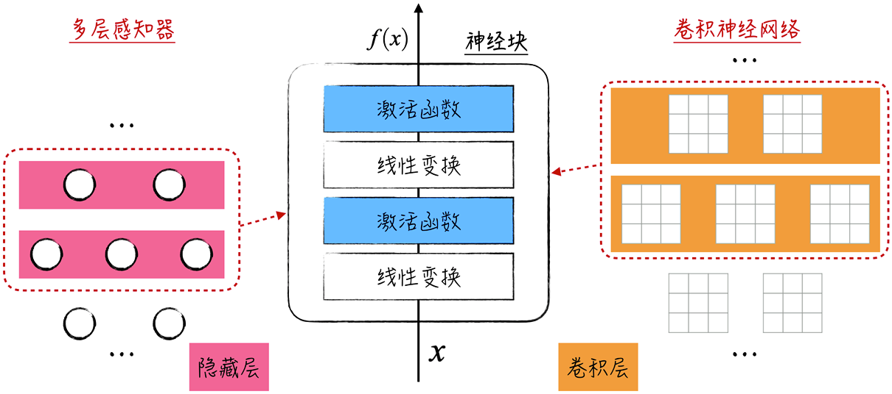
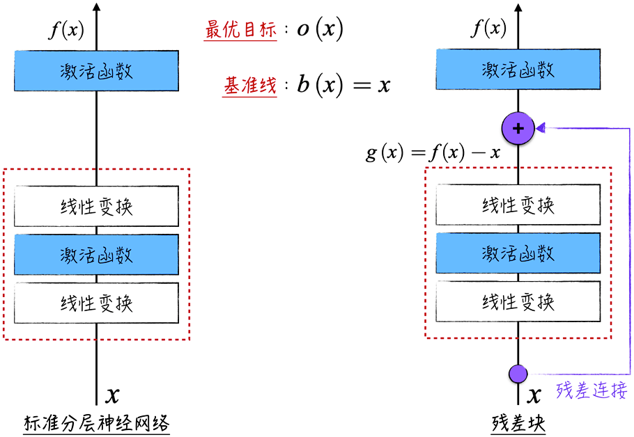
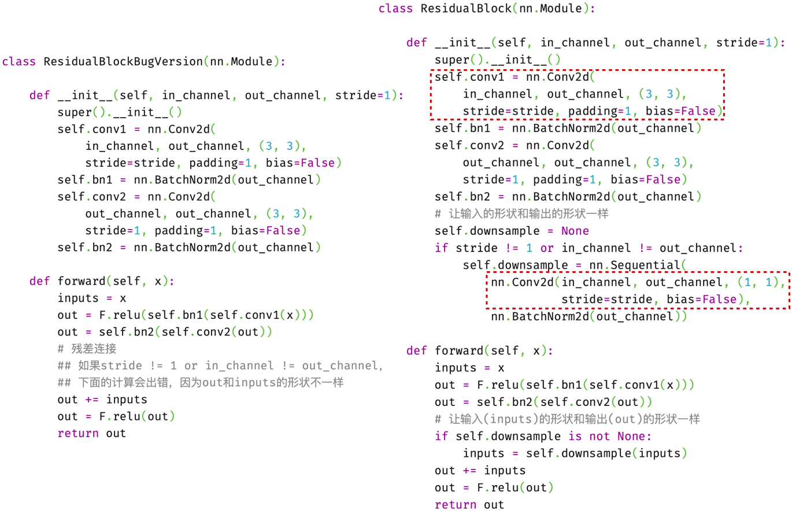
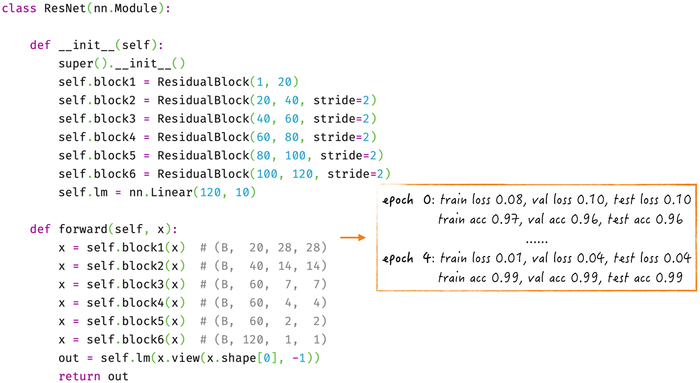

## 9.3 残差网络

如[9.2 节](/books/deconstructing_LLM/chapter-9/9-2)中的图 9-17 所示，经典的卷积神经网络是由卷积层和池化层组合而成的。网络中卷积层的数量较少，通常为两个。卷积层主要用于提取局部特征，池化层用于对图像数据进行压缩。卷积神经网络已经证明了深度学习的潜力，即通过增加网络的深度，模型性能可以显著提高。那么，如果继续增加网络的深度，是否会获得更好的效果呢？

从直觉上来看，答案应该是肯定的。如果神经网络包含多个卷积层，而且这些卷积层的结构相似，那么较浅的网络其实是较深网络的一个子集。然而，在实际生产中，增加网络的深度并不总是能够提高模型的性能，反而可能导致性能下降。其中最重要的原因之一是，随着网络深度的增加，模型训练面临越来越严重的梯度消失或梯度爆炸问题（详见[8.4.4 节](/books/deconstructing_LLM/chapter-8/8-4#section-8-4-4)）。

为了解决梯度不稳定性的问题，需要采用一些优化技术。在[8.4.5 节](/books/deconstructing_LLM/chapter-8/8-4#section-8-4-5)和[8.5.4 节](/books/deconstructing_LLM/chapter-8/8-5#section-8-5-4)中，分别采用了更高效的激活函数和引入归一化层。[9.3.1 节](/books/deconstructing_LLM/chapter-9/9-3#section-9-3-1)将深入讨论另一种广泛应用的技术——残差连接（Residual Connection）。这 3 种技术能够显著提高深度神经网络的训练效率，已经成为深度学习的基石优化工具，在实际场景中得到广泛应用。在详细讨论残差连接后，将演示如何利用这 3 种关键技术构建经典的残差网络（Residual Network，ResNet）。

### 9.3.1 残差连接

根据前面的讨论，不论是多层感知器还是卷积神经网络，它们都以分层的方式来组织神经元。每一层的神经元只与相邻层的神经元相连接，不存在跨层连接。为了更清晰地说明这一点，下面使用不同的图示来放大网络[^9-16]中的一部分，如图 9-20 所示。



在图 9-20 中，将相邻的两层组合成一个神经块。在神经块内部，我们不再关注神经元的具体排列方式，而是用图形来表示数据经过的计算步骤（线性变换和激活函数的逐层叠加）。这种展示方式有助于我们更好地理解残差连接。尽管残差连接对神经块输入/输出的形状和激活函数并没有特殊要求，但为了更直观地理解，接下来的讨论默认使用 ReLU 作为激活函数，并假设神经块的输入和输出具有相同的形状，即 $f(x)$ 和 $x$ 的形状相同。

图 9-21 右侧所示为更加直观和精确的残差连接示意图。残差连接是一种允许神经元跨越多层建立连接的技术。图 9-21 中仅显示了跨越两层的残差连接，这也是实际应用中最常见的形式。在理论上，残差连接可以跨越任意多层。



为什么采用残差连接可以提高模型的学习效率，从而最终提升模型的性能呢？这个问题可以从两个关键角度来解答：首先，残差连接有助于克服梯度不稳定的挑战；其次，引入残差连接后，模型的初始状态更接近最终目标，使训练过程更顺畅，更容易达到理想的性能。

1. 在神经网络的学习过程中，梯度扮演着至关重要的角色。在反向传播算法中，梯度沿着网络的反方向逐层传播。正如[8.4.4 节](/books/deconstructing_LLM/chapter-8/8-4#section-8-4-4)中提到的，梯度在经过每一层时可能会被缩小或放大（通常是缩小）。在标准的分层神经网络中，随着网络层数的增加，各层的参数梯度很难同时保持适当的大小（通常前面几层的梯度相比于后面几层来说会显得太小），导致整个模型的训练效率下降。通过图形化表示，我们可以将残差连接视为一种特殊的“高速通道”，它允许梯度在经过较少的神经元后就能传播到前面的层级。这个机制使得前面几层的梯度变得更适中，从而大幅提高它们的学习效率。
2. 从数学的角度来看，图 9-21 中的神经块可以被看作一个函数，它的输入是 $x$，输出是 $f(x)$。模型的训练目标是不断改进 $f(x)$，使其逐渐接近最优的目标 $o(x)$（当 $f(x)=o(x)$ 时，模型损失最小）。为了衡量 $f(x)$ 的学习效果，除最优目标外，还有一个基准线，即 $b(x)=x$。当 $f(x)$ 刚好达到这个基准线时，也就是 $f(x)=x$，整个神经网络相当于去掉了两层，退化成一个较浅的神经网络。换句话说，这时模型的损失应该等于较浅的网络。

然而，实际应用中的结果却显示，增加网络的深度并不总是能够提高模型的性能，反而有时可能导致性能下降。这表明在标准分层神经网络中，要使网络达到基准线是非常困难的。这是因为，达到基准线要求图 9-21 左侧虚线框中的两个线性变换都是恒等变换，恒等变换意味着模型参数将组成一个单位矩阵。而在模型初始化时，线性变换的参数是在 0 附近随机生成的，距离单位矩阵很远，因此很难达到。

有了残差连接，要达到基准目标就变得非常容易，如图 9-21 右侧所示，只需使虚线框所代表的 $g(x)$ 等于 0 即可[^9-17]。这对应于虚线框中的两个线性变换的参数都等于 0 的情况，而这距离初始化的结果不远，比较容易达到。

引入残差连接后，虚线框 $g(x)$ 的学习目标变成了 $o(x)-x$（如果没有残差连接，如图 9-21 左侧所示，虚线框的学习目标近似于 $o(x)$）。这个表达式类似于数学中的残差（Residual），因此在学术界被称为残差映射（Residual Mapping），这也是残差连接这一技术名称的来源。此外，为了便于讨论和代码实现，学术界将带有残差连接的神经块称为残差块（Residual Block）。

### 9.3.2 实现要点和小窍门

下面看看如何用代码实现残差连接。在实现残差连接时，有一个关键点，那就是确保进行残差连接的两个张量形状一致，否则将无法计算。要实现这一点，最简单的方法是确保残差块的输入和输出具有相同的形状。以图 9-21 为例，这要求 $g(x)$ 和 $x$ 的形状一致。

对于多层感知器，这一要求相对简单，最简单的方法是确保每一层的神经元个数都相同。但对于卷积层来说，需要仔细选择参数以确保输入和输出的形状匹配。程序清单 9-6 演示了两种常用的卷积层参数设置。

#### 程序清单 9-6 卷积层参数设置示例（[完整代码](https://github.com/GenTang/regression2chatgpt/blob/zh/ch09_cnn/res_nets.ipynb)）

```python
# 这个卷积操作的输入和输出形状是一样的
conv3 = nn.Conv2d(3, 3, (3, 3), stride=1, padding=1)
x = torch.randn(1, 3, 28, 28)
print(x.size(), conv3(x).size())
# torch.Size([1, 3, 28, 28]) torch.Size([1, 3, 28, 28])

# 这两个卷积操作输出的形状是一样的
stride = torch.randint(0, 10, (1,))
conv1 = nn.Conv2d(3, 4, (3, 3), stride=stride, padding=1)
conv2 = nn.Conv2d(3, 4, (1, 1), stride=stride, padding=0)
x = torch.randn(1, 3, 28, 28)
print(stride, conv1(x).size(), conv2(x).size())
# tensor([6]) torch.Size([1, 4, 5, 5]) torch.Size([1, 4, 5, 5])
```

以此为基础，可以实现一个包含两个卷积层的残差块，如图 9-22[^9-18]左侧所示。



强制要求输入和输出的形状完全相同，可能会限制残差连接的应用范围。以图像识别为例，类似于标准的卷积神经网络，我们希望沿着网络的方向增加隐藏层的通道，同时减少隐藏层的高度和宽度。但上述实现方式并不支持这一需求，当尝试增加通道时，图 9-22 中左侧的代码会报错。为了解决这个问题，可以对这个基础实现进行适当改进：在输出形状和输入形状不同时，首先对输入进行一次线性变换，然后再进行残差连接，如图 9-22 右侧所示。这一改进的精髓在于虚线框内的两个卷积层的输出形状相同，具体示例如程序清单 9-5 中第 7～13 行所示。这种改进方式赋予了残差连接更大的灵活性，以满足不同网络结构的需求。

### 9.3.3 代码实现

如图 9-22 所示，在实现残差块时，我们巧妙地融合了归一化层、ReLU 激活函数及残差连接这 3 种技术。这使得残差块的训练非常高效，即使多个残差块叠加在一起，也不会降低它们的学习效率。借助这一基础，我们能够构建经典的残差网络[^9-19]，如图 9-23 所示。



[^9-16]: 与[9.2 节](/books/deconstructing_LLM/chapter-9/9-2)中介绍的标准卷积神经网络不同，本节探讨的卷积神经网络只包含卷积层，这与经典的残差网络结构类似。
[^9-17]: 除输入层外，$x$ 代表的是激活函数的输出，因此它的值大于等于 0。当输入大于等于 0 时，ReLU 激活函数表现为恒等变换。
[^9-18]: 完整的实现见本书[配套代码](https://github.com/GenTang/regression2chatgpt/blob/zh/ch09_cnn/res_nets.ipynb)。
[^9-19]: 这个实现中的残差网络与经典论文中的网络结构略有不同。本书采用了更简洁但突出核心结构的网络设计。完整代码见本书[配套代码](https://github.com/GenTang/regression2chatgpt/blob/zh/ch09_cnn/res_nets.ipynb)。
