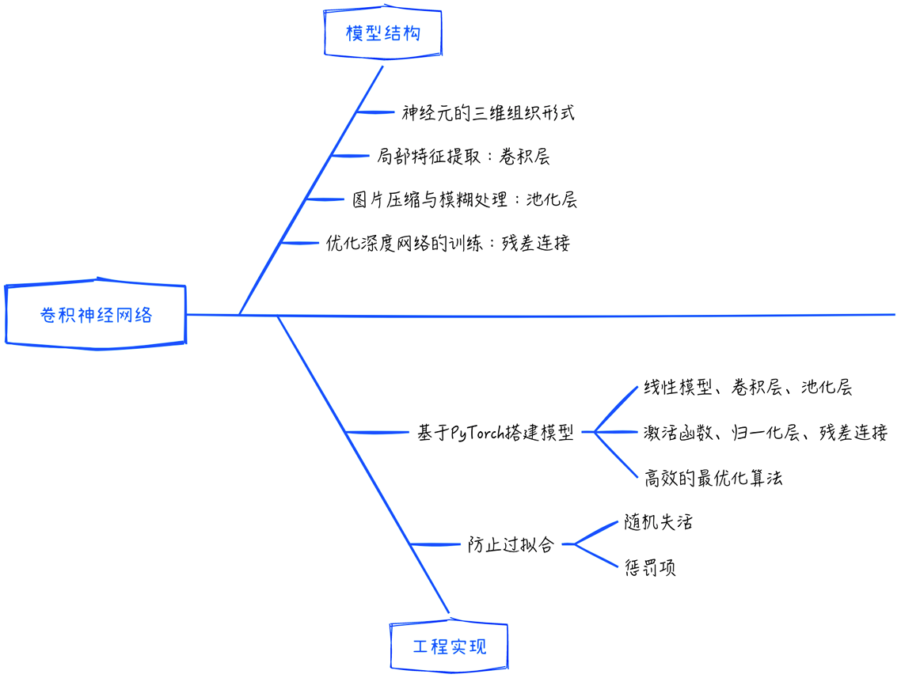

## 9.4 本章小结

### 9.4.1 要点回顾

本章开始尝试用神经网络来解决一些比较复杂的实际问题。首先使用多层感知器来识别图像。根据[第 8 章](/books/deconstructing_LLM/chapter-8)的模型讨论，基于 PyTorch 的封装来搭建模型，并在这此过程中深入讨论了如何加速模型的训练和解决过拟合的问题。

当面对复杂的图像识别任务时，多层感知器存在一些限制，包括神经元排列的一维结构、全连接的架构，以及不允许跨层信息传递。为了应对这些限制，引入了卷积神经网络，这标志着深度学习时代的来临。卷积神经网络引入了 3 个关键的创新点：神经元的三维排列方式、用于捕获局部特征的卷积层和池化层，以及被广泛应用的 GPU 计算。本章中详细讨论了前两个创新点，并提供了相应的实现代码。GPU 计算已在[7.5.1 节](/books/deconstructing_LLM/chapter-7/7-5#section-7-5-1)进行了详细讨论。

标准卷积层克服了多层感知器的前两个限制，但随着网络深度的增加，预测性能仍然会遇到瓶颈。为了解决深度网络的训练难题，引入了残差网络。通过引入残差连接，深度网络的训练变得可行且高效。即使是上千层的神经网络，也可以被有效训练，这进一步拓宽了深度学习的应用领域。

### 9.4.2 常见面试问题

针对本章讨论的内容，常见的面试问题如下。

1. 模型结构
   - 卷积层在卷积神经网络中的作用是什么？请描述卷积操作的过程。
   - 卷积核的大小对模型性能有何影响？如何选择合适的卷积核大小？
   - 池化层在卷积神经网络中的作用是什么？有哪些常见的池化操作方式？
2. 残差连接
   - 什么是残差连接？它如何解决梯度消失问题？
   - 在残差网络中，残差块的核心设计是什么？请解释残差块的工作原理。
   - 在残差块中，为什么需要在输出中加上恒等映射？
3. 模型细节处理
   - 请解释卷积神经网络中的步幅。它如何影响卷积层的输出尺寸？
   - 如何处理输入图像的边界效应问题，以防止信息丢失？
4. 其他
   - 如何使用卷积神经网络完成图像分类任务？请简要描述训练过程。
   - 除了图像处理，卷积神经网络还有哪些其他应用领域？请举例说明。
